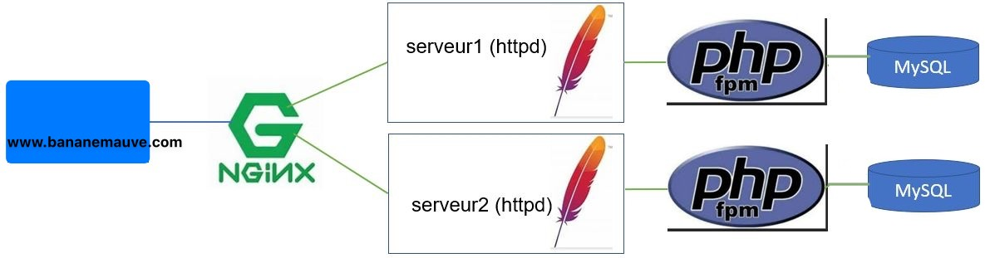

# Évaluation 2

### Informations

- Évaluation : 20 % de la session (15 % pour la partie 1 et 5 % pour la partie 2).
- Type de travail : équipe de 2 pour la partie 1 et individuel pour la partie 2.
- Date de remise : voir sur léa.
- Durée : 6 heures. 
- Système d’exploitation : Linux / Docker
- Environnement : virtuel / Docker.

### Critère d'évaluation

- Applique la politique de vérification de l’authenticité de systèmes.
- Reconnais que le système doit être mis à jour.
- Détermine la pertinence des correctifs proposés.
- Gère les correctifs du système d’exploitation.
- Applique les correctifs.
- Détecter et comprendre des entrées de sécurité dans les journaux.
- Utiliser un logiciel pour lire les journaux.
- Suivre en temps réel les journaux
- Applique la politique d’installation et de vérification d’installation du logiciel de sauvegarde.
- Applique la politique de sauvegarde des données.
- Applique la politique de sauvegarde des appareils réseau.
- Configure les droits d’accès aux journaux et aux serveurs de journaux, selon la politique de sécurité.
- Installe et configure le service de journalisation des sauvegardes.
- Effectue la lecture des journaux du serveur de sauvegarde pour comprendre les entrées.
- Localise les journaux d’un système d’exploitation.
- Lis les journaux.
- Détermine un évènement de sécurité à l’intérieur d’un journal.


### Description

Cette évaluation à deux parties.  

La première partie touchera l'intégrité du système où vous aurez les tâches suivantes à accomplir:  

- Faire une installation complète d’un site Web avec équilibrage de charge.  
- Utiliser Nginx comme un équilibreur/répartiteur de charge (load balancer).  
- Utiliser Apache (httpd) comme serveur de contenus.  
- Utiliser php-fpm comme fastCgi.  
- Utiliser MySQL comme serveur de base de données.  
- Le tout automatisé avec Ansible et avec l'utilisation de conteneur.  

La deuxième partie sera un questionnaire sur les sujets des cours précédents.  

## Partie 1 : Déploiement d'un environnement avec Ansible

### Description de l'infrastructure

Vous allez utiliser Nginx comme équilibreur de charge pour avoir une structure comme celle-ci :

  
**Figure 1 : Infrastrucutre principale.**


Donc, on se connecte sur www.bananemauve.com (vous utiliser votre nom de domaine de l'exercice 4) qui appelle le proxy nginx qui lui appelle en alternance les serveurs 1 et 2. Chacun des serveurs est relié à un serveur php et à un serveur MySQL.  


- Vous devez avoir 2 VMs serveurs : une pour l'équilibreur de charge et un des deux serveurs Web et une pour l'autre serveur Web (n'oubliez pas de renommer vos VMs, de créer les utilisateurs...)  
- Les services seront des conteneurs.  
- Les deux serveurs Web doivent être identiques, à part une information, dans la page Web, qui permet de distinguer le serveur 1 et le serveur 2 : par exemple le hostname ou/et l'adresse IP.  
- Les serveurs httpd seront reliés à un réseau avant pour la communication extérieur.  
- Les serveurs httpd auront chacun leur réseau arrière pour communiquer avec leurs serveurs php et MySQL.  
- Le fichier de configuration httpd.conf et default.conf doivent être montés par un point de montage aux fichiers respectif des conteneurs.
- Le contenu des serveurs httpd doit être monté par un point de montage à un répertoire de la VM.  
- Le serveur MySQL doit avoir un volume de données persistant dans la VM.  

**Attention :** il n'est pas nécessaire de mettre de dépendance aux serveurs httpd.

**Note :** Je vous recommande d'avancer de manière graduelle : commencer par installer le conteneur Apache, tester Apapche, ajouter le conteneur php, tester php, ajouter le conteneur mysql...  

**Note :** vous avez déjà réalisé cet exercice avec Docker dans le cours 420-DN2-SF.

Vous pouvez réaliser ce travail sur votre infrastructure local, sur vSphere ou sur CyberQuebec.

Voici les spécifications si vous travaillez sur vSphere :  
 
- Utiliser le gabarit DFC DS -> VM DFC -> Modeles -> ClaudeRoy -> TPL\_20231002\_UbSrv2204_BaseSmall.  
- Utilisez les noms de VMs : `srv-lbweb1-[matricule]`, `srv-web2-[matricule]`.
- Mettre les VMs dans le dossier du cours : A24\_4154\_420DN4\_SA\_CR.

### Ansible 

#### Spécifications pour les noeuds gérés :

- Un fichier d'inventaire en format YAML doit contenir :  
	- Tous les hôtes via le groupe "all" et ils devront avoir pour login `admin`.
	- Ne pas inclure le noeud de contrôle dans l'inventaire.  
	- Vous devez avoir un groupe _lbservers_ pour l'équilibreur de charge et un groupe _webservers_ pour les serveurs Web.
	- Les noeuds gérés devront également faire partie d'un groupe appeler _prod_ (consulter la documentation sur le principe parent-enfant).  
	- Les serveurs Web écouteront sur le port 8080.  
- Le mot de passe à utiliser pour toutes les connexions ssh devra être ***CegepSt&Foy*** pour toutes les machines du groupe _prod_.  
- Les mots de passe doivent être placés dans un fichier chiffré par Ansible Vault. Le mot de passe pour l'Ansible Vault est `secret`.  
- La variable _env_ devra être égale à _production_ pour toutes les machines du group _prod_. La variable doit être placée dans une variable de groupe.  

#### Vous devez avoir des playbook pour :

- LoadBalancer
- Web : gère également php et MySQL

#### Votre déploiement :

- Se fait avec une seule commande et reproduit toute l'architecture : vous allez avoir un playbook nommé `deploiement.yaml`.

## Partie 2 : Questionnaire

Vous devez répondre aux questions sur le lien donné sur léa.


## Remise 

Vous devez fournir (déposé sur LÉA) :

- L'adresse de votre dépôt GitHub dans un fichier texte.

Vous devez fournir (déposé sur GitHub) :

  - Un dépôt privé avec tous vos fichiers de code source de l'évaluation.
      - Un fichier README.md qui résume les informations sur le dépôt.
    	- Nom du projet  
       - Date 
       - Description du projet  
      - Le dépôt doit inclure le fichier .traces\_d\_ansible. 
      - Tous les fichiers de votre travail. Je dois pouvoir reproduire votre installation.
  - Un document Markdown nommé `Section1_Validation.md` contenant les informations suivantes :
  	- Une capture d'écran d'un ping (avec ansible) aux appareils de `prod`.
  	- Une capture d'écran de la commande qui lance le playbook final.
  	- Une capture d'écran du résultat de la commande ansible-playbook.
  	- Une capture d'écran de votre navigateur affichant le site Web du premier serveur. Je dois voir votre FQDN dans l'URL.  
  	- Une capture d'écran de votre navigateur affichant le site Web du deuxième serveur. Je dois voir votre FQDN dans l'URL.  
  - Vous devez m'ajouter collaborateur à votre dépôt (claude-roy).
  - Vous devez utiliser le format Markdown (md).
  - Vous devez donner vos sites de références.


## Évaluation :

### Section 1 (15 %)  

|Item 							|			            |Points | Résultat |
|--- 							| --- 			         | :---: | :---:    |
|LoadBalancer 				|				         |       |          |
|								|Fichier default.conf.|6      |          |
|                          |Répartition de charge entre les deux serveurs. |3  |  |
|                          |LoadBalancer.yaml.   |12     |          |
|Serveur1/Serveur2  Web    |                     |       |          |
|                          |Lien avec php.       |3      |          |
|                          |Répertoire et FQDN.  |3      |          |
|                          |Dockerfile php.      |3      |          |
|                          |Fichier index.php.   |2      |          |
|                          |Gestion du mot de passe admin.   |2      |          |
|                          |Fichier Web.yaml.    |20     |          |
|                          |Identification du serveur dans la page Web.|2    |     |
|Fichier deploiement.yaml  |                     |4      |          |
|Fonctionnement            |                     |       |     |
|                          |Fichier .traces\_d\_ansible d'ansible.      |15   |     |
|                          |Fichier Section1_Validation.md.      |15   |     |
|**Total**                 |                     |**90** |          |


### Section 2 : (5 %)  

Le résultat vous sera donné à la fin du questionnaire.


## Informations supplémentaires :

Pour créer un playbook qui regroupe tous les playbook, vous utilisez le module <code>import_playbook</code>.

```yaml
---
- name: Configure LoadBalancer
  ansible.builtin.import_playbook: loadBalancer.yaml
- name: Configure les serveurs Web
  ansible.builtin.import_playbook: Web.yaml

```

Vous pouvez utiliser le module <code>copy</code> dans un playbook :

```yaml
  tasks:
    - name: Telecharger Application
      copy:
        src: ./index.php
        dest: /home/admin/html/index.php
        mode: 0755

```

Pour organiser vos fichiers, vous pouvez créer des répertoires avec le module <code>file</code> :

```yaml
  tasks:
    - name: Creates directory
      ansible.builtin.file:
        path: /home/admin/html
        state: directory
        owner: admin
        group: admin
        mode: 0775
```

## Références :

[A system administrator's guide to getting started with Ansible - FAST!](https://www.redhat.com/en/blog/system-administrators-guide-getting-started-ansible-fast)  
[Documentation ansible pour fichier inventaire avec des relations parent/enfant](https://docs.ansible.com/ansible/latest/inventory_guide/intro_inventory.html#grouping-groups-parent-child-group-relationships)  
[Documentation ansible pour group_vars](https://docs.ansible.com/ansible/latest/inventory_guide/intro_inventory.html#organizing-host-and-group-variables)  
[Documentation ansible pour import_playbook](https://docs.ansible.com/ansible/latest/collections/ansible/builtin/import_playbook_module.html)  
[Documentation ansible pour copy](https://docs.ansible.com/ansible/latest/collections/ansible/builtin/copy_module.html)  
[Documentation ansible pour file](https://docs.ansible.com/ansible/latest/collections/ansible/builtin/file_module.html#file-module)  
[Documentation de Community.Docker](https://docs.ansible.com/ansible/latest/collections/community/docker/index.html#description)  
[Documentation pour une adresse statique sur un serveur Ubuntu 22.04](https://www.linuxtechi.com/static-ip-address-on-ubuntu-server/)  
[Documentation pour l'utilisation de la fonction php_uname](https://www.php.net/manual/en/function.php-uname.php)
