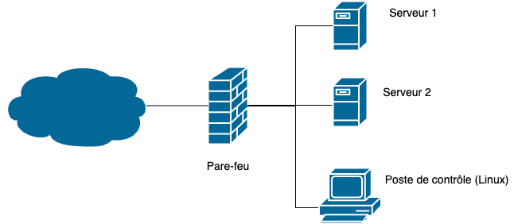
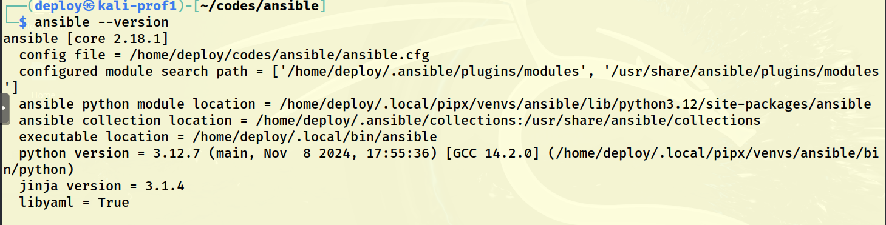
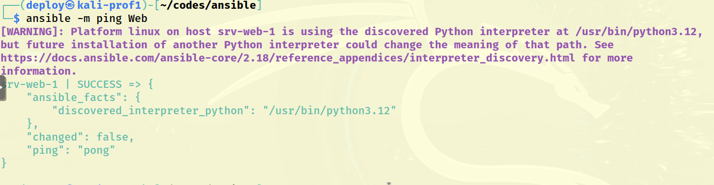
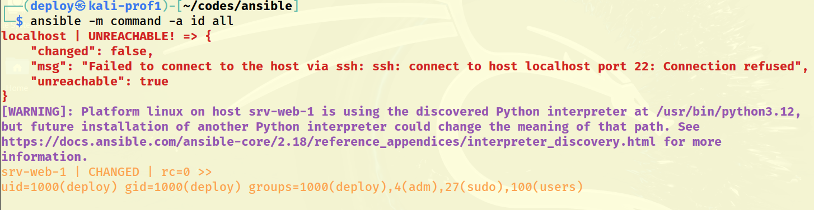
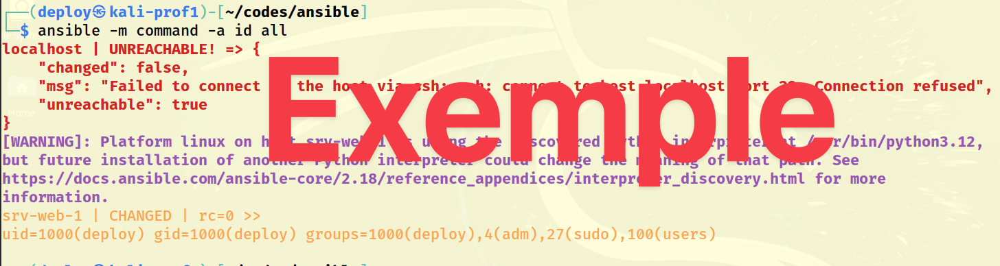

# Exercice 5 : L’intégrité des systèmes avec l’automatisation : Ansible - mise en place

### Informations

- Évaluation : **formative**.
- Type de travail : individuel.
- Durée estimée : 2 heures.
- Système d'exploitation : Linux.
- Environnement : Virtuel. 

### Objectifs  

- Reconnais que le système doit être mis à jour.
- Détermine la pertinence des correctifs proposés.
- Gère les correctifs du système d’exploitation.
- Applique les correctifs.
- Applique une politique d’installation et de vérification d’installation des logiciels.


### Description

L'intégrité des systèmes est de gérer les logiciels du système, vérifier régulièrement les systèmes et vérifier également l'authenticité du système. Les outils d'automatisation comme Ansible nous permettent de faire ça de manière très efficace.

Voici ce que dit la documentation d'Ansible :

"Ansible est un outil d'automatisation informatique. Il permet de configurer des systèmes, de déployer des logiciels et d'orchestrer des tâches informatiques plus avancées, telles que des déploiements continus ou des mises à jour permanentes sans temps d'arrêt."

"Les principaux objectifs d'Ansible sont la simplicité et la facilité d'utilisation. Il met également l'accent sur la sécurité et la fiabilité, avec un minimum de pièces mobiles, l'utilisation d'OpenSSH pour le transport (avec d'autres transports et modes d'extraction comme alternatives), et un langage qui est conçu autour de l'auditabilité par les humains - même ceux qui ne sont pas familiers avec le programme."

### Environnement de travail 

Pour la partie automatisation, nous aurons besoin de trois VMs : un poste de contrôle, et deux serveurs.

  
**Figure 1 : Topologie finale.**

Dans cet exercice, nous utiliserons le poste de contrôle et un serveur. Un client Linux servira pour le poste de contrôle et le serveur sera également un Linux avec le nom d'hôte de `srv-web-01`. Le deuxième serveur servira dans les prochains exercices et aura le nom d'hôte `srv-mysql-01`. Ces derniers représentent des machines qui serviront des nœuds à gérer.  


#### Environnement local (à la maison)

Vous utilisez un client Linux de votre choix. Comme on a déjà utilisé un client Kali, vous pouvez reprendre la même VM. Vous pouvez également vous télécharger une VM déjà monter sur le site de Kali Linux.

Pour le serveur, vous pouvez également utiliser un de vos petits serveurs Ubuntu qu'on a monté dans un exercice précédent. Vous pouvez vous créer un clone *linked* pour le deuxième serveur.

Voici les informations pour vous créer un nouveau serveur :

- Ubuntu serveur 24.04 ou plus récent.
- Disque : minimum de 15 Go.
- Mémoires : 2 Go.
- Processeurs : 2.
- 1 carte d’interface réseau NAT.
- Services : installation minimale (minimized), serveur ssh, docker (faire l’installation telle que vue dans votre formation).

#### Environnement vSphere  

Vous devez créer vos VMs dans le répertoire du cours : vcenterdfc.csfoy.ca/DFC DS/VM DFC/A24\_4154\_420DN4\_SA\_CR. 
 
Utiliser les modèles suivants pour créer vos VMs (les modèles se trouvent sous vcenterdfc.csfoy.ca/DFC DS/VM DFC/Models/ClaudeRoy/) :  
- TPL\_20230815\_Kali2023.2  
	- Utilisateur/passwd : etudiant: S0l&il01  
- TPL\_20231002\_UbSrv2204\_BaseSmall  
	- Utilisateur/passwd : user1: S0l&il  

Utiliser les noms suivants :  

- Kali : A24\_4154\_420DN4\_SA\_*Initiales*\_Kali\_00\_*#matricule*  
- Serveur 1 : A24\_4154\_420DN4\_SA\_*Initiales*\_UbSrv\_00\_*#matricule*  
- Serveur 2 : A24\_4154\_420DN4\_SA\_*Initiales*\_UbSrv\_01\_*#matricule*  
- Storage/disque : utiliser le disque ESXDFC2.  

Vous devez également changer les noms d'hôte avec la commande `hostnamectl set-hostname srv-web-01 --static`.

Malheureusement, vSphere à de la difficulté avec les modèles et il donne souvent la même adresse IP aux VMs qui sont faites à partir du même modèle. Pour éviter les problèmes de doublon d'adresse IP, je vous recommande de faire les commandes suivantes à chaque lancement de la VM :

```bash
sudo ip add flush ens160
sudo dhclient -v ens160
ip -4 add
```

## Section 1 : Mise en place de l'utilisateur et de SSH 

Ansible est principalement conçu pour gérer des machines à l’aide du protocole SSH ou via des commandes lancées en local. Il est également possible de gérer d’autres types de machines, comme des systèmes Windows, des conteneurs Docker ou encore via des mécanismes d’isolation (chroot ou jail).

Même s’il est possible de passer par des mots de passe pour se connecter aux machines Linux, il est fortement recommandé de passer par des clés SSH.

### Utilisateur de déploiement 

Les connexions se feront avec l’utilisateur *deploy*. Il faut donc créer cet utilisateur sur le poste de contrôle et sur le serveur et créer sa clé ssh. Pour améliorer la sécurité, nous allons installer la clé du poste de contrôle sur les noeuds que nous voulons gérer, dans notre cas `srv-web-01` (on devrait également changer la configuration de SSH pour accepter seulement les connexions avec clés).

Il est mieux d'utiliser un usager différent de votre usager de travail habituel. Ce nouvel usager doit pouvoir avoir les droits sudo pour exécuter les commandes sur la machine de contrôle, mais il devra également exister sur chacun des noeuds gérés.


```bash
 sudo adduser deploy # Création rapide de l'usager
 sudo usermod -aG adm,sudo  deploy  # ajouter au groupe adm et sudo
 su deploy # ce connecter avec l'usager
 cd # ce déplacer dans son répertoire 
```  

Vous devez créer une clé SSH pour l'utilisateur *deploy*, puis copier celle du poste de contrôle sur la machine serveur.

Pour générer votre clé ssh :

```bash
ssh-keygen -t ed25519 -N "" -C "deploy, Poste de contrôle."
```

Pour copier votre clé ssh :

```bash
ssh-copy-id -i ~/.ssh/ed25519.pub deploy@adresseIPServeur 
```

Pour travailler avec SSH, il est important de comprendre comment fonctionne l’authentification par clé qu'il utilise. Pour cela, la commande SSH procède à un certain nombre d’opérations :

- Vérification de la signature du serveur distant. Si ce dernier n’est pas connu, l’utilitaire ssh proposera de stocker la chaîne présentée par le serveur.

- Récupération des clés privées SSH présentes dans le répertoire .ssh (fichiers id\_rsa, id\_dsa ou id\_ed25519) de l’utilisateur et vérification des droits sur les fichiers.

- Présentation des clés aux serveurs distants. Si une clé correspond à une entrée dans le fichier ~/.ssh/authorized\_keys distant, le serveur crée un challenge à résoudre par le client.

- Le client résout le challenge (c’est d’ailleurs à ce moment qu’il faut saisir la passphrase de la clé SSH si vous l'avez configurée) et le renvoie au serveur : l’utilisateur est authentifié.

Les étapes permettent de s’assurer que l’utilisateur est bien celui qu’il prétend être.

### Hébergement dans le nuage

Dans certaines situations (par exemple, le changement souvent de clé SSH pour des machines hébergées dans l’infonuagique), il n’est pas faisable de maintenir la liste des signatures de machines distantes.

La désactivation de ce mécanisme sur le poste de contrôle se fait à l’aide des options SSH suivantes :

- Désactivation de la vérification stricte des clés SSH des machines distantes 
    (StrictHostKeyChecking no).

- Stockage des signatures de machines dans le fichier /dev/null 
    (UserKnownHostsFile /dev/null).

Cette configuration se fait en alimentant le contenu du fichier ~/.ssh/config. Ci-dessous le contenu de ce fichier avec ces deux options :

```bash
StrictHostKeyChecking no 
UserKnownHostsFile /dev/null  
```

Il est aussi possible d'utiliser le paramètre `host_key_cheking=False` dans le fichier `ansible.cfg` (voir plus bas).

Par contre, ce n'est pas une bonne pratique de sécurité.

## Section 2 : Installation d'ansible sur le poste de contrôle

 L’installation d’Ansible peut se faire de plusieurs manières;
 
- par l’intermédiaire des packages du système d'exploitation utilisé;
- à l’aide de l’outil pip ou pipx de Python (éventuellement combiné avec virtualenv);
- par l’utilisation des archives contenant le code source d’Ansible;
- ou enfin, en interprétant directement le code source en provenance de Git.


Nous allons opter pour les packages système.  

Pour, l'installation :

```bash
sudo apt update && sudo apt install ansible -y
```


Vérification de l'installation d’Ansible

```bash
ansible --version
```

Ci-dessous un exemple de sortie de cette commande (ici avec la version 2.18.1) :

```bash
ansible [core 2.18.1]
  config file = None
  configured module search path = ['/home/prof/.ansible/plugins/modules', '/usr/share/ansible/plugins/modules']
  ansible python module location = /home/prof/.local/share/pipx/venvs/ansible/lib/python3.12/site-packages/ansible
  ansible collection location = /home/prof/.ansible/collections:/usr/share/ansible/collections
  executable location = /home/prof/.local/bin/ansible
  python version = 3.12.7 (main, Nov  8 2024, 17:55:36) [GCC 14.2.0] (/home/prof/.local/share/pipx/venvs/ansible/bin/python)
  jinja version = 3.1.4
  libyaml = True
```

Vous pouvez noter qu'il n'y a pas d'information sur le fichier de configuration : le paramètre `config file`.  

### Modifiez l'emplacement du fichier `ansible.cfg`.

Ansible recherche un fichier de configuration dans cet ordre :

1. La variable d'environnement <code>ANSIBLE_CONFIG</code>.
2. Le fichier <code>ansible.cfg</code> dans le répertoire actuel.
3. Le fichier <code>~/.ansible.cfg</code> dans le répertoire <code>home</code> de l'usager.
4. <code>/etc/ansible/ansible.cfg</code>

Ansible utilisera le fichier de configuration situé dans `/etc/ansible/ansible.cfg`, sauf s'il y a un fichier `ansible.cfg` dans le répertoire courant. 

Pour que Ansible prenne en considération notre répertoire, nous allons créer un fichier `ansible.cfg` dans le répertoire de travail de l'usager deploy.

On se crée un répertoire de travail et l'on crée un fichier `ansible.cfg`.

```bash
mkdir -p ~/codes/ansible
cd ~/codes/ansible
vim ansible.cfg
#contenu du fichier :
[defaults]
inventory   = ./hosts
remote_user = deploy
retry_files_enabled = False
log_path    = ./.traces_d_ansible
```


- Pour tester les modifications, appelez à nouveau la commande ansible version:

```bash
ansible --version
```

Voici le résultat attendu : 

  
**Figure 2 : Résultat de la commande ansible --version.**


## Section 3 : Première utilisation 

La syntaxe de base d'Ansible est la suivante :

```
ansible [-m module] [-a arguments] cible
```

Exemple avec le module setup qui se connecte sur la machine et va chercher toutes les informations de configuration :

```bash
ansible -m setup localhost > localhost.setup 
# La sortie est très importante, alors nous l'envoyons dans un fichier qui sera écrit dans un format JSON.
```


## Section 4 : Modifier le fichier d'inventaire 

Ansible utilise un fichier d'inventaire appelé `hosts` qui contient des informations sur l'appareil utilisé par les playbooks Ansible. Avec une installation par package, l'emplacement par défaut du fichier d'inventaire Ansible est `/etc/ansible/hosts` comme spécifié dans le fichier `/etc/ansible/ansible.cfg`, donc par défaut dans le même répertoire que `ansible.cfg`. Ces fichiers par défaut sont utilisés lorsque Ansible est exécuté globalement. Cependant, pour des raisons de facilité et de sécurité, vous allez exécuter Ansible à partir du répertoire de l'usager deploy, créé précédemment, qui est membre du groupe sudo. Par contre, dans notre fichier `ansible.cfg`, nous avons spécifié que le fichier d'inventaire se trouvait dans le répertoire immédiat (paramètre `inventory`).

Le fichier d'inventaire Ansible définit les périphériques et groupes d'appareils utilisés par Ansible et le playbook Ansible. Le fichier peut être dans l'un des nombreux formats, y compris YAML et INI, en fonction de votre environnement Ansible (le défaut est INI). Le fichier d'inventaire peut répertorier les périphériques par adresse IP ou par nom de domaine complet (FQDN), et peut également inclure des paramètres spécifiques à l'hôte. Il est également possible de créer des groupes d'hôtes.

- Avec un éditeur de textes, créer un fichier d'inventaire avec les informations suivantes :

```bash
# Utiliser l'éditeur de texte de votre choix.
vim hosts

# Contenu du fichier

[Web]
srv-web-01 ansible_host=X.X.X.X # L'adresse IP de votre serveur

[local]
localhost # Poste de contrôle 

```

Sauvegardez vos modifications et sortez de l'éditeur.  
Au lieu d'utiliser le paramètre `ansible_host`, vous pourriez ajouter à votre fichier `/etc/hosts` l'adresse IP et le nom de votre srv-web-01.

Pour tester l'inventaire , vous pouvez appeler la commande ansible avec les options suivantes :

- le module ping (`-m ping`) ;
- le groupe sur lequel vous souhaitez travailler (ici `Web`, utiliser `all` pour désigner toutes les machines).

```bash
ansible -m ping Web
# Ping sur tous les membres du groupe Web
```

Si la communication se passe bien, vous devriez obtenir le message suivant :

  
**Figure 3 : Résultat de la commande ansible -m ping Web.**

Vous pourriez utiliser un fichier d'inventaire différent avec le paramètre `-i` : par exemple `-i srv-web-1.inv.

Testons l'ensemble de l'inventaire (All) et pas seulement le groupe Web et ce avec la commande `id` sur chacun des hôtes. Nous utilisons le module `command` avec l'argument `-a id` :

```
ansible -m command -a id all
```

Voici un exemple de résultat :

  
**Figure 4 : Résultat de la commande ansible -m command -a id all Web.**

Je vous recommande d'essayer les commandes suivantes :

```bash
ansible --list-hosts all
ansible --list-hosts Web:local
ansible -m shell -a "hostnamectl" Web
# La commande suivante a le même résultat que la précédente.
ansible -m shell -a "hostnamectl" \!local

```

## Défis et remise: 

Expliquer pourquoi, lors de la commande <code>id</code> du module commande, Ansible n'a pu se connecter sur localhost et a généré un message d'erreur. Est-il possible de changer ça ?  


Remettez sur LÉA votre réponse avec une capture d'écran de la commande :

```
ansible -m command -a id all
```

Exemple de remise :

  
**Figure 5 : Exemple de remise.**


## Référence :

[Documentation officielle d'Ansible.](https://docs.ansible.com/ansible/latest/getting_started/index.html)  

[Documentation sur le fichier d'inventaire.](https://docs.ansible.com/ansible/latest/inventory_guide/intro_inventory.html)

[Ansible - Gérez la configuration de vos serveurs et le déploiement de vos applications (2e édition). ](https://www.eni-training.com/portal/client/mediabook/home)

[Github-Ansible](https://github.com/EditionsENI/ansible)

[group discussion](https://groups.google.com/g/ansible-project)


&copy; Claude Roy 2025