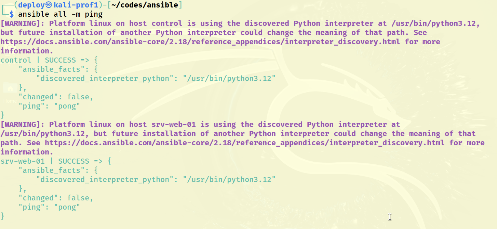
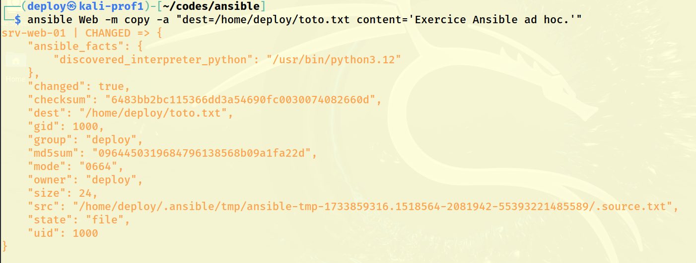
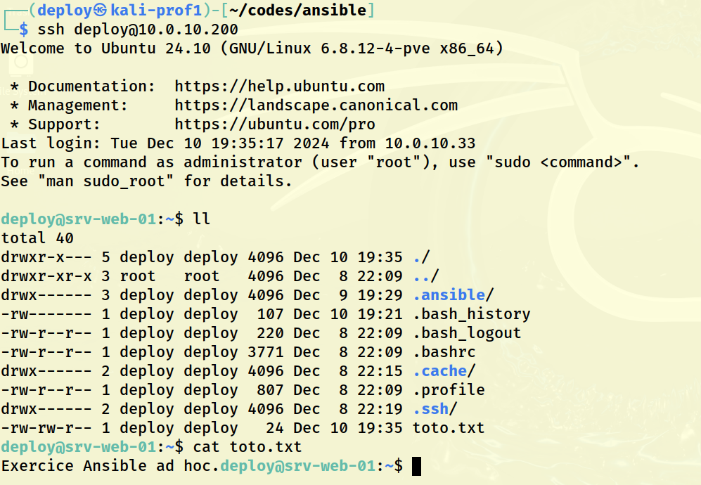
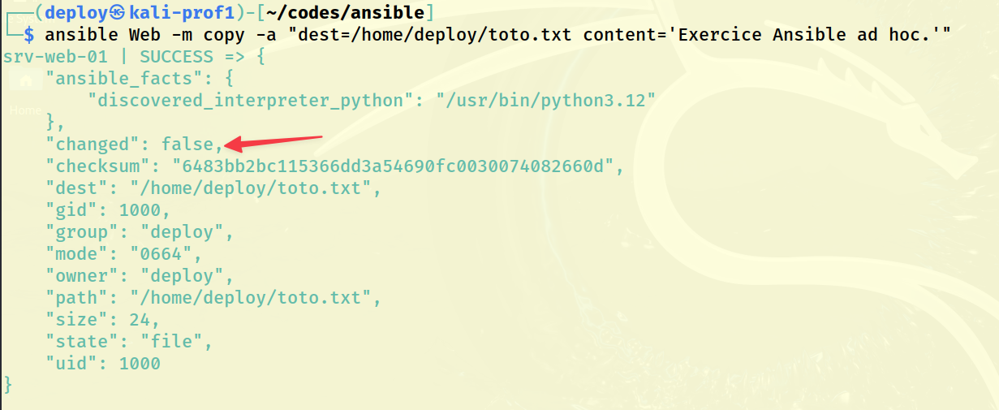
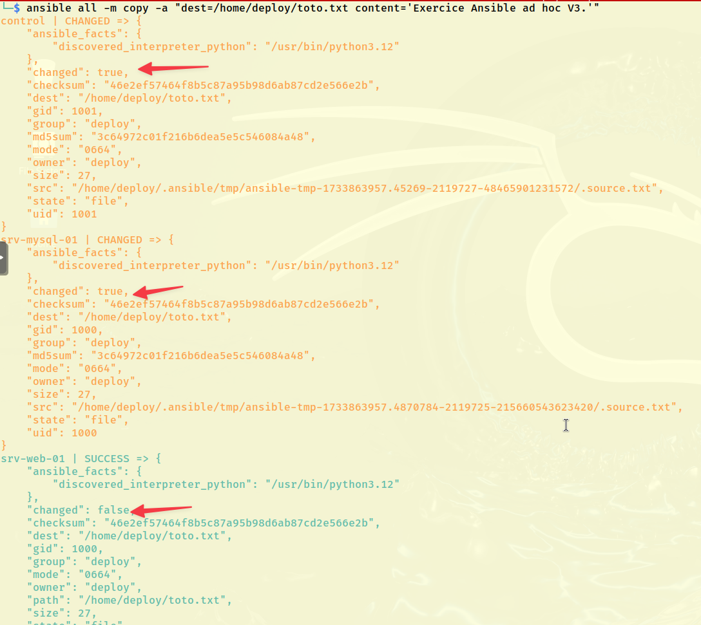

# Exercice 6  : L’intégrité des systèmes avec l’automatisation : Ansible mode ad hoc

### Informations
- Évaluation : **formative**.
- Durée estimée : 2 heures.
- Système d'exploitation : Linux.
- Environnement : Virtuel. 

### Objectifs  

- Reconnais que le système doit être mis à jour.
- Détermine la pertinence des correctifs proposés.
- Gère les correctifs du système d’exploitation.
- Applique les correctifs.
- Applique une politique d’installation et de vérification d’installation des logiciels.

### Description

Dans cet exercice, nous allons utiliser Ansible sur des machines distantes en mode ad hoc.  
Le mode ad hoc est en général utilisé dans ces situations :

- Test de module.
- Lancement de tâche rapidement.

Voici les tâches à réaliser dans cet exercice :

  - Modifier le fichier d'inventaire et le fichier `ansible.cfg`. 
  - Utilisez une commande ad hoc pour tenter de rejoindre le/les nœuds gérés Ansible .
  - Utilisez une commande ad hoc pour créer un fichier toto.txt avec le contenu "Exercice Ansible ad hoc." qui se trouvera sur les nœuds gérés, et ce, dans le dossier /home/deploy/toto.txt. 
  - Vérifier que le fichier a bien été créé avec le contenu.
  - Rajoutez un nœud et modifiez le fichier inventaire afin de rajouter le nouveau nœud.
  - Relancez l'action ping et de création d'un fichier sur les nœuds gérés.
  - Vérifier le résultat.
  - Testez l'effet du module "setup" sur votre inventaire.


## Section 1 : Un hôte

### Erreurs et avertissements 

Modifier le fichier d'inventaire pour ne plus avoir d'erreurs sur localhost.

```bash
su deploy
cd
pwd
ansible --version
cd codes/ansible # Dans ma machine contrôle.
vim hosts # ou l'éditeur de votre choix.
```

Contenu du fichier inventaire :

```
[Web]
srv-web-01 ansible_user=deploy ansible_host=X.X.X.X # IP de votre serveur

[local]
control ansible_connection=local # Donne un nom plus significatif et défini le type de connexion.

```

**Attention** : le paramètre <code>ansible_user</code> n'est pas nécessaire, car nous l'avons déjà défini dans le fichier <code>ansible.cfg</code>.

Donc, le fichier d'inventaire devient :

```
[Web]
srv-web-01 ansible_host=X.X.X.X # IP de votre serveur

[local]
control ansible_connection=local

```

Vérifier le contenu du fichier.

```
cat hosts
```

Maintenant, nous pouvons faire les commandes ad hoc :  

```bash
# Syntaxe :
# ansible -i[ fichier inventaire] [groupe de machine dans le fichier d'inventaire] -m [module]
ansible all -m ping
```

**Attention** : comme le fichier inventaire est défini dans le fichier <code>ansible.cfg</code> du répertoire de travail, le paramètre `-i` n'est pas nécessaire.

Sortie : 


**Figure 1 : Module ping.**

Lors de l'exécution d'Ansible, nous avons également un avertissement à propos de l'interpréteur Python.

  
**Figure 2 : Avertissement pour l'interpréteur Python.**  

Il existe plusieurs méthodes pour arrêter l'affichage de cet avertissement, consulter le lien dans la partie références pour les connaître. De notre côté, nous allons modifier notre fichier `ansible.cfg`. Ajoutez le paramètre `interpreter_python` comme indiquer ici :  

```bash
[defaults]
inventory   = ./hosts
remote_user = deploy
retry_files_enabled = False
log_path    = ./.traces_d_ansible
interpreter_python = auto_silent
```

En lançant une commande Ansible, vous ne devriez plus voir d'avertissement.  

### Utilisation du module `copy` 

Maintenant, utilisons le module [Copy](https://docs.ansible.com/ansible/latest/collections/ansible/builtin/copy_module.html). On va créer le fichier sur srv-web-01 avec un contenu. Mais, seulement sur la machine srv-web-01 qui est dans le groupe Web :

```bash
ansible Web -m copy -a "dest=/home/deploy/toto.txt content='Exercice Ansible ad hoc.'"
```

Le résultat :

  
**Figure 3 : Module copy.**  

#### Vérification sur votre serveur (srv-web-01)  

Établir une connexion SSH sur votre serveur et vérifier la création du fichier.

```
ssh deploy@addresIPServeur
ll
cat toto.txt
```

  
**Figure 4 : Vérification.**  

#### Sur votre machine de contrôle

Exécutez à nouveau la commande :

```bash
ansible Web -m copy -a "dest=/home/deploy/toto.txt content='Exercice Ansible ad hoc'"
```

  
**Figure 5 : Module copy 2.**

**Attention :** remarquez les changements (ou non-changement) au niveau `changed`: il indique false.

Si nous avions fait une copie avec `scp`, quelle aurait été la situation ?

Vous pouvez le tester : 

```bash
vim toto.txt # Ajoutez le contenu 'Exercice Ansible ad hoc.'
scp toto.txt deploy@x.x.x.x:/home/deploy/toto.txt #Remplacer x.x.x.x par l'adresse IP de votre serveur
```

Le fichier va écraser l'autre. Ansible lui voit que c'est le même contenu donc ne fait rien.

Pour vérifier, connectez-vous sur le serveur et listez le répertoire. Vous verrez que l'heure de création du fichier a changé.

Essayer à nouveau avec une modification au contenu :

```bash
ansible Web -m copy -a "dest=/home/deploy/toto.txt content='Exercice Ansible ad hoc v2.'"
```

Ansible a modifié le fichier.

À nouveau avec la même commande :

```bash
ansible Web -m copy -a "dest=/home/deploy/toto.txt content='Exercice Ansible ad hoc v2.'"
```

Rien n'a changé (changed:false)
Essayer à nouveau avec ceci :

```bash
ansible Web -m copy -a "dest=/home/deploy/toto.txt content='Exercice Ansible ad hoc v3.'"
```

Le fichier a changé (changed:true)

Il exécute le changement seulement s’il y a changement à faire au fichier. Alors que `scp` vas nécessairement écraser le fichier.

### Il s'agit ici de la notion d'**idempotence** : 

Un logiciel idempotent produit le même résultat souhaitable chaque fois qu'il est exécuté.  
Dans un logiciel de déploiement, l'idempotence permet la convergence et la composabilité, ce qui permet de :  

- Rassembler plus facilement des composants dans des collections qui créent de nouveaux types d'infrastructure et effectuent de nouvelles tâches opérationnelles.
- Exécuter des collections complètes de développement/déploiement pour réparer en toute sécurité les petits problèmes d'infrastructure, effectuer des mises à niveau progressives, modifier la configuration ou gérer la mise à l'échelle. 

## Section 2 : Ajouter un nouveau serveur

Nous allons ajouter le deuxième serveur, un serveur MySQL.  

Vous allez utiliser la deuxième VM serveur que vous avez créé.

### Machine de contrôle 

- Si ce n'est pas déjà fait, copier la clé ssh de l'utilisateur deploy de la machine de contrôle sur la machine srv-mysql-01.  

- Ajouter la machine à l'inventaire :

```bash
vim hosts

#contenu du fichier hosts :
[Mysql]
srv-mysql-01 ansible_host=X.X.X.X # IP de votre hôte

[Web]
srv-web-01 ansible_host=X.X.X.X # IP de votre hôte

[local]
control ansible_connection=local

```

Vérifiez la connectivité.

```bash
ansible all -m ping
```


Refaites la copie 

```bash
ansible all -m copy -a "dest=/home/deploy/toto.txt content='Exercice Ansible ad hoc v3.'"
```

#### Attention  : 

- Ansible fait le travail sur localhost avec changed=true.
- Ansible fait le travail sur srv-web avec changed=false.
- Ansible fait aussi le travail sur le srv-mysql avec change=true.

Voici la sortie :

  
**Figure 6 : Module copy 3.**


## Section 3 : Ansible - Mode ad hoc avec format YAML

Dans cette partie de l'exercice, nous allons utiliser Ansible sur des machines distantes en mode ad hoc, mais cette fois, avec un inventaire au format YAML.
 
### Sur votre machine de contrôle 

À l'aide d'un éditeur de texte, reproduire le fichier d'inventaire en format YAML.
Consultez la documentation pour vous aidez : [documentation l'inventaire](https://docs.ansible.com/ansible/latest/user_guide/intro_inventory.html).

Vérifiez vos informations :

```
cat hosts.yaml
```

<details>
  <summary markdown="span">Résultat</summary>
  
  ```yaml
  # hosts.yaml
  ---
  Web:
    hosts:
      srv-web-01:
        ansible_host: 10.100.2.128
  Mysql:
    hosts:
      srv-mysql-01:
        ansible_host: 10.100.2.206
  local:
    hosts:
      control:
        ansible_connection: local
  ```

</details>
Maintenant, nous pouvons faire les commandes ad hoc:

```bash
ansible -i hosts.yaml all -m ping
```


## Section 4 : Le module setup

Le module setup balai la machine pour vous donner l'ensemble des informations à exploiter dans les playbook que nous utiliserons dans le prochain exercice.

Faites la commande :

```bash
ansible -i hosts.yaml all -m setup
```

Comme la sortie est trop imposante, renvoyez-le tous dans un fichier :

```bash
ansible -i hosts.yaml all -m setup > setup.txt
```

Remarquer les points suivants pour chacune des machines :  

 - Adresse IPv4 et IPv6.
 - Nos distributions : ansible_distribution.
 - Les variables d'environnement : ansible_env.
 - Plusieurs informations sur les éléments physiques de la machine :
    - Disque dur
    - Mémoire vive 
    - etc.


## Référence :

[Documentation officielle d'Ansible](https://docs.ansible.com/ansible/latest/getting_started/index.html)  

[Github-Ansible](https://github.com/EditionsENI/ansible)

[group discussion](https://groups.google.com/g/ansible-project)

[Choisir l'interpréteur Python](https://docs.ansible.com/ansible/latest/reference_appendices/python_3_support.html)

[Silencing Python Interpreter Warnings in Ansible](https://medium.com/@sahildrive007/silencing-python-interpreter-warnings-in-ansible-d4e0c2149596)

&copy; Claude Roy 2025