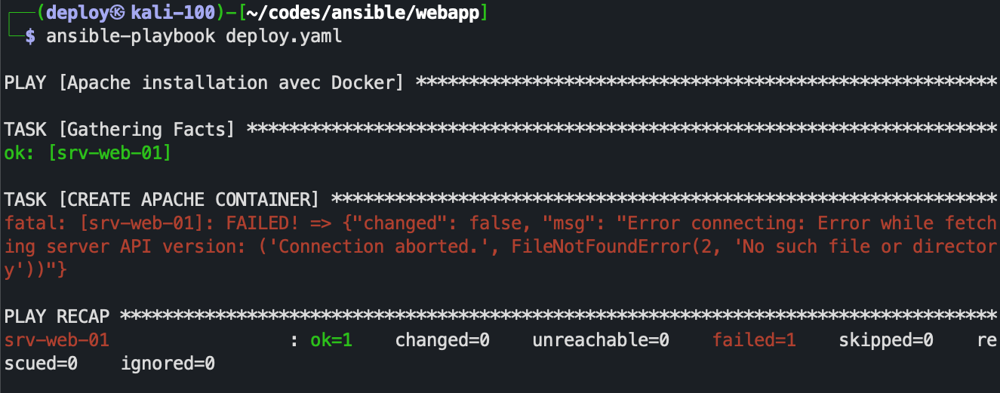
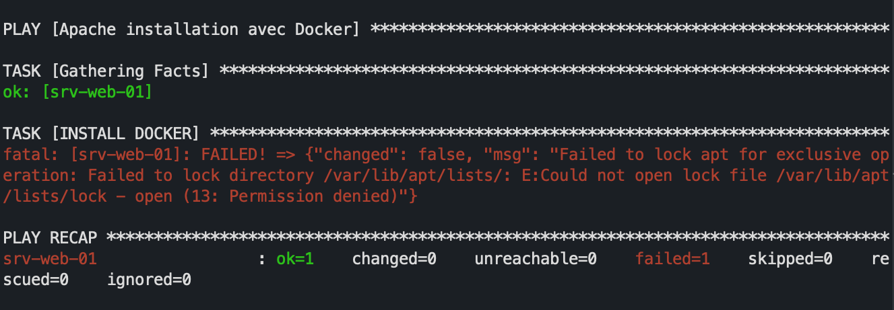
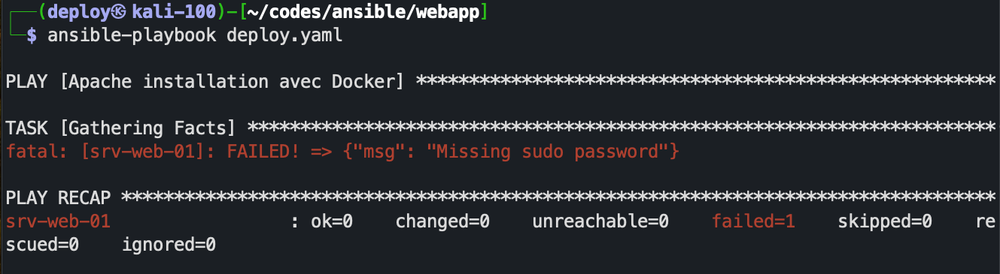
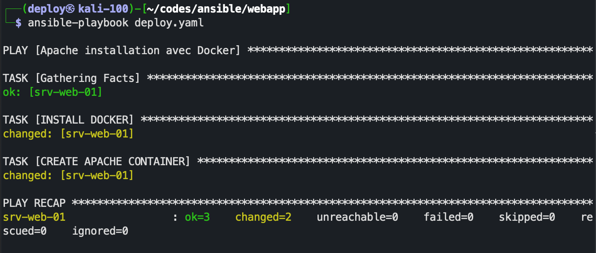
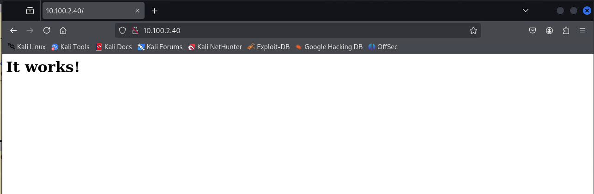
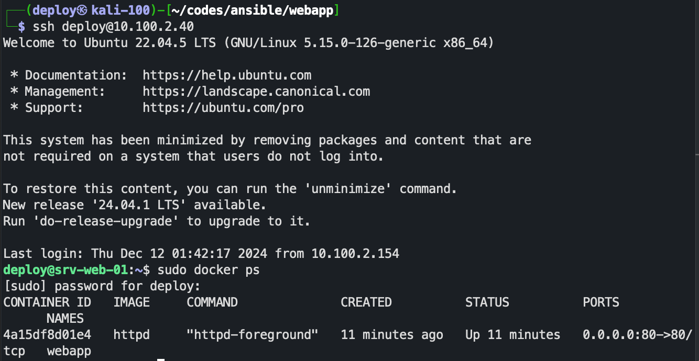
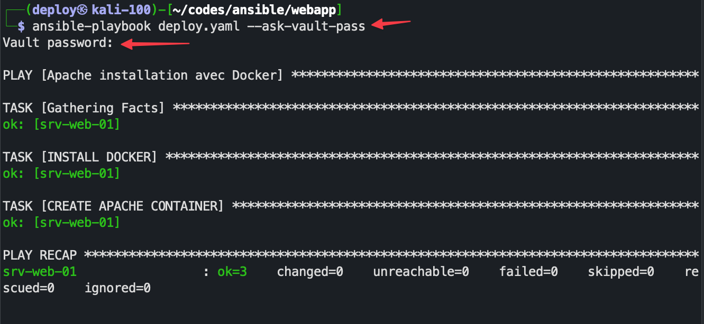
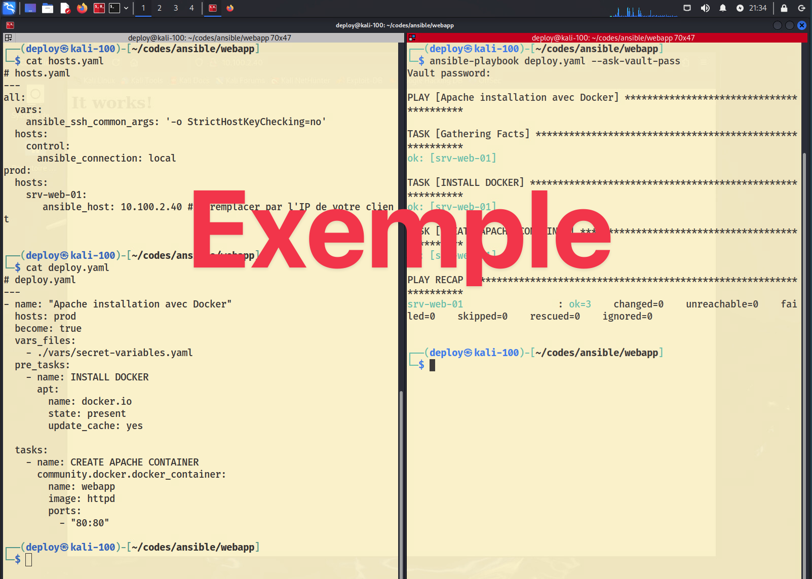

# Exercice 7 : L’intégrité des systèmes avec l’automatisation : Ansible playbook

### Informations
- Évaluation : **formative**.
- Durée estimée : 3 heures.
- Système d'exploitation : Linux.
- Environnement : Virtuel. 

### Objectifs  

- Reconnais que le système doit être mis à jour.
- Détermine la pertinence des correctifs proposés.
- Gère les correctifs du système d’exploitation.
- Applique les correctifs.
- Applique une politique d’installation et de vérification d’installation des logiciels.

### Description

Dans cet exercice, vous allez utiliser Ansible sur des machines distantes avec des playbook.

Voici les tâches à réaliser dans cet exercice :
 
  - Créer un dossier *webapp* qui va contenir tous les fichiers du projet.
  - Créer un dépôt git pour le projet et le placer sur GitHub.
  - Créer un fichier d'inventaire pour le projet. 
  - Créer un groupe *prod* dans votre fichier d'inventaire. 
  - Créer un fichier group_vars qui va contenir un fichier nommé *prod* qui contiendra les informations de connexion à utiliser par Ansible (Login et mot de passe).  
  - Créez un playbook nommé deploy.yaml permettant de déployer apache à l'aide de Docker sur le client (l'image à utiliser est httpd et le port à exposer à l'extérieur est le 80).  
  - Vous devez installer tous les prérequis à l'aide du module apt.
  - Vérifier la syntaxe du playbook avec la commande *ansible-lint*.  
  - Vérifier qu'après l'exécution de votre playbook le site par défaut d’apache est bien disponible sur le port 80.  
  - Extraire le mot de passe du playbook.
  - Utiliser Ansible vault pour plus de sécurité.
  - Explorez les options de debug d’Ansible.  
  - Afin de conserver votre travail, poussez sur votre Github en mode privé. 
  - Ajouter le professeur à votre dépôt github.

## Section 1 : Projet Ansible

### 1 - Créer un dossier webapp qui va contenir tous les fichiers du projet.

Sur le poste de contrôle, créez le dossier sous l'utilisateur deploy. Vous devez également y copier le fichier <code>ansible.cfg</code>.

```bash
su deploy
cd
cd codes/ansible
mkdir -p webapp
cp ansible.cfg webapp
cd webapp/
```

### 2 - Suivre son code source sur GitHub

GitHub est une plateforme extrêmement utile en cybersécurité pour plusieurs raisons, allant de la gestion de projets et du partage de code à la recherche et au développement d’outils spécifiques à la sécurité informatique. Voici quelques cas d’utilisation clés :

1. Partage et collaboration sur des outils de cybersécurité
	- Développement d’outils : De nombreux outils de cybersécurité populaires (comme Metasploit, Wireshark, ou nmap) ont leur code source hébergé sur GitHub. Cela permet à la communauté de contribuer à leur développement.
	- Open source : Les projets open source permettent aux professionnels de la cybersécurité de collaborer pour améliorer la qualité des outils existants.

2. Accès à une vaste bibliothèque d’outils
	- GitHub regorge de projets utiles en cybersécurité, allant des scanners de vulnérabilités aux outils de forensic, en passant par des scripts d’automatisation.
	- Les chercheurs en sécurité publient souvent leurs preuves de concept (PoC) pour des vulnérabilités récemment découvertes, ce qui aide à comprendre les menaces et à préparer des contre-mesures.

3. Gestion de projets et de scripts personnalisés
	- Les équipes de cybersécurité utilisent GitHub pour gérer leurs propres projets, tels que des **scripts d’automatisation** ou des outils internes pour surveiller, analyser ou protéger les systèmes.
	- L’utilisation de Git permet de suivre les modifications, de collaborer efficacement et de maintenir des versions de code fiables.

4. Partage de rapports et d’analyses
	- Les professionnels peuvent partager des scripts ou du code qui illustrent une attaque ou démontrent une faille, ce qui est très utile pour les tests d’intrusion ou l’enseignement.
	- Les entreprises publient parfois des rapports techniques sur des vulnérabilités et des analyses sur GitHub.

5. Veille technologique et apprentissage
	- Les professionnels en cybersécurité utilisent GitHub pour suivre les dépôts liés aux dernières techniques d’attaque et de défense.
	- Il sert également comme plateforme d’apprentissage : l’étude du code source d’outils connus ou la participation à des projets open source permet d’acquérir de nouvelles compétences.

6. Automatisation et intégration CI/CD
	- GitHub peut être intégré dans des workflows de CI/CD pour automatiser les tests de sécurité (analyse de code statique, scan de dépendances, etc.).
	- Cela garantit que les applications sont plus sécurisées avant d’être déployées.

7. Recherche et détection de menaces
	- Les chercheurs en cybersécurité utilisent GitHub pour surveiller des dépôts publics où du code malveillant ou des informations sensibles (comme des clés API) peuvent avoir été accidentellement publiés.
	- Des outils comme “truffleHog” ou “GitLeaks” permettent de scanner les dépôts GitHub pour détecter de telles fuites.

8. Formation et exercices
	- De nombreux dépôts sur GitHub contiennent des environnements ou des scénarios d’entraînement pour apprendre la cybersécurité, tels que des machines virtuelles vulnérables ou des laboratoires de simulation.

En résumé, GitHub est une plateforme incontournable pour les professionnels de la cybersécurité en raison de sa capacité à centraliser, collaborer, et partager du code, des outils, et des connaissances tout en facilitant la gestion des projets et la veille technologique.

Si ce n'est pas déjà fait, vous devez vous créez un compte sur la plateforme [github.com](https://github.com/).  

On doit ajouter la clé publique SSH de notre poste de contrôle dans notre compte GitHub : [ajout d'une nouvelle clé SSH à notre compte GitHub](https://docs.github.com/fr/authentication/connecting-to-github-with-ssh/adding-a-new-ssh-key-to-your-github-account).

Nous allons maintenant préparer et initialiser le répertoire de notre code pour l'utilisation de git.  

Créez un projet webapp-ansible sur Github.com, en ne mettant PAS de Readme. Il vaut mieux l’ajouter après, une fois que les fichiers ont été téléchargés, pour éviter tout conflit.

```bash
echo "# Webapp-ansible" >>README.md
git config --global user.email "your@exemple.com" #si pas déjà définit.
git config --global user.name "Votre nom" #si pas déjà définit.
git init
git add *
git commit -m "Intialisation de mon dépôt"
git branch -M main
# Si ce n'est pas fait, créez le projet sur Github.com avec votre navigateur
git remote add origin git@github.com:[votrecompte git hub]/webapp-ansible.git
git push -u origin main
git status
```

Rafraîchir la page GitHub de vote navigateur pour voir le projet mis à jour.  

### 3 - Créer un fichier inventaire.yaml 

Créer un fichier `hosts.yaml pour le projet webapp.yaml avec un groupe prod : 

```yaml
---
all:
  vars:
    ansible_ssh_common_args: '-o StrictHostKeyChecking=no'
  hosts:
    control:
      ansible_connection: local
prod:
  hosts:
    srv-web-01:
       ansible_host: 10.0.1.4 # A remplacer par l'IP de votre client
```

Modifiez votre fichier <code>ansible.cfg</code> pour qu'il tienne compte du nouveau fichier d'inventaire yaml.

Vérifiez que tout fonctionne.

```bash
ansible all -m ping
```


### 4 - Créer un playbook nommé deploy.yaml

Un playbook Ansible est un fichier YAML contenant un ou plusieurs plays. Chaque play est un ensemble de tâches.  

- Un **play** est un ensemble de tâches correspondant à un appareil ou un groupe d'appareils.
- Une **tâche** est une action unique qui fait référence à un **module** à exécuter avec tous les arguments et actions en entrée. Ces tâches peuvent être simples ou complexes selon le besoin d'autorisations, l'ordre d'exécution des tâches, etc.

Un playbook peut également contenir des **rôles**. Un rôle est un mécanisme permettant de diviser un playbook en plusieurs composants ou fichiers, de simplifier le playbook et de le rendre plus facile à réutiliser. Par exemple, le rôle **commun** est utilisé pour stocker les tâches qui peuvent être utilisées dans tous vos playbooks.

Le playbook Ansible YAML comprend des **objets**, des **listes** et des **modules**.
 
- Un objet YAML est une ou plusieurs paires de valeurs clés. Les paires de valeurs clés sont séparées par un deux-points sans l'utilisation de guillemets, par exemple  <code>hosts: srv-web-01</code>.
-  Un objet peut contenir d'autres objets tels qu'une liste. YAML utilise des listes ou des tableaux. Un tirait "-" est utilisé pour chaque élément de la liste.
-  Ansible est livré avec un certain nombre de modules (appelés bibliothèque de modules) qui peuvent être exécutés directement sur des hôtes distants ou via des playbooks. Par exemple, le module <code>ping</code> utilisé pour vérifier la connectivité. Chaque tâche se compose généralement d'un ou de plusieurs modules Ansible.

Vous exécutez un playbook Ansible à l'aide de la commande <code>ansible-playbook</code>, par exemple :

```bash
ansible-playbook mon_playbook.yaml -i hosts.yaml
```

La commande <code>ansible-playbook</code> utilise des paramètres pour spécifier : 
 
- Le playbook que vous voulez exécuter (mon_playbook.yaml).
- Le fichier d'inventaire et son emplacement (-i hosts). Ce paramètre est nécessaire si vous n'avez pas de fichier <code>ansible.cfg</code> qui change son emplacement par défaut.


Créez un playbook nommé `deploy.yaml` permettant de déployer Apache à l'aide de Docker sur le client (l'image à utiliser est httpd et le port à exposer à l'extérieur est le 80).  

```Bash
vim deploy.yaml
```

```yaml
---
- name: "Apache installation avec Docker"
  hosts: prod
  tasks:
    - name: CREATE APACHE CONTAINER
      community.docker.docker_container:
        name: webapp
        image: httpd
        ports:
          - "80:80"
```

### 5 - Lancer le playbook

```
ansible-playbook deploy.yaml
```

Il devrait avoir une erreur d'absence du module Docker (l'erreur peut être différente):

  
**Figure 1 : Absence du module Docker.**  

On va ajouter le module manquant directement dans le playbook, c'est sa raison d'être après tout.

```yaml
---
- name: "Apache installation avec Docker"
  hosts: prod
  pre_tasks:
    - name: INSTALL DOCKER
      apt:
        name: docker.io
        state: present
        update_cache: yes
  tasks:
    - name : Create Apache container
      community.docker.docker_container:
        name: webapp
        image: httpd
        ports:
            - "80:80"
```

Exécution du playbook.  

```
ansible-playbook deploy.yaml
```

Une nouvelle erreur : nous n'avons pas les permissions.

  
**Figure 2 : Permission manquante.**  

Nous n'avons pas les droits d'installer une application. Le compte deploy n'est pas suffisant. Il faut une élévation de privilège. Nous allons l'obtenir avec l'ajout de `become: true`.
  

```yaml
---
- name: Apache installation avec Docker
  hosts: prod
  become: true  
  pre_task:
   - name: Install Docker
      apt:
        name: docker.io
        state: present
        update_cache: yes
  tasks:
    - name : Create Apache container
      docker_container:
        name: webapp
        image: httpd
        ports:
            - "80:80"
```

Exécution de playbook.  

```
ansible-playbook deploy.yaml
```


Oups! Il manque le mot de passe de sudo.  

  
**Figure 3 : Mot de passe sudo.**  


Nous allons y aller avec la façon la plus simple, mais la moins sécuritaire :


```yaml
---
- name: "Apache installation avec Docker"
  hosts: prod
  become: true
  vars:
    ansible_sudo_pass: MotDePasse # Mettre votre mot de passe de deploy
  pre_task:
   - name: Install Docker
      apt:
        name: docker.io
        state: present
        update_cache: yes
  tasks:
    - name : Create Apache container
      community.docker.docker_container:
        name: webapp
        image: httpd
        ports:
            - "80:80"
```

Exécution de playbook.  

```
ansible-playbook deploy.yaml
```

Résultat attendu : 

  
**Figure 4 : Le playbook fonctionne.**  


Vérifions avec un navigateur sur le poste de contrôle :

  
**Figure 5 : La page est là!** 

On peut également vérifier l'exécution du conteneur sur la machine srv-web-01 : 

  
**Figure 6 : La commande docker ps.** 


### 6 - Sortir le mot de passe du playbook
Enlevez les objets (entrées) `vars` et `ansible\_sudo\_pass` de votre fichier `deploy.yaml`.

Nous allons utiliser un fichier de variables de groupes.

Bien que vous puissiez stocker des variables dans le fichier d'inventaire principal, le stockage de fichiers de variables d'hôte et de groupe distincts peut vous aider à organiser plus facilement les valeurs de vos variables. Vous pouvez également utiliser des listes et des données de hachage dans les fichiers de variables d'hôte et de groupe, ce que vous ne pouvez pas faire dans votre fichier d'inventaire principal.

Les fichiers de variables d'hôte et de groupe doivent utiliser la syntaxe YAML. Les extensions de fichier valides incluent « .yml », « .yaml », « .json » ou aucune extension de fichier. Consultez la syntaxe YAML si vous êtes nouveau sur YAML.

Ansible charge les fichiers de variables d'hôte et de groupe en recherchant les chemins relatifs au fichier d'inventaire ou au fichier playbook. Si votre fichier d'inventaire dans `/etc/ansible/hosts` contient un hôte nommé « foosball » qui appartient à deux groupes, « raleigh » et « webservers », cet hôte utilisera des variables dans les fichiers YAML aux emplacements suivants :

```Bash
/etc/ansible/group_vars/raleigh # peut se terminer avec '.yml', '.yaml', ou '.json'
/etc/ansible/group_vars/webservers
/etc/ansible/host_vars/foosball
```

Vous pouvez également créer des répertoires nommés d'après vos groupes ou hôtes. Ansible lira tous les fichiers de ces répertoires par ordre lexicographique. Un exemple avec le groupe « raleigh » :

```Bash
/etc/ansible/group_vars/raleigh/db_settings
/etc/ansible/group_vars/raleigh/cluster_settings
```

Tous les hôtes du groupe «raleigh» disposeront des variables définies dans ces fichiers. Cela peut être très utile pour garder vos variables organisées lorsqu'un seul fichier devient trop volumineux ou lorsque vous souhaitez utiliser Ansible Vault sur certaines variables de groupe.

Pour `ansible-playbook`, vous pouvez également ajouter les répertoires `group_vars/` et `host_vars/` à votre répertoire playbook. D'autres commandes Ansible (par exemple, `ansible`, `ansible-console`, etc.) rechercheront uniquement `group_vars/` et `host_vars/` dans le répertoire d'inventaire. Si vous souhaitez que d'autres commandes chargent des variables de groupe et d'hôte à partir d'un répertoire playbook, vous devez fournir l'option `--playbook-dir` sur la ligne de commande. Si vous chargez des fichiers d'inventaire à partir du répertoire playbook et du répertoire d'inventaire, les variables du répertoire playbook remplaceront les variables définies dans le répertoire d'inventaire.

Créer un répertoire `group\_vars` qui va contenir un fichier nommé `prod.yaml` qui contiendra les informations de connexion à utiliser par Ansible (Login et mot de passe).

```Bash
mkdir group_vars
vim group_vars/prod.yaml
```

Contenus du fichier `prod.yaml`.

```yaml
---
ansible_user: deploy
ansible_sudo_pass: votreMotDePasse
```

Exécution du playbook.

```bash
ansible-playbook deploy.yaml
```

Jusqu'à maintenant, nous avons toujours le mot de passe dans un fichier texte. Donc, nous avons un problème de sécurité.

Enlevez l'objet (entrée) `ansible\_sudo\_pass` de votre fichier `group_vars/prod.yaml`.

Modifiez le fichier `ansible.cfg` comme suit :

```bash
vim ansible.cfg

# Ajoutons le paramètre nécessaire:
[privilege_escalation]
become_ask_pass=true
```

Exécution du playbook.

```bash
ansible-playbook deploy.yaml
```

On vous demande le mot de passe à l'exécution du playbook.


### 7 - Ansible Vault pour plus de sécurité

Essentiellement, Vault est un moyen pour garder secrètes les informations sensibles de votre configuration Ansible. Il vous permet de chiffrer vos fichiers plutôt que d'avoir du texte brut dans vos playbooks.  

Nous pouvons essentiellement exécuter la commande `ansible-vault` pour chiffrer n'importe quel fichier. Pour l'instant, la plupart des fichiers que nous allons chiffrer seront des fichiers variables, car ils contiendront peut-être des mots de passe ou des clés sensibles.
Ces fichiers peuvent être partagés via un outil de contrôle de sources comme GIT, en gardant les mots de passe et les clés sensibles hors du contrôle de sources.  

Tous ces fichiers sont protégés par un mot de passe et le chiffrement par défaut est AES.

Ajoutons un répertoire `vars` :

```bash
mkdir vars
```

Nous allons créer notre fichier de variables sensibles :

```bash
ansible-vault create vars/secret-variables.yaml
```

Entrez un mot de passe pour protéger le fichier. Le fichier va s'ouvrir dans l'éditeur par défaut.

Entrez le mot de passe de l'utilisateur deploy (pour l'utilisation de la commande sudo) :

```yaml
# À ajouter dans le fichier
---
ansible_sudo_pass: votreMotDePasse
```

Pour éditer à nouveau le fichier, vous utilisez la commande `ansible-vault edit NomFichier`.
Vous pouvez vérifier que le fichier est bien chiffré :

```bash
cat -v vars/secret-variables.yaml
```

Enlevez les lignes pour `[privilege_escalation]` du fichier `ansible.cfg`.

Modifiez le fichier `deploy.yaml` pour ajouter le fichier contenant la variable chiffrer :

```yaml
---
- name: "Apache installation avec Docker"
  hosts: prod
  become: true
  vars_files:
    - ./vars/secret-variables.yaml
  pre_task:
   - name: Install Docker
      apt:
        name: docker.io
        state: present
        update_cache: yes
  tasks:
    - name : Create Apache container
      community.docker.docker_container:
        name: webapp
        image: httpd
        ports:
            - "80:80"
```

Maintenant, on doit ajouter le paramètre `--ask-vault-pass au lancement de notre playbook :

```bash
ansible-playbook deploy.yaml --ask-vault-pass
```

Le mot de passe pour ouvrir le fichier `secret-variables.yaml` est demandé.

  
**Figure 7 : L'exécution avec Vault.** 

Maintenant, faites un _commit_ (ne pas oublier d'ajouter les nouveaux fichiers) de votre projet et _poussez_ votre projet dans votre dépôt github.

Retrouvez-vous votre fichier de _vault_ (<code>secret-variables.yaml</code>) ?

<details>
	<summary>Réponse</summary/>
	Oui.
</details>

Que retrouvez-vous dans le fichier lorsque vous essayez de le consulter sur github ?

<details>
	<summary>Réponse</summary/>
	Le ficher est chiffrer, donc on ne peut pas lire les informations à l'intérieur.
</details>

## Remise

Placez des captures des commandes suivantes dans un seul fichier et déposez-le sur LÉA dans Travaux. 

>Astuce : utiliser un terminal pour les deux commandes `cat` et un autre pour l'exécution de playbook et ce, côte à côte.

```bash
cat hosts.yaml
cat deploy.yaml
ansible-playbook deploy.yaml --ask-vault-pass
```


  
**Figure 8 : Exemple de remise.** 

## Références
[Ajout d'une nouvelle clé SSH à notre compte GitHub](https://docs.github.com/fr/authentication/connecting-to-github-with-ssh/adding-a-new-ssh-key-to-your-github-account)

[Ansible palybooks](https://docs.ansible.com/ansible/latest/playbook_guide/playbooks_intro.html)

[Documentation ansible pour group_vars](https://docs.ansible.com/ansible/latest/inventory_guide/intro_inventory.html#organizing-host-and-group-variables)

&copy; Claude Roy 2025