# Exercice 8 : Journalisation

### Informations
- Évaluation : **formatif**.
- Type de travail : en équipe de 2.
- Durée estimée : 2 heures.
- Système d'exploitation : Windows.
- Environnement : Virtuel. 

### Objectifs  

- Effectuer la lecture des journaux du serveur de sauvegarde pour comprendre les entrées.  
- Localiser les journaux d’un système d’exploitation.
- Lire les journaux.
- Déterminer un événement de sécurité à l’intérieur d’un journal.


### Description

Dans cet exercice, vous allez consulter les journaux d'un Windows serveur localement. Cependant, vous aller débuter par créer un système centraliser avec un Windows serveur et un Windows client relié à un DC (domain controller).

Voici les tâches à réaliser dans cet exercice :
 
  - Promouvoir un Windows serveur à un DC.
  - Ajouter un utilisateur au DC.  
  - Ajouter un poste de travail au DC.  
  - Consulter les journaux du serveur à l'aide de l'Event viewer.  
  - Consulter les journaux à l'aide de commandes Powershell.

## Section 1 : Gestion centralisée avec un DC.
Dans cette section, nous allons créer un système de gestion centralisé avec un DC (domain controller).

### 1 - Promouvoir un serveur en DC.

Un DC est un serveur chargé d’authentifier de manière sécurisée les utilisateurs afin qu’ils puissent accéder aux ressources réseau d’une organisation.

#### Prétâches

Nous allons débuter par mettre à jour le serveur : assurez-vous que les mises à jour du serveur sont installées.  


Nous allons également renommer nos systèmes.  
Cliquez avec le bouton droit sur le logo de Windows (en bas à gauche) et choisissez **System**. Dans la fenêtre ouverte, cliquer sur **Rename this PC**.  
Renommez votre serveur `DC1` et votre station de travail `Station01`.  

Finalement, configurer les informations IPv4 suivantes (ajuster à votre réseau) :  
- Adresse fixe : 10.10.10.200/24.  
- Passerelle par défaut : 10.10.10.1.  
- Serveurs DNS : 8.8.8.8.


#### Promouvoir le serveur  

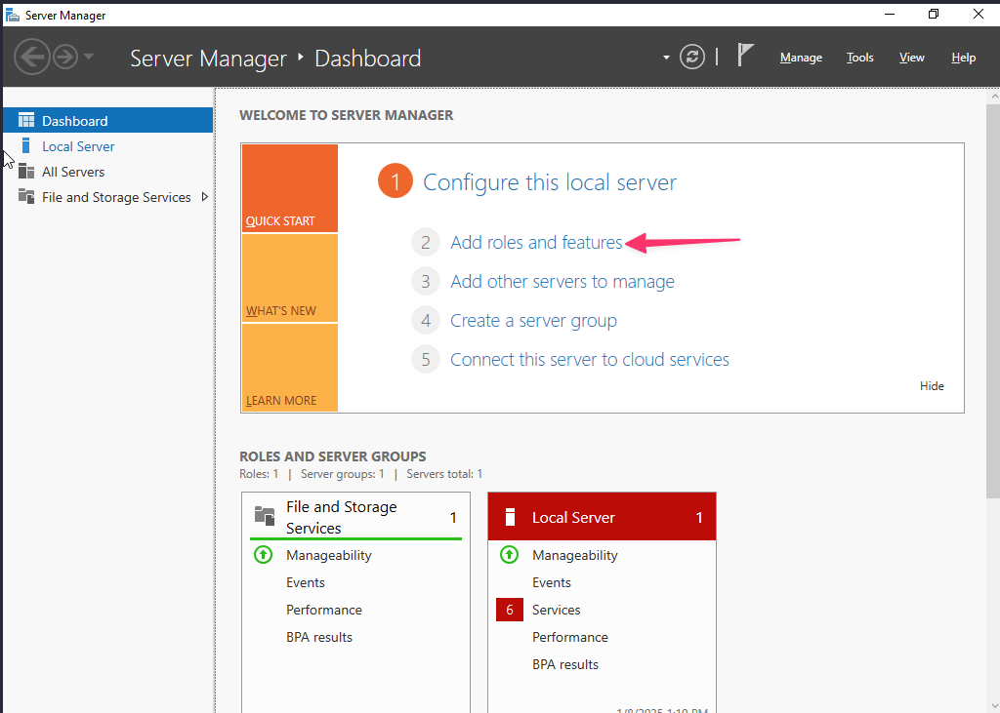  
**Figure 1 : Add roles and features.**

1. Dans la console **Server Manager** (s'elle n'est pas ouverte, cliquer sur le bouton **Start** et cliquer sur la tuile **Server Manager**), cliquer sur **Add roles and features**.  
2. Dans la fenêtre d'assistant (Wizard) **Add roles and features**, cliquer **Next**.  
3. Sélectionnez l'option **Role-based or feature-based installation** et cliquez sur **Next**.
3. Sélectionnez un serveur (vous devriez en avoir seulement un) dans l'option **pool server** et cliquez sur **Next**.  
4. Sélectionnez le rôle **Active Directory Domain Services**, comme indiqué dans l'image suivante, puis cliquez sur **Next** :

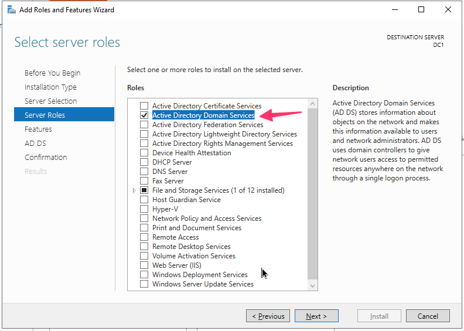  
**Figure 2 : Assistant Add roles and features.**  

6. Cliquez sur le bouton **Add Features** lors de l'ajout de fonctionnalités requises pour **Active Directory Domain Services**. Cliquez ensuite sur **Next**.  
6. Acceptez les paramètres par défaut à l'étape **Select features** et cliquez sur **Next**.  
7. Prenez votre temps et lisez la description d'AD DS et les éléments à noter concernant l'installation d'AD DS. Cliquez ensuite sur **Next**.  
8. Confirmez vos sélections d'installation pour le rôle AD DS et cliquez sur le bouton **Install**.  
9. Cliquez sur **Close** ou attendez que la progression de l'installation atteigne sa fin.  
10. Cliquez sur **Close** pour fermer l'assistant **Add roles and features**.  
11. Dans la console **Server Manager**, sous **Notifications**, cliquez sur **Promote this server to a domain controller**.  

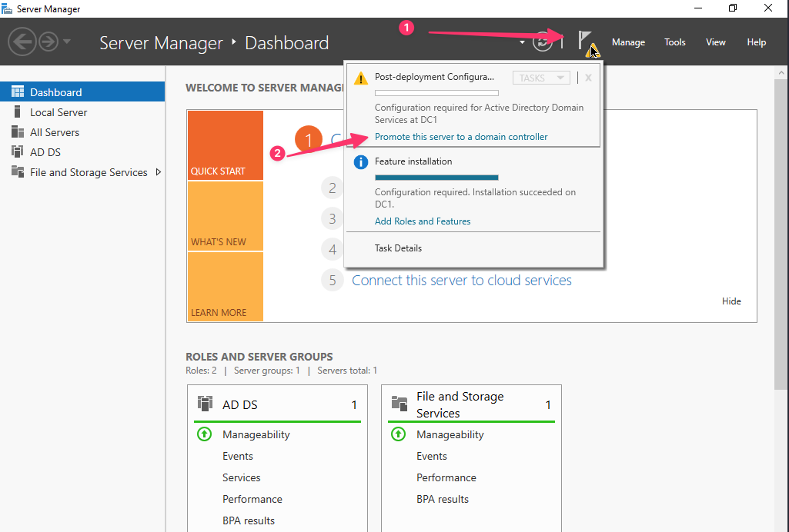  
**Figure 3 : Promote to DC.**

12. Dans l'assistant **Active Directory Domain Services Configuration**, sélectionnez l'option **Add a new forest**, comme indiqué dans l'image suivante, et entrez un nom de domaine racine (utiliser _votreNom_.local. Cliquez ensuite sur **Next**.

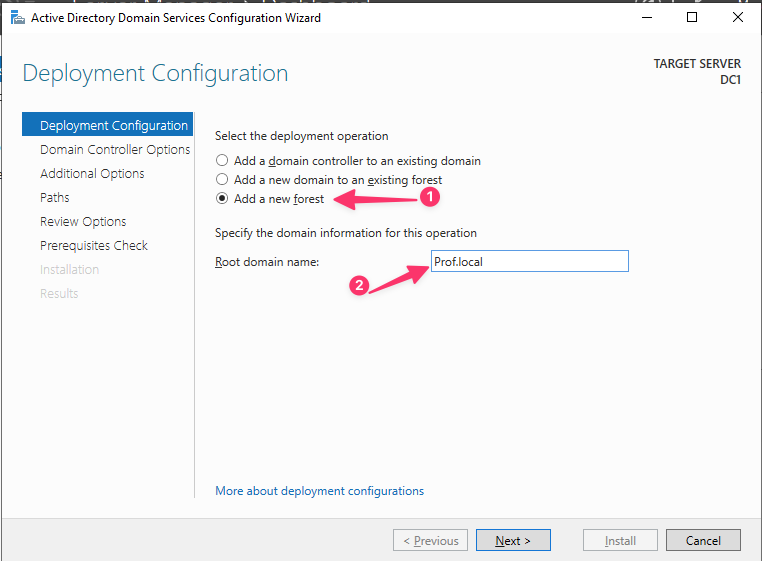  
**Figure 4 : New Forest.**  

14. Acceptez les valeurs par défaut pour les niveaux fonctionnels de la forêt et du domaine, puis entrez le mot de passe du mode **Directory Services Restore Mode (DSRM)**. Cliquez ensuite sur **Next**.  
15. Aucune action n'est requise. Cliquez sur **Next**.  
16. Acceptez l'entrée NetBIOS par défaut ou modifiez-la en conséquence. Cliquez sur **Next**.  
17. Acceptez les chemins par défaut ou modifiez-les en conséquence. Cliquez sur **Next**.  
18. Vérifiez vos options et cliquez sur **Next**.  
19. Les conditions préalables étant remplies (ignorer les avertissements, les points d'exclamation), cliquez sur **Install**.

Maintenant que vous avez effectué toutes les étapes nécessaires, le serveur redémarre pour terminer sa promotion en tant que DC.

#### Ajout d'un utilisateur et d'une station de travail

Nous allons maintenant ajouter un utilisateur dans l'AD et notre station de travail Windows.

**Ajout d'un utilisateur**  

1. Ouvrir la console **Active Directory Users and Computers** : faire une rechercher dans la barre de recherche.
2. Cliquer sur la flèche à côté de votre domaine pour voir la liste des OUs.

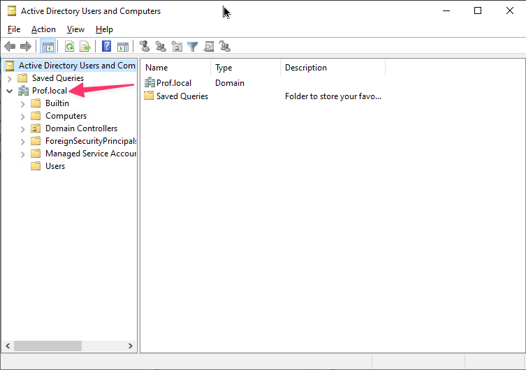  
**Figure 5 : Liste des OUs.**  

3. Cliquer avec le bouton droit sur **Users** et choisir **New > User**.

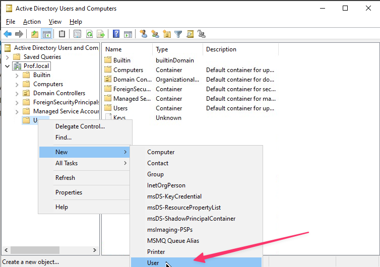  
**Figure 6 : Ajout d'un utilisateur.**  

4. Remplir les champs demandés et cliquer sur **Next**.
5. Entrer un mot de passe pour l'utilisateur, décocher la case **User must change password at next logon** et cliquer sur **Next**.  
6. Cliquer sur **Finish**.

**Ajout d'une station de travail**  

1. Connectez-vous à la station Windows 10.  
2. Dans les configurations réseau de l'adresse IPv4, changer l'adresse du serveur DNS par celle de votre serveur Windows 2022. Vous pouvez laisser l'adresse IPv4 en DHCP.
2. Ouvrir les propriétés système en entrant `sysdm.cpl` dans la fenêtre de recherche.  
3. Cliquer sur **Change...**.
4. Sous **Member of**, choisir **Domain:**, entrer le nom de votre domaine et cliquer **OK**.  

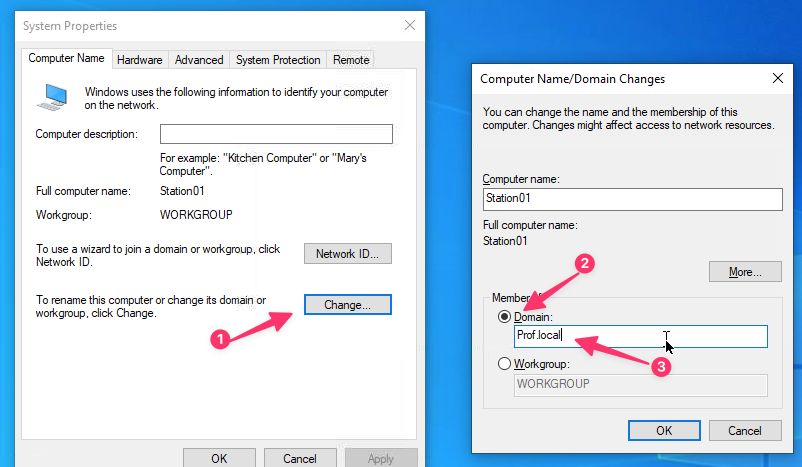  
**Figure 7 : Ajout au domaine.**  

5. Entre un nom d'utilisateur de l'AD (il n'est pas nécessaire d'être un utilisateur administrateur).

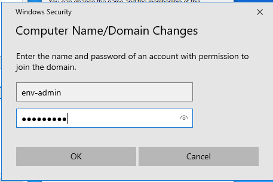  
**Figure 8 : Utilisateur du domaine.**  

6. Cliquer **OK** à la fenêtre de confirmation.  
7. Cliquer **OK** pour fermer la fenêtre.
8. Fermer la fenêtre de système.
7. Cliquer **Restart Now.** pour relancer la VM.
8. Après le redémarrage, ouvrir une session avec l'utilisateur de l'AD créé précédemment.


#### Pour vérification

Ouvrer une fenêtre de commande et exécuter la commande suivante pour vérifier que vous êtes bien dans le domaine :

```bash
systeminfo | findstr /i "domain"
```

Prendre une capture d'écran du résultat pour la remise.

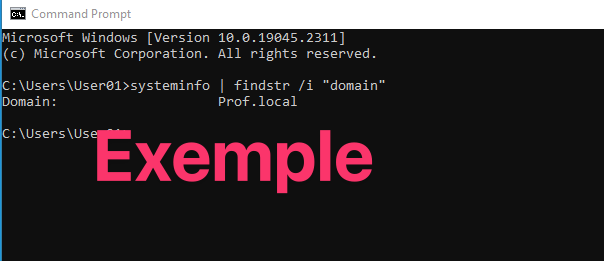  
**Figure 9 : Exemple de remise 1.**  

Si vous retournez sur votre serveur et vous consulter **Computers** dans la console **Active Directory Users and Computers**, vous devriez voir votre station de travail.  

## Section 2 : Consulter les journaux

### L'Event Viewer

Dans Windows serveur, ouvrer l'Event Viewer : dans la barre de recherche entrer `eventvwr`.

La fenêtre de l'Observateur d'événements comporte trois volets.  
Le volet de gauche présente la hiérarchie des fichiers journaux. Le volet de droite affiche les actions que vous pouvez effectuer.  
Pour une vue détaillée des journaux, utilisez le grand volet central. Ouvrez chaque niveau de journaux en cliquant sur la flèche à gauche du dossier dans le volet de gauche.  

Sous **Windows Logs**, cliquez sur **Security**. Au centre de la page, une liste de tous les événements de sécurité qui ont été enregistrés sur cette machine s'affiche.

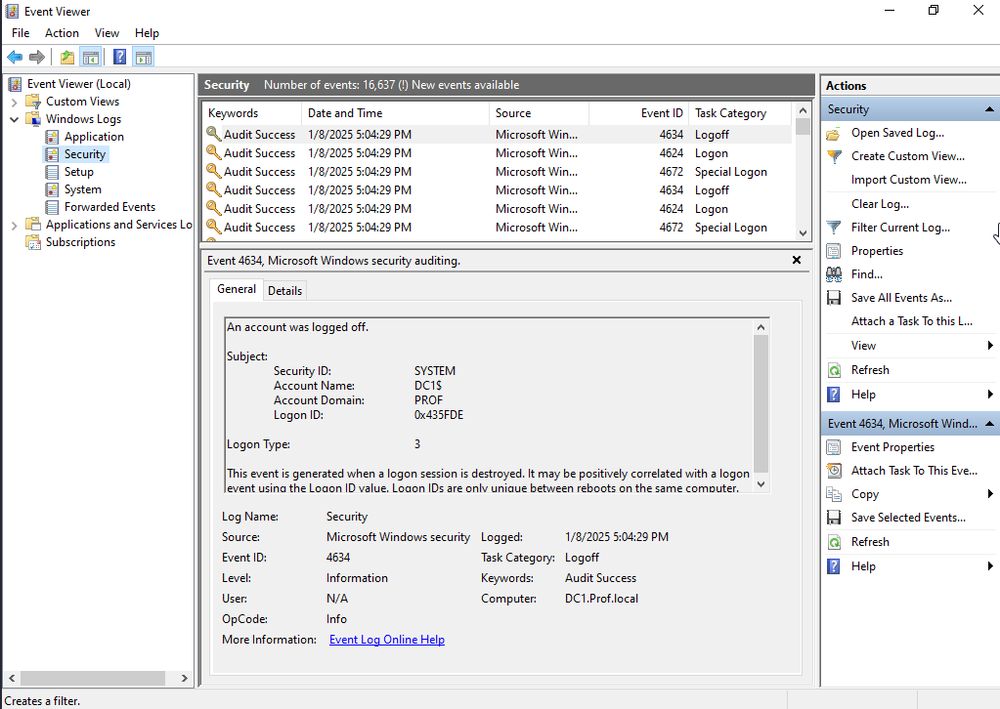  
**Figure 10 : Event Viewer.**  

Comme vous pouvez le voir dans l'image ci-dessus, il s'agit des réussites d'audit enregistrées sur cet hôte. À droite, vous voyez les actions que vous pouvez effectuer sur ces journaux, notamment les filtrer pour les événements critiques ou les avertissements, ainsi que l'examen des propriétés du journal.

Vous pouvez maintenant ouvrir les dossiers journaux **Application** et **System**. Ces journaux vous aideront à comprendre quelles applications sont exécutées sur votre machine, ce qu’elles font et si elles rencontrent des difficultés. Le dossier **System** est un excellent endroit pour filtrer les événements critiques tels que les modifications de configuration ou les coupures de courant.

### PowerShell pour les journaux  

La recherche de journaux à l'aide de PowerShell présente un avantage par rapport à l'Observateur d'événements Windows. Vous pouvez vérifier les événements sur les ordinateurs distants beaucoup plus rapidement, ce qui est extrêmement utile si vous gérez un serveur. L'automatisation avec PowerShell vous aidera à générer des rapports plus rapidement.

Ouvrez une fenêtre PowerShell : entrer **powershell** dans la barre de recherche.  

Utiliser la commande ci-dessous pour avoir une liste de journaux d'événements sur la machine locale.

```bash
Get-EventLog -List
```

Pour voir les journaux **System** du système local, utiliser la commande suivante :

```bash
Get-EventLog -LogName System
```

Comme la liste peut être très longue, vous pouvez demander les dernières 20 entrées :

```bash
Get-EventLog -LogName System -Newest 20
```

Vous pouvez également spécifier une source ou un InstanceID :

```bash
Get-EventLog -LogName System -Source Disk
Get-EventLog -LogName System -InstanceID 566
```

### Suivi de connexion

Relancer votre station Windows 10 et établir une connexion (logon) avec votre utilisateur de l'AD.

Retourner sur votre serveur et retrouver la déconnexion de votre utilisateur et sa nouvelle connexion (elle sera représentée par un Logon Type 5).

**Les types de connexion (Logon)**  

|Logon Type| Description |
|:---------|:----------------|
| 2        | Connexion interactive via le clavier système.|
| 3        | Connexion réseau. Par exemple, accès aux fichiers partagés via SMB.|
| 4        | Connexion par lots. Par exemple, tâches planifiées.|
| 5        | Connexion aux services Windows.|
| 7        | Déverrouillage de l'écran à l'aide d'informations d'identification.|
| 8        | Connexion réseau à l'aide d'informations d'identification en texte clair.|
| 9        | Présentation d'informations d'identification alternatives par rapport à celles que l'utilisateur utilise actuellement, comme avec RunAs ou accès aux partages réseau avec d'autres informations d'identification.|
| 10       | Connexion interactive à distance, comme RDP.|
| 11       | Utilisez les informations d'identification mises en cache pour vous connecter au lieu de vous authentifier auprès du contrôleur de domaine. Cela se produit lorsque la machine n'est pas en mesure d'atteindre le contrôleur de domaine et décide de dépendre des informations d'identification du compte de domaine qui ont été mises en cache sur la machine.|
| 12       | Utilisez les informations d'identification mises en cache pour la connexion à distance (similaire au type 10 et au type 11 combinés).|
| 13       | Utilisez les informations d'identification mises en cache pour déverrouiller l'écran.|

Les numéros d'événements (Event ID) de connexion sont : 4624 pour une connexion d'utilisateur réussi, 4672 pour une connexion d'administrateur réussi, 4634 pour la fermeture d'une connexion et 4625 pour une tentative de connexion échouée.  

#### Pour vérification

Prendre une capture d'écran de la déconnexion et de la nouvelle connexion.

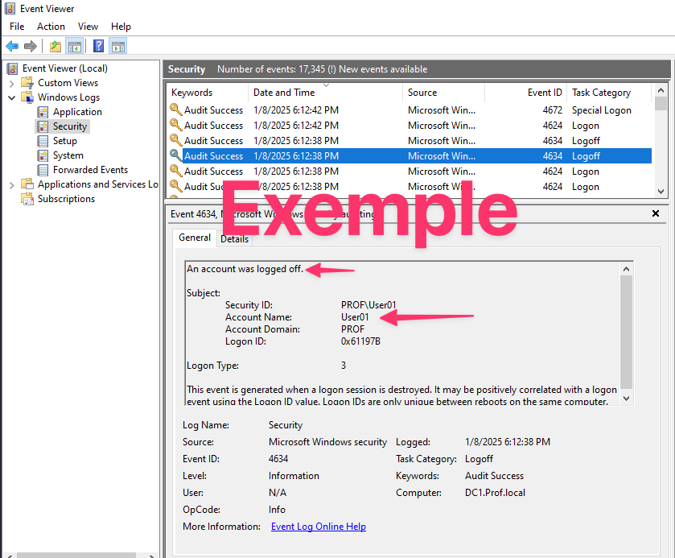  
**Figure 11 : Exemple de remise 2.**  

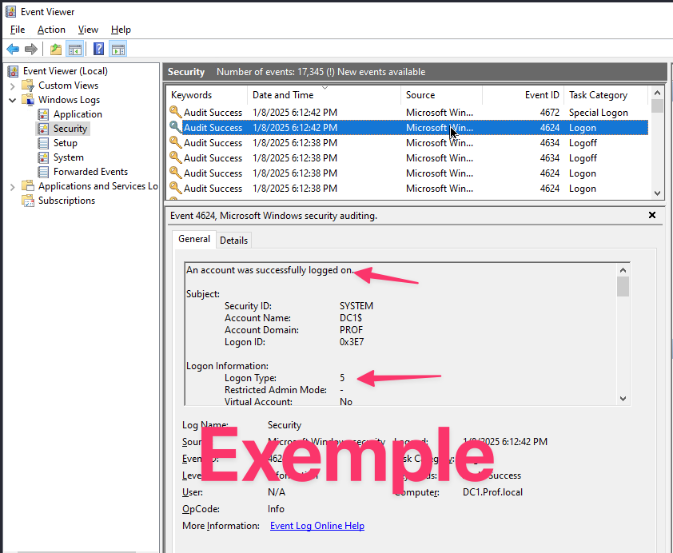  
**Figure 12 : Exemple de remise 3.**  


## Remise

Remettre vos trois captures d'écran dans un fichier compressé (zip).

## Références

- Windows Server 2022 Administration Fundamentals - Third Edition par Bekim Dauti  
- Effective Threat Investigation for SOC Analysts par Mostafa Yahia
- Cybersecurity – Attack and Defense Strategies par Yuri Diogenes, Erdal Ozkaya
- Cybersecurity Blue Team Toolkit par Nadean H. Tanner


&copy; Claude Roy 2025