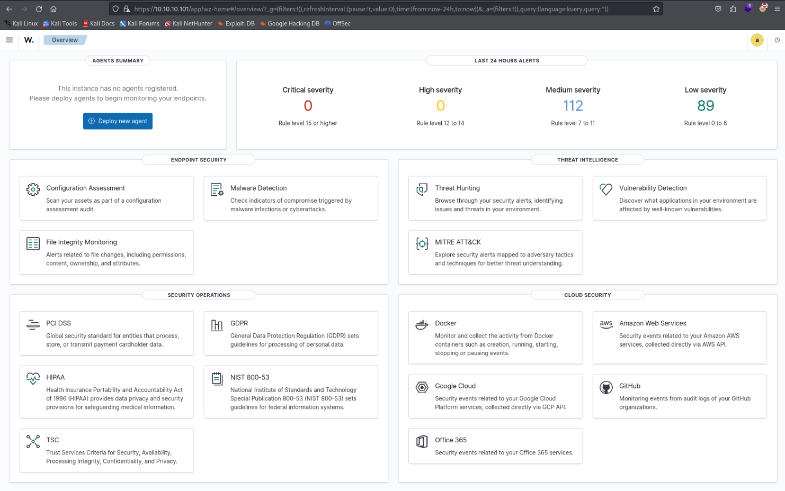
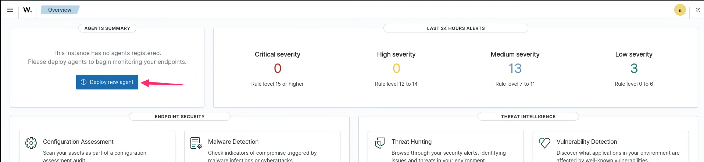
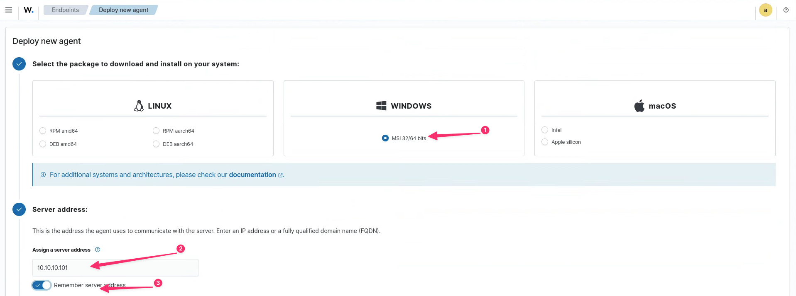
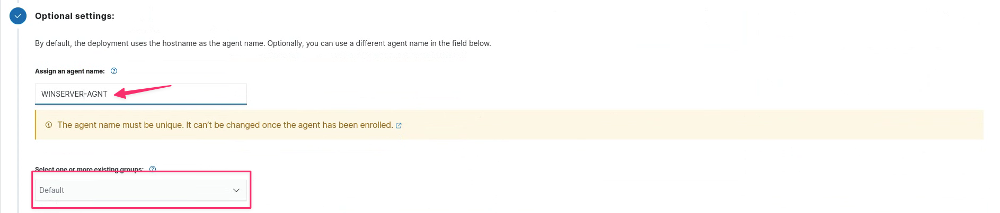
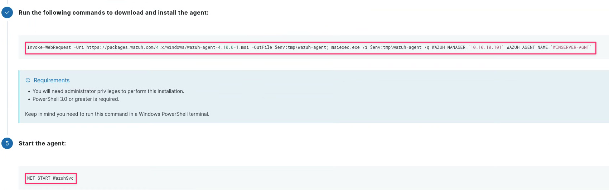
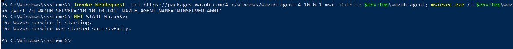
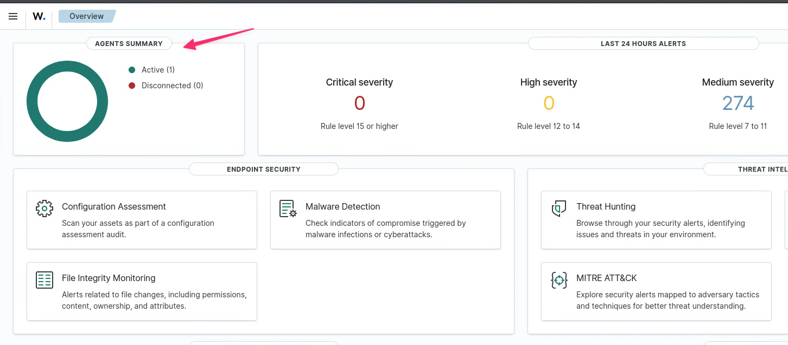
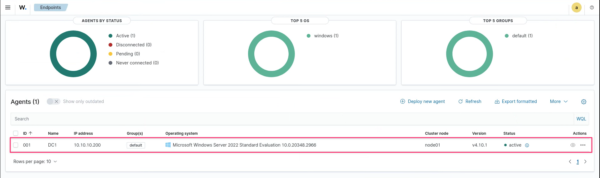
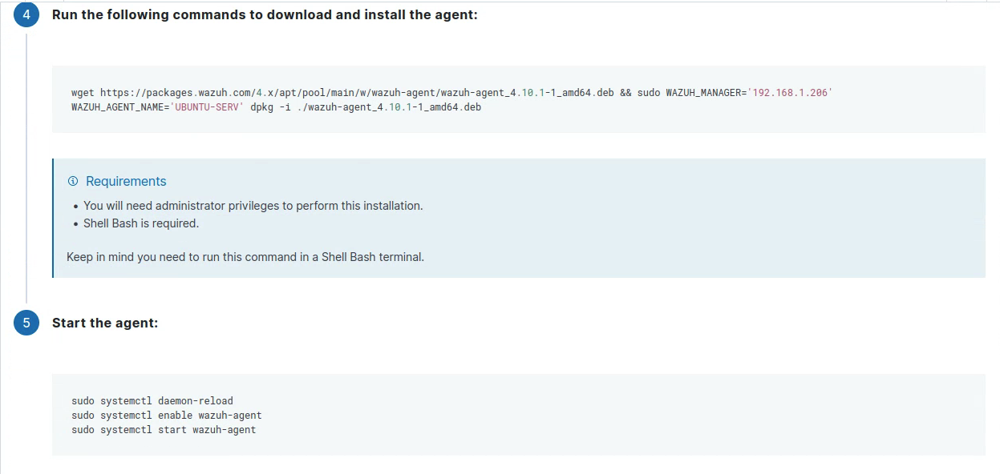
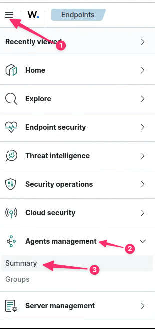

# Exercice 9 : Wazuh, mise en place

### Informations
- Évaluation : **formatif**.
- Type de travail : en équipe de 2 ou individuel.
- Durée estimée : 2 heures.
- Système d'exploitation : Linux, Windows.
- Environnement : Virtuel. 

### Objectifs  

- Installer et configurer un système de détection d’intrusion réseau et hôtes.  
- Configurer les droits d’accès aux journaux et aux serveurs de journaux, selon la politique de sécurité.
- Installer et configurer un serveur de journaux centralisé.  
- Lecture des journaux de serveurs Web pour comprendre les entrées.  
- Détecter et comprendre des entrées de sécurité dans les journaux.  
- Utiliser un logiciel pour lire les journaux.  
- Suivre en temps réel les journaux.

### Description

Dans cet exercice, vous allez faire une installation d'un système de surveillance des systèmes, d'un SIEM et d'un système de détection d'intrusion.

Voici les tâches à réaliser dans cet exercice :
 
  - Installer un serveur Wazuh.  
  - Installer des agents Wazuh.  
  - Installer un IDS, Suricata.  

### Prérequis

Pour cet exercice, vous aurez besoin de 4 VMs :

- Windows serveur 2022.  
- Deux serveurs Linux, Ubuntu.  
	- À la maison, vous allez utiliser un des serveurs pour Wazuh et l'autre comme serveur à surveiller.
	- Dans CyberQuébec, vous avez deux services : un service pour Windows et un autre pour Linux. Vous devez installer Wazuh dans un serveur Ubuntu des deux services, donc 2 installations.   
- Un poste d'attaque, je recommande un Kali.

Vous pouvez utiliser la plateforme CyberQuébec, vous avez deux services déjà complets de disponibles.  

## Section 1 : Installation de Wazuh
Dans cette section, nous allons installer Wazuh et des agents pour Windows et Linux.

### 1 - Installation de Wazuh.

Consultez la page Web de départ rapide de Wazuh : [https://documentation.wazuh.com/current/quickstart.html](https://documentation.wazuh.com/current/quickstart.html).  

La page nous indique que suivre le départ rapide nous installe le serveur, l'indexeur et le tableau de bord.

La page nous indique également les besoins matériels minimum.  

Quels sont les besoins matériels pour 1 à 25 nœuds (agents) et 90 jours de données d'alerte interrogeables/indexées ? 

  
Réponse :

  
- 4 processeurs.
- 8 Go de mémoires.  
- 50 Go d'espace disque.

Nous allons faire l'installation sur un serveur Ubuntu. Voici la commande pour lancer l'installation (n'oubliez pas de faire un `update` avant) :  

~~~bash
curl -sO https://packages.wazuh.com/4.10/wazuh-install.sh && sudo bash ./wazuh-install.sh -a
~~~

**Note :** Dans CyberQuébec, vous devez ajouter le paramètre `-i`, car la VM a seulement 1 processeur.  
**Attention :** N'oubliez pas, à la fin de l'installation, de prendre en note le mot de passe de l'utilisateur `admin`.  

Vous vous connectez au site https://*wazuh-dashboard-ip*:443.  

Vous devriez avoir cette page d'accueil :  

  
**Figure 1 : Page d'accueil de wazuh.**  

Dans CyberQuébec, vous devez installer Wazuh dans un serveur Ubuntu de vos deux services, vous aurez deux serveurs Wazuh.  

### 2 - Installation des agents.  

L'étape suivante est l'ajout d'agents Wazuh. Nous allons installer un agent pour un serveur Windows et un agent pour un serveur Ubuntu.

#### Agent Windows  

Pour débuter, vous devez être connecté au tableau de bord de votre serveur Wazuh. Nous allons débuter par celui du côté Windows.  

Cliquez sur "Deploy new agent".  

  
**Figure 2 : Ajouter un agent.**  

Vous choisissez le *package* Windows et vous entrez l'adresse de votre serveur Wazuh.  

  
**Figure 3 : Agent Windows.**  

Vous entrez un nom pour l'agent et vous choisissez un groupe (on garde Default, pour utiliser un autre groupe, il aurait fallu le créer avant).  

  
**Figure 4 : Nom pour agent Windows.**  

Vous devez prendre en note la ligne de commande PowerShell pour installer l'agent. Voici la commande pour ma version :  

~~~PowerShell
Invoke-WebRequest -Uri https://packages.wazuh.com/4.x/windows/wazuh-agent-4.10.1-1.msi -OutFile $env:tmp\wazuh-agent; msiexec.exe /i $env:tmp\wazuh-agent /q WAZUH_MANAGER='10.10.10.101' WAZUH_AGENT_NAME='WINSERVER-AGNT' 
~~~  

On vous donne également la commande pour lancer l'agent.  

  
**Figure 5 : Commande PowerShell**  

Connectez-vous sur votre serveur Windows, ouvrez une fenêtre PowerShell administrative et exécutez la commande pour installer l'agent et la commande pour lancer l'agent.

  
**Figure 6 : Exécution de la commande PowerShell.**  

  
Si l'agent Wazuh ne réussit pas à démarrer.

Si l'agent Wazuh ne résussit pas à démarrer, vous pouvez consulter la page Web suivante, [https://documentation.wazuh.com/current/installation-guide/wazuh-agent/wazuh-agent-package-windows.html](https://documentation.wazuh.com/current/installation-guide/wazuh-agent/wazuh-agent-package-windows.html), pour télécharger un installateur et exécuter une commande plus simple. Vous devez désinstaller l'autre agent Wazuh avant.   

Pour vérifier que l'agent est connecté et actif, retournez dans le tableau de bord et vous devriez voir un agent d'actif sous **AGENTS SUMMARY**.  

**Figure 7 : AGENTS SUMMARY.**  

Vous pouvez cliquer sur `Active` pour voir les agents actifs des points terminaux, ici seulement notre Windows serveur.

**Figure 8 : Endpoints.**  

Portez attention aux informations suivantes :  
- **ID** : 001  
- **NAME** : DC1  
- **IP address** : 10.10.10.200  
- **Group(s)** : default  
- **Operating system** : Microsoft Windows Server 2022 Standard...  
- **Status** : active  

#### Agent Ubuntu  

Déplacez-vous du côté de votre service Linux et connectez-vous au tableau de bord de votre serveur Wazuh.

Cliquez sur **Deploy new agent** et compléter les informations pour obtenir à la fin la commande à lancer sur votre deuxième serveur Ubuntu : vous avez 2 serveurs dans ce service, un des serveurs est pour Wazuh et le deuxième est le serveur à surveiller.

Voici les choix à faire :  

- Linux, DEB amd64.  
- Assign a server address : entrer l'adresse de votre serveur Wazuh.  
- Agent name : UBUNTU-SERV
- Group : Default.

Au bas de la page, vous allez retrouver les commandes à exécuter.

**Figure 9 : Commande pour installer l'agent sur Ubuntu.**  

Voici les commandes à exécuter (ajuster à votre version) :

~~~bash
# Pour l'installation de l'agent.
wget https://packages.wazuh.com/4.x/apt/pool/main/w/wazuh-agent/wazuh-agent_4.10.1-1_amd64.deb && sudo WAZUH_MANAGER='192.168.1.206' WAZUH_AGENT_NAME='UBUNTU-SERV' dpkg -i ./wazuh-agent_4.10.1-1_amd64.deb

# Pour lancer le service.
sudo systemctl daemon-reload
sudo systemctl enable wazuh-agent
sudo systemctl start wazuh-agent
~~~

**Note** : si vous avez une erreur de nom d'hôte non trouvé, ajouter le nom d'hôte à votre fichier `/etc/hosts` avec l'adresse 127.0.0.1.

Sur le serveur Wazuh, déplacez-vous à la gestion de vos agents :

  
**Figure 10 : Gestion des agents.**  

Vous devriez voir le nouvel agent Ubuntu.

## Section 2 : installation de Suricata  
Avec la capacité de détecter des activités malveillantes ou suspectes en temps réel, Suricata est un outil NSM (Network Security Monitoring), qui a le potentiel de fonctionner comme un IPS/IDS. Son objectif est d'empêcher les intrusions, les logiciels malveillants et d'autres types de tentatives malveillantes de profiter d'un réseau. Dans cette section, nous allons installer Suricata sur un serveur Ubuntu.  

Nous allons utiliser le gestionnaire de paquets `apt` pour l'installation de Suricata. Nous allons également installer les règles Open Source de Suricata créées par la communauté ET (Emerging Threats). Les règles de ET couvrent un large éventail de catégories de menaces, notamment les logiciels malveillants, les exploits, les violations de politique, les anomalies, les botnets, etc. 

### Installation de Suricata  
Vous allez utiliser Suricata sur le même serveur Linux où vous avez l'agent Wazuh d'installer. Sur CyberQuébec, vous allez installer Suricata du côté du service Linux.  

Voici les commandes pour l'installation :  

~~~bash  
sudo add-apt-repository ppa:oisf/suricata-stable  
sudo apt-get update  
sudo apt-get install suricata –y  
~~~  

**Note** : vous pouvez ignorer l'avertissement sur le CPU.  

### Install les règles ET  
L'ensemble de règles ET Suricata comprennent une compilation de règles créées pour l'IDS Suricata. Nous devons stocker toutes les règles dans le répertoire /etc/suricata/rules.  

Voici les commandes pour l'installation (vous devez adapter pour votre version de Suricata, vérifier les informations affichées pendant l'installation de Suricata) :  

~~~bash
cd /tmp/ && curl -LO https://rules.emergingthreats.net/open/suricata-7.0.8/emerging.rules.tar.gz  
sudo mkdir -p /etc/suricata/rules  
sudo tar -xvzf emerging.rules.tar.gz && sudo mv rules/*.rules /etc/suricata/rules/  
sudo chmod 640 /etc/suricata/rules/*.rules  
~~~  

### Modification de la configuration de Suricata  
Afin d'ajuster la configuration de Suricata, il est nécessaire de modifier la configuration par défaut dans le fichier de configuration de Suricata situé dans `/etc/suricata/suricata.yaml` :  

~~~bash  
HOME_NET: "<AGENT_IP>"
EXTERNAL_NET: "any"

default-rule-path: /etc/suricata/rules
rule-files:
  - "*.rules"
# Linux high speed capture support
af-packet:
  - interface: ens3
~~~

Voici les informations sur le code :  

- `HOME_NET` : il s'agit d'une variable qui doit être définie avec l'adresse IP de ou des agents. Modifier pour votre réseau (vous pouvez tout simplement commenter la ligne et enlever le commentaire devant la ligne de votre réseau.).  
- `EXTERNAL_NET` : cette variable doit être définie avec « any » pour garantir que Suricata surveillera le trafic provenant de n'importe quelle adresse IP externe. Plus tard, on pourra l'ajuster plus précisément.  
- `default-rule-path` : il s'agit de notre chemin de règle Suricata.  
- `af-packet` : il s'agit d'une méthode de capture de paquets utilisée pour capturer le répertoire de trafic réseau à partir d'une carte d'interface réseau (NIC). Vous pouvez vérifier le nom de vote carte réseau actuelle en utilisant la commande `ip link` et ajuster le paramètre `af-packet`.

Vous devez relancer Suricata après les modifications :  

~~~bash  
sudo systemctl restart suricata  
~~~  

### Intégrer avec Wazuh  
Pour que l'agent Wazuh surveille et collecte le trafic Suricata, nous devons spécifier l'emplacement du fichier journal Suricata sous le fichier de configuration ossec de l'agent Wazuh situé dans `/var/ossec/etc/ossec.conf`. Suricata stocke tous les journaux dans `/var/log/suricata/eve.json`. Vous devez mentionner ce fichier sous la balise `<location>` dans le fichier ossec.conf. Ajouter les informations suivantes au fichier :  

~~~bash  
<ossec_config>  
...
  <localfile>  
    <log_format>json</log_format>  
    <location>/var/log/suricata/eve.json</location>  
  </localfile>  
...
</ossec_config>  
~~~

Vous devez relancer le service `wazuh-agent` après les modifications :  

~~~bash  
sudo systemctl restart wazuh-agent    
~~~  

### Les règles Suricata  
Suricata est puissant lorsque vous disposez d'un ensemble de règles puissantes. Bien qu'il existe des milliers de modèles de règles Suricata disponibles en ligne, il est toujours important d'apprendre à créer une règle Suricata personnalisée à partir de zéro. Voici la syntaxe de base des règles Suricata et quelques cas d'utilisation courants avec attaque et défense.  

Suricata utilise des règles pour détecter différents événements réseau et, lorsque certaines conditions sont remplies, il peut être configuré pour effectuer des actions telles qu'une alerte ou un blocage.  

Voici un aperçu de la syntaxe des règles Suricata :

~~~bash  
action proto src_ip src_port -> dest_ip dest_port (msg:"Alert message"; content:"string"; sid:12345;)  
~~~

Voici les informations de ce code :  

- `action` : indique ce qui doit être fait lorsque la règle est vraie. Il peut s'agir d'alerte pour envoyer une alerte, d'abandon pour arrêter le trafic ou de toute autre action prise en charge.  
- `proto` : indique le type de trafic correspondant, comme TCP, UDP et ICMP.  
- `src_ip` : il s'agit de l'adresse IP source ou de la plage d'adresses IP source. C'est de là que provient le trafic.  
- `src_port` : il s'agit du port ou de la plage de ports d'où provient le trafic.  
- `dest_ip` : il s'agit de l'adresse IP ou de la plage d'adresses IP vers laquelle se dirige le trafic.  
- `dest_port` : il s'agit du port ou de la plage de ports vers lesquels se dirige le trafic.  
- `msg` : le message qui s'affichera sous forme d'alerte lorsque la règle est vraie.  
- `content` : il s'agit d'un champ facultatif qui vérifie la charge utile du paquet pour une certaine chaîne ou un certain contenu.

Maintenant, en fonction de notre configuration actuelle de Suricata, nous avons les variables réseau $HOME\_NET et $EXTERNAL\_NET. Voyons comment fonctionne un exemple de règle pour détecter une connexion SSH :  

~~~bash
alert tcp $EXTERNAL_NET any -> $HOME_NET 22 (msg:"SSH connection detected"; flow:to_server,established; content:"SSH-2.0-OpenSSH"; sid:100001;)  
~~~

Voici les informations de ce code :  

- `alert` : la règle spécifie qu'une alerte doit être générée si les conditions spécifiées sont remplies.  
- `tcp` : cela fait référence au trafic basé sur le protocole TCP (Transmission Communication Protocol).  
- `$EXTERNAL_NET any -> $HOME_NET 22` : le flux de trafic est défini en dirigeant le trafic de n'importe quelle adresse IP de réseau externe `($EXTERNAL_NET)` vers n'importe quelle adresse IP de réseau domestique ou local `($HOME_NET)` sur le port 22 (SSH).  
- `(msg : "Connexion SSH détectée " ;)` : cela spécifie un message détaillé à ajouter à l'alerte. Cela indique que la règle a identifié une connexion SSH dans cette instance.  
- `flow : to_server, Established` : cela définit la direction du trafic qui initie la règle. Elle recherche des connexions établies entre le serveur (réseau interne) et le serveur (réseau externe). Cette partie de la règle empêche les tentatives de connexion initiales de générer des alertes.  
- `content:"SSH-2.0-OpenSSH` : cette partie examine la charge utile du paquet pour une chaîne particulière (« SSH-2.0-OpenSSH »). Elle recherche la charge utile du trafic pour cette chaîne spécifique, ce qui signifie l'utilisation du protocole OpenSSH et du protocole SSH en général.  
- `sid:100001` : il s'agit d'un identifiant unique pour une règle particulière.

Vous pouvez consulter le fichier /etc/suricata/rules/emerging-scan.rules pour voir des exemples de règles.

## Références

- Security monitoring with Wazuh par Rajneesh Gupta  
- [Documentations wazuh](https://documentation.wazuh.com/current/)  
- [Changement le mot de passe de l'utilisateur `admin` dans Wazuh.](https://documentation.wazuh.com/current/user-manual/user-administration/password-management.html#changing-the-password-for-single-user)  
- [Communauté ET](https://community.emergingthreats.net/)

&copy; Claude Roy 2025