# Exercice 10 : Détection d'attaques

### Informations
- Évaluation : **formatif**.
- Type de travail : en équipe de 2 ou individuel.
- Durée estimée : 2 heures.
- Système d'exploitation : Linux, Windows.
- Environnement : Virtuel. 

### Objectifs  

- Installer et configurer un système de détection d’intrusion réseau et hôtes.  
- Configurer les droits d’accès aux journaux et aux serveurs de journaux, selon la politique de sécurité.
- Installer et configurer un serveur de journaux centralisé.  
- Lecture des journaux de serveurs Web pour comprendre les entrées.  
- Détecter et comprendre des entrées de sécurité dans les journaux.  
- Utiliser un logiciel pour lire les journaux.  
- Suivre en temps réel les journaux.  
- Configurer un coupe-feu pour laisser passer les services d’un serveur.  

### Description

Dans cet exercice, vous allez réaliser 2 différentes attaques sur des systèmes et vérifier comment notre SIEM Wazuh et l'IDS Suricata les détecte.

Voici les tâches à réaliser dans cet exercice :
 
  - Faire une attaque de balayage de port et la détecter.  
  - Faire une attaque d'injection SQL et la détecter.  

### Prérequis

Pour cet exercice, vous aurez besoin de 3 VMs, mais 2 topologies.

Voici la première topologie :

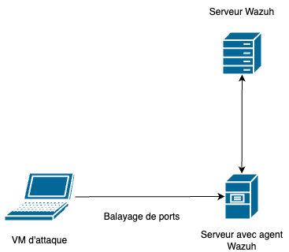  
**Figure 1 : Attaque de balayage de ports.**  

Dans cette attaque, vous aurez une VM d'attaque, une VM serveur cible et une VM serveur pour Wazuh.  

- La VM d'attaque peut être n'importe quelle machine qui peut exécuter _nmap_. On peut utiliser un Kali ou un Ubuntu client en y installant _nmap_.  
- Le serveur peut être un Windows ou un Linux. Nous allons utiliser un Linux.  
- Le serveur Wazuh sera un serveur Ubuntu avec Wazuh installé.  

Voici la deuxième topologie :

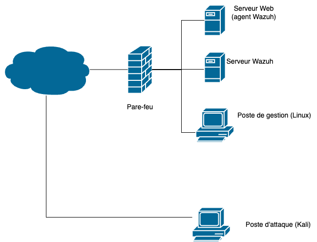  
**Figure 2 : Attaques sur des applications Web.**  

Dans cette partie, vous aurez une VM d'attaque, une VM serveur cible, et une VM serveur pour Wazuh. Par contre, la VM d'attaque sera à l'extérieur de votre réseau.  

- La VM d'attaque peut être n'importe quelle machine qui peut établir une connexion Web. Nous allons utiliser un client Linux (par exemple un Kali).  
- Le serveur sera un serveur Linux avec un agent Wazuh et l'IDS Suricat d'installer, ainsi que l'application DVWA d'installé. 
- Le serveur Wazuh sera un serveur Ubuntu avec Wazuh installé.  
- Naturellement, vous aurez besoin d'un poste de gestion pour le serveur Wazuh.

Vous pouvez utiliser la plateforme CyberQuébec, vous avez deux services déjà complets de disponibles.  

## Section 1 : Attaque de balayage de ports
Dans cette section, nous allons une attaque de balayage de port. Nous allons simuler un attaquant qui tente de découvrir les ports ouverts sur un serveur, puis tente de découvrir les versions des services derrière les ports ouverts.

Pour l'attaque, vous allez utiliser une VM Linux avec _nmap_ d'installer. Si vous utilisez Kali, _nmap_ est déjà installé. Sinon, vous devez l'installer sur la VM d'attaque.

### 1 - Mise en place du serveur.

Dans l'exercice précédent, vous avez installé un agent sur un serveur Ubuntu. Nous allons utiliser ce serveur.  

Si ce n'est pas déjà fait, installer Docker sur le serveur.  

~~~bash
curl -sSL https://get.docker.com/ | sh
sudo usermod -aG docker VotreNomUtilisateur
~~~

Lancer un conteneur nginx associer au port 80 de la VM serveur.  

~~~bash
docker container run --name web-server -p 80:80 -v "$PWD"/html/:/usr/share/nginx/html/ -d nginx

~~~

Vérifier que les ports 22 et 80 sont ouverts.

~~~bash
sudo ss -tnap '( src :22 or src :80 )'
~~~

### 2 - L'attaque.  

Pour l'attaque, vous allez utiliser les deux commandes suivantes :

~~~bash
sudo nmap -sS -Pn 192.168.1.208  // Balayage des ports  
sudo nmap -sS -sV -p 22,80 -Pn 192.168.1.208  // Balaage des versions
~~~  

Voici un petit rappel de la commande _nmap_. Pour la première commande, le paramètre `-sS` est pour une analyse SYN et le paramètre `-Pn` pour ignorer la découverte d'hôte. L'analyse SYN de Nmap est une analyse semi-ouverte qui fonctionne en envoyant un paquet TCP SYN à la machine cible (le serveur Web avec l'agent Wazuh). Si le port est ouvert, le périphérique cible répond avec un paquet SYN-ACK (synchronize-acknowledgment). Cependant, si le port est fermé, le périphérique peut répondre avec un paquet RST (reset), ce qui signifie que le port n'est pas ouvert. La deuxième commande répète une analys SYN, mais avec le paramètre `-sV` pour la découverte de la version du service et le paramètre `-p` pour spécifier seulement les ports ouverts.

Exécutez les deux commandes.  

Quels sont vos résultats ?  

	
Résultats.

~~~bash
sudo nmap -sS -Pn 192.168.1.208
Starting Nmap 7.94SVN ( https://nmap.org ) at 2025-01-22 16:10 EST
Nmap scan report for 192.168.1.208
Host is up (0.00057s latency).
Not shown: 998 closed tcp ports (reset)
PORT   STATE SERVICE
22/tcp open  ssh
80/tcp open  http
MAC Address: 02:00:C0:A8:01:04 (Unknown)

Nmap done: 1 IP address (1 host up) scanned in 0.45 seconds  
~~~

~~~bash  
sudo nmap -sS -sV -p 22,80 -Pn 192.168.1.208
Starting Nmap 7.94SVN ( https://nmap.org ) at 2025-01-22 16:12 EST
Nmap scan report for 192.168.1.208
Host is up (0.0012s latency).

PORT   STATE SERVICE VERSION
22/tcp open  ssh     OpenSSH 8.9p1 Ubuntu 3ubuntu0.10 (Ubuntu Linux; protocol 2.0)
80/tcp open  http    nginx 1.27.3
MAC Address: 02:00:C0:A8:01:04 (Unknown)
Service Info: OS: Linux; CPE: cpe:/o:linux:linux_kernel

Service detection performed. Please report any incorrect results at https://nmap.org/submit/ .
Nmap done: 1 IP address (1 host up) scanned in 6.91 seconds
~~~

### 3 - Vérification sur Wazuh.  

Ouvrez le tableau de bord de Wazuh. Dans le menu de gauche choisissez Threat intelligence -> Threat Hunting.

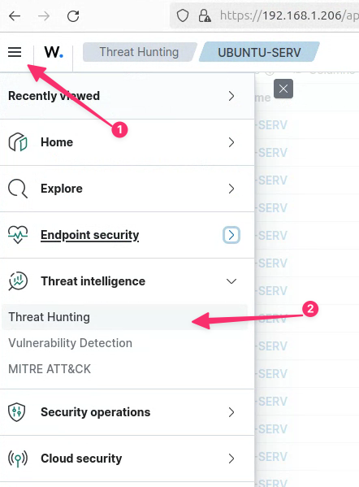  
**Figure 3 : Menu Threat Hunting.**  

Cliquez sur Events.

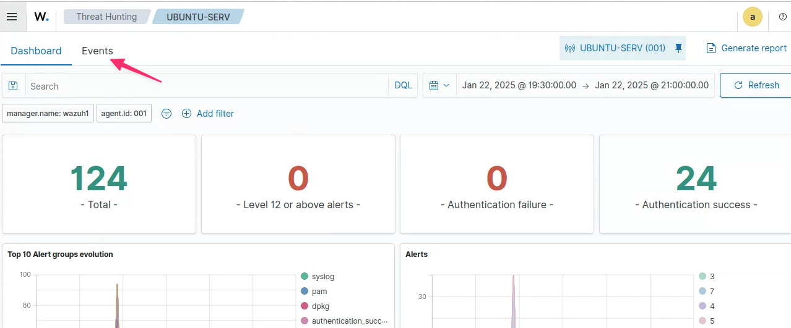  
**Figure 4 : Onglet Events.**  

Dans le bas de la page, vous devriez voir les balayages.

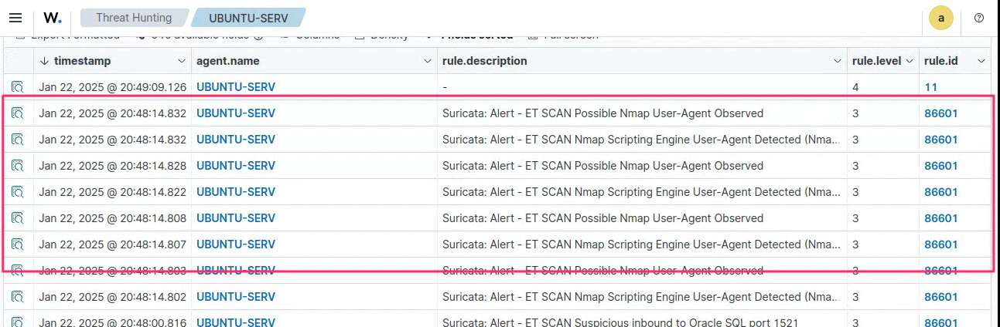  
**Figure 5 : Balayages détectés.**  

Vous pouvez aussi spécifier les règles pour Suricata avec `rule.groups : suricata`.

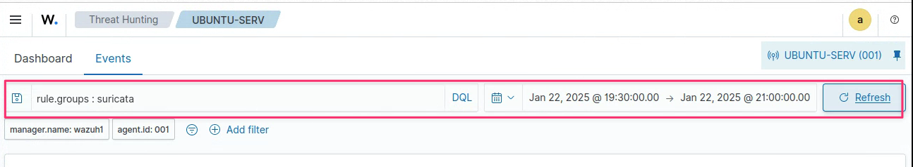  
**Figure 6 : Règles Suricata.**  

Cliquez sur la loupe à gauche d'un des événements et observez les détails d'un événement.

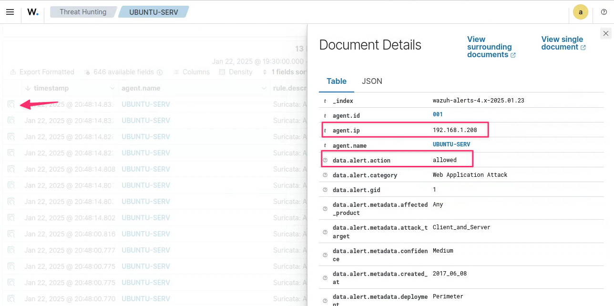  
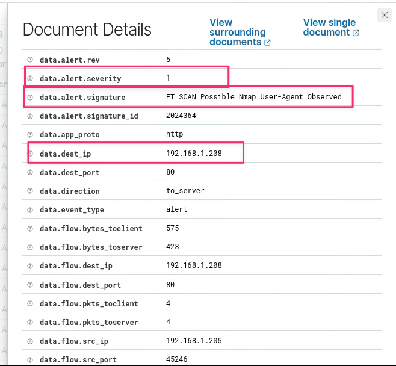  
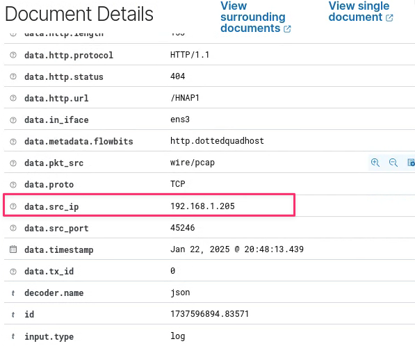  
**Figure 7 : Détails de l'événement.**  

Les noms des paramètres parlent par eux même.  

## Section 2 : Attaque d'injection SQL  

### Prérequis  

  
**Figure 8 : Attaques sur des applications Web.**  

Pour cette attaque, vous allez utiliser une VM en dehors de votre réseau. Vous avez déjà d'installé la VM serveur avec l'agent Wazuh et Suricata (n'oubliez pas d'arrêter le conteneur nginx), la VM Wazuh. Donc, il vous manque une VM d'attaque à l'extérieur de votre réseau.  

À la maison, vous pouvez utiliser votre ordinateur hôte ou une VM Kali.  

Pour CyberQuébec, la VM Ubuntu client (VM d'attaque de la section précédente) sera la VM de gestion utiliser pour consulter le serveur Wazuh. Vous allez configurer le routeur pfSense (admin/pfsense) pour permettre une redirection de port (port forwarding) à votre VM Ubuntu client. Vous utiliserez la VM Kali, du service Windows, comme VM d'attaque.  

Nous avons besoin d'une application Web vulnérable, nous allons utiliser DVWA. Vous pouvez utiliser l'image docker [https://hub.docker.com/r/sagikazarmark/dvwa](https://hub.docker.com/r/sagikazarmark/dvwa). Lancer le conteneur sur le serveur et faire un test local : à votre premier accès, vous devez créer la base de données.  

### L'attaque  
À partir de votre VM d'Attaque, connectez-vous à l'application DVWA (utilisateur admin et mot de passe password). Dans le menu à gauche, choisir DVWA security et ajuster la sécurité à _low_.

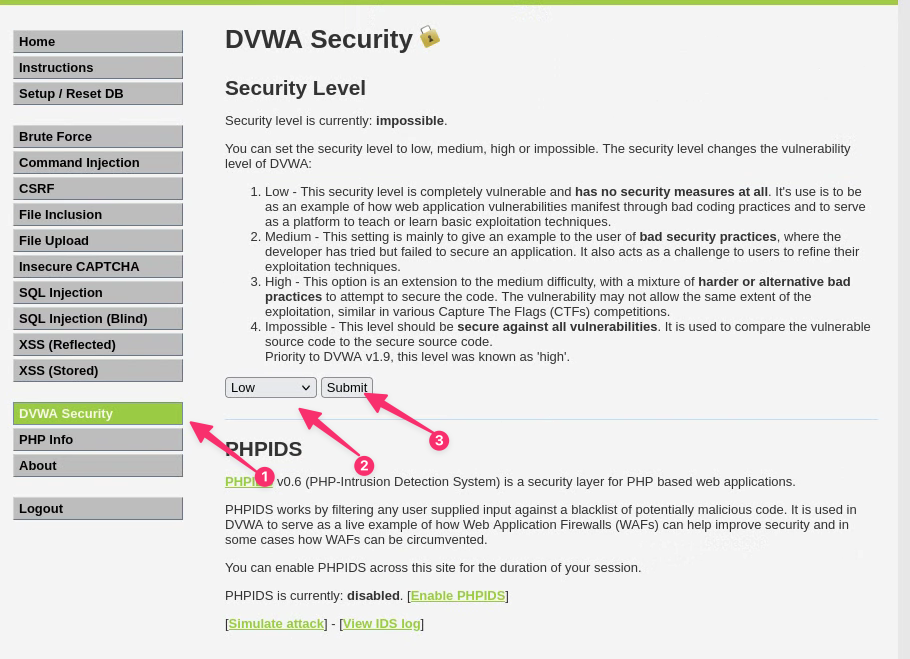  
**Figure 9 : Sécurité de DVWA.**  

Dans votre navigateur, entrez l'URL suivant :

~~~url
http://<PFSENSE-DISTANT_WAN-IP_ADDRESS>/vulnerabilities/sqli/?id=a' UNION SELECT "Hello","Hello Again";-- -&Submit=Submit
~~~

Retourner à la VM de gestion et rafraîchir la page d'événements. Il devrait y avoir une nouvelle entrée.

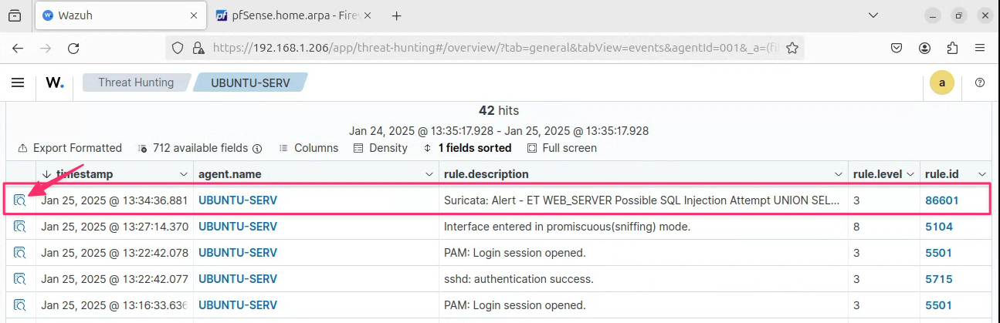  
**Figure 10 : Attaque d'injection SQL.**  

Cliquez sur la loupe à gauche pour consulter les détails de cette entrée.Vous pouvez voir la catégorie et le type d'attaque : `SQL_Injection`.  

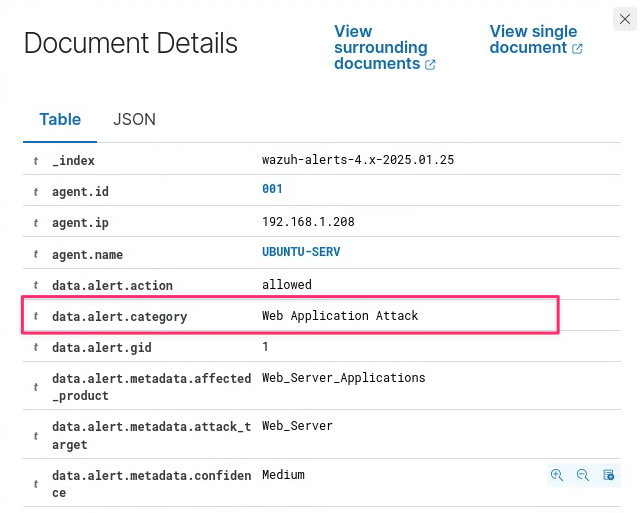  
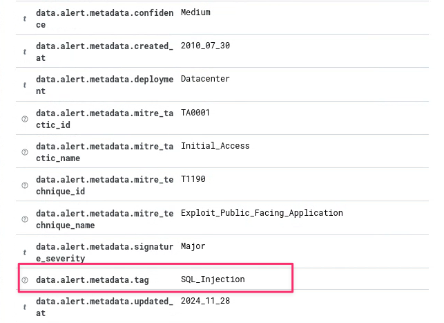  
**Figure 11 : Attaque d'injection SQL data.**  

En descendant dans les entrées, vous pouvez trouver l'information sur l'agent (le type de navigateur) et l'URL utilisés dans l'attaque.

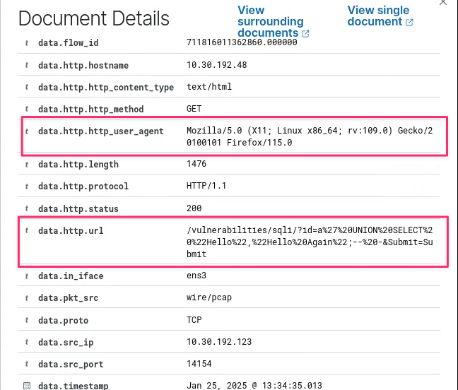  
**Figure 12 : Agent et URL de l'attaque d'injection SQL.**  

Vous pouvez arrêter le conteneur de l'application DVWA.

## Références

- Security monitoring with Wazuh par Rajneesh Gupta  
- [Documentations wazuh](https://documentation.wazuh.com/current/)  
- [Changement le mot de passe de l'utilisateur `admin` dans Wazuh.](https://documentation.wazuh.com/current/user-manual/user-administration/password-management.html#changing-the-password-for-single-user)  
- [Communauté ET](https://community.emergingthreats.net/)  
- [Conteneur Docker pour DVWA](https://hub.docker.com/r/sagikazarmark/dvwa)

&copy; Claude Roy 2025