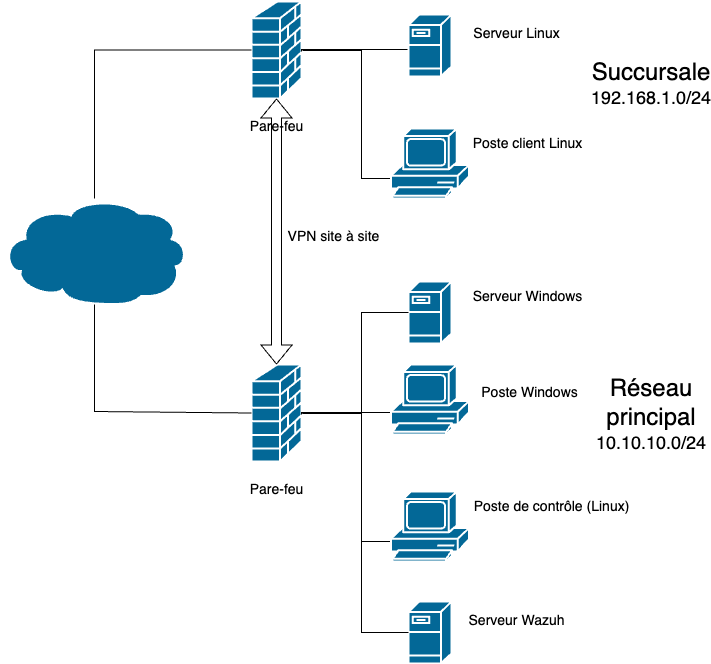
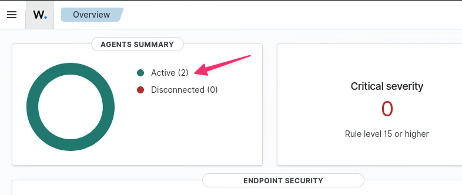
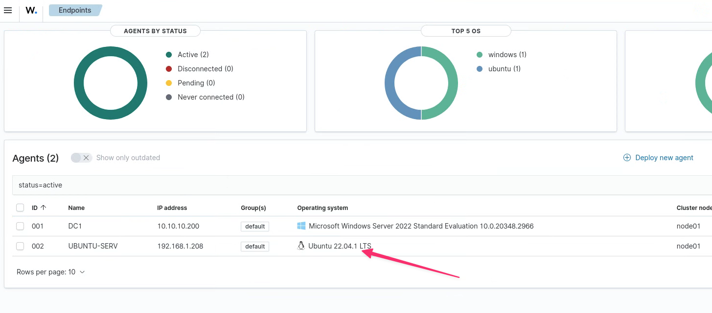
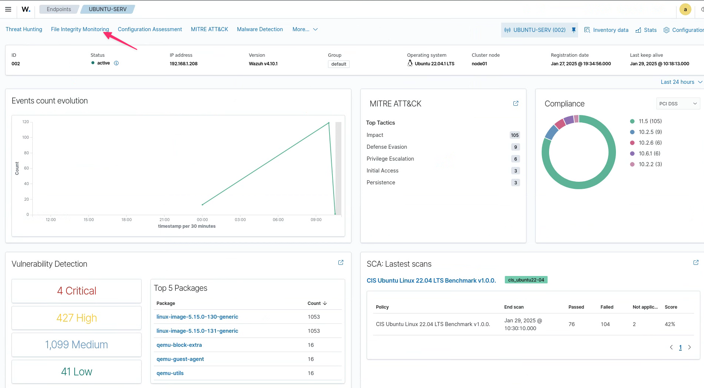
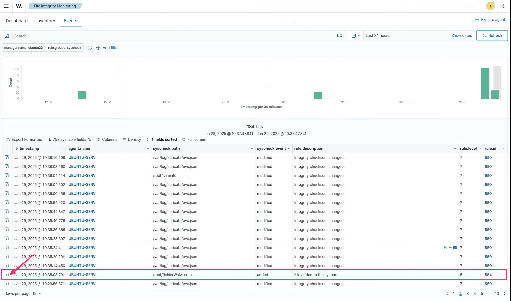
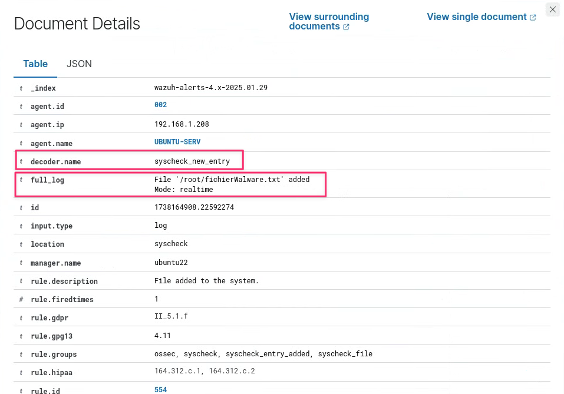

# Exercice 11 : Projet et FIM

### Informations
- Évaluation : **formatif**.
- Type de travail : en équipe de 3 ou 4.
- Durée estimée : 3 heures.
- Système d'exploitation : Linux, Windows.
- Environnement : Virtuel. 

### Objectifs  

- Installer et configurer un système de détection d’intrusion réseau et hôtes.  
- Configurer les droits d’accès aux journaux et aux serveurs de journaux, selon la politique de sécurité.
- Installer et configurer un serveur de journaux centralisé.  
- Lecture des journaux de serveurs Web pour comprendre les entrées.  
- Détecter et comprendre des entrées de sécurité dans les journaux.  
- Utiliser un logiciel pour lire les journaux.  
- Suivre en temps réel les journaux.  
- Configurer un pare-feu pour laisser passer les services d’un serveur.  
- Installer et configurer un outil de protection des logiciels malveillants.  
- Accéder de manière sécuritaire à un serveur ou un appareil réseau.  
- Installer et configurer un outil de protection des logiciels malveillants.  
- Appliquer une politique de vérification de l’authenticité de systèmes.  

### Description

Cet exercice va se diviser en deux parties. Dans la première partie, vous allez commencer l'installation d'un mini projet. Dans la deuxième partie, vous allez configurer la détection de modifications au système de fichiers (FIM).  

## Section 1 : mini projet  
### Description du projet

Notre projet va consister en un réseau principal et à une succursale. Le réseau principal va contenir un serveur Windows, un poste client Windows et un poste de contrôle Linux. La succursale va contenir un serveur Linux et un poste client Linux.

Voici la topologie :

  
**Figure 1 : Topologie du projet.**  

### Les VMs  

À la maison, vous aurez besoin de 8 VMs.  

- 2 VMs pour les pares-feu pfSense.  
- 1 VM serveur Ubuntu et 1 VM client Ubuntu du côté de la succursale. Vous pouvez utiliser d'autres distributions Linux si vous le désirez.  
- 1 VM client Linux du côté du réseau principal. Je recommande Kali Linux.  
- 1 VM Windows serveur et 1 VM Windows client du côté du réseau principal.  
- 1 VM serveur Ubuntu pour le serveur Wazuh.

Le réseau principal a déjà été monté dans l'exercice 3.  

Vous devriez avoir les VMs de la succursale déjà montées, à l'exception du pare-feu.  Je vous recommande de faire un clone de la VM pare-feu que vous avez déjà. Vous devrez changer le réseau LAN.  

Pour la plateforme CyberQuébec, vous avez deux services déjà complets de disponibles. Si vous aviez déjà commencé à travailler sur CyberQuébec, vous devriez avoir une partie du projet déjà configuré.

### Le VPN  

Vous devez configurer un VPN site à site entre le réseau principal et la succursale. Vous pouvez utiliser la technologie que vous voulez, mais je recommande OpenVPN ou WireGuard.  

Les pare-feu utilisés doivent avoir des accès sécurisés et limités à un poste de gestion pour chacun des réseaux.

### Dépôt GitHub  

Vous devez créer un dépôt GitHub pour votre projet :  

- Le dépôt sera privé avec chaque membre de l'équipe comme collaborateur. Vous devez également m'inclure comme collaborateur (claude-roy).  
- Vous devez inclure un fichier README.md avec au minimum les informations suivantes :  
	-  Nom du projet (vous pouvez lui donner un nom à votre goût).  
	-  Les noms des membres de l'équipe.  
	-  Date.  
	-  Description du projet.  
- Vous devez utiliser le format Markdown (md).  
- N'oubliez pas de donner vos sites de références.  
- Je vais vous indiquer les autres documents à inclure à fur et à mesure du développement du projet.  

Pour cette partie, vous devez créer un document nommé **PareFeu_VPN.md** décrivant votre VPN.  

- Topologie du projet.  
- Adresses réseau : adresses des LANs et adresse du VPN.  
- Information sur la configuration sécurisée des pare-feu.
- Technologie VPN utilisé.  
- Informations de configuration du VPN.  
- Toutes autres informations pertinentes.  

### Ajustement de l'agent  

Une fois que le VPN site à site est fonctionnel, ajuster l'agent sur le serveur Linux, de la succursale, pour qu'il se connecte sur le serveur Wazuh du côté Principal. Vous devez modifier le fichier `/var/ossec/etc/ossec.conf`. N'oubliez pas de relancer l'agent après.  

### Pondération du projet (40 %)  

- Dépôt GitHub 2 points  
- Topologie VPN 3 points  
- Installation pare-feu 3 points  
- Configuration du pare-feu 3 points  
- Installation Wazuh serveur 3 points  
- Installation Wazuh agent 3 points  
- FIM 5 points  
- Listes CDB 5 points  
- Intégration VirusTotal 5 points  
- Wazuh et Windows Logs 8 points  

## Section 2 : FIM  
Wazuh propose plusieurs fonctionnalités qui contribuent à son efficacité dans la détection des logiciels malveillants. Cela est rendu possible grâce à l'utilisation d'une combinaison d'analyse des journaux, de détection des intrusions et de renseignements sur les menaces (threat intelligence.). Il fournit également des alertes en temps réel, une corrélation des événements et la possibilité d'exécuter des scripts personnalisés pour des activités de réaction automatisées, ce qui en fait un outil puissant pour identifier et répondre efficacement aux attaques de logiciels malveillants. Voici quelques-unes des méthodes de détection des logiciels malveillants de Wazuh :  

- **Règles de détection des menaces et FIM (File Integrity Monitoring)** : dans cette méthode, Wazuh utilise sa capacité intégrée pour détecter toute modification critique des fichiers. Voici quelques-unes de ces capacités :  
	- Wazuh utilise un ensemble de principes de détection des menaces prédéfinis et surveillés en permanence. Le but de ces principes est d'identifier les activités, événements et modèles suspects qui peuvent indiquer des infections par des logiciels malveillants ou des failles de sécurité.  
	- La détection des logiciels malveillants de Wazuh repose largement sur FIM. Il surveille les modifications apportées aux fichiers et aux répertoires, telles que les ajouts et les suppressions. Wazuh génère une alerte lorsqu'un changement non autorisé ou imprévu se produit, ce qui peut indiquer une activité de logiciel malveillant.  
- **Détection du comportement des rootkits** : Wazuh utilise la fonction rootcheck pour détecter les anomalies qui pourraient indiquer la présence de logiciels malveillants dans un point de terminaison :  
	- Les rootkits sont une forme de logiciel malveillant qui peut masquer leur présence et d'autres actions malveillantes sur un système compromis. Wazuh identifie les activités de type rootkit à l'aide de techniques de détection basées sur le comportement.  
	- Wazuh recherche les comportements suspects du système, tels que l'escalade de privilèges non autorisée, les tentatives de dissimulation de fichiers ou de processus et d'autres activités généralement associées aux rootkits. Lorsqu'un tel comportement est identifié, une alerte est déclenchée.
- **Intégration de VirusTotal** : Wazuh détecte les fichiers malveillants grâce à l'intégration avec VirusTotal :  
	- VirusTotal est un service Web qui analyse les fichiers et les URL à la recherche de dangers potentiels à l'aide de plusieurs moteurs antivirus et de diverses sources de renseignements sur les menaces. Wazuh intègre VirusTotal pour améliorer ses capacités de détection des logiciels malveillants.  
	- Lorsque Wazuh rencontre un fichier ou une URL qu'il soupçonne d'être malveillant, il peut automatiquement soumettre l'échantillon à VirusTotal pour analyse. Le résultat inclut les conclusions de plusieurs moteurs antivirus, qui sont ensuite intégrées au mécanisme d'alerte de Wazuh. Si le fichier est identifié comme malveillant par plusieurs moteurs, la confiance dans l'alerte est renforcée.  
- **Intégration YARA** : Wazuh détecte les échantillons de malwares à l'aide de YARA, un outil open source qui identifie et classe les artefacts de malwares en fonction de leurs modèles binaires :  
	- YARA est un outil puissant qui vous permet d'écrire vos propres règles pour rechercher des malwares et certains modèles dans les fichiers et les processus. Wazuh fonctionne avec YARA, de sorte que les utilisateurs peuvent créer leurs propres règles que YARA utilisera pour rechercher des malwares adaptés à leurs besoins.  
	- Les professionnels de la sécurité peuvent utiliser l'intégration YARA pour créer des signatures personnalisées qui détectent des souches ou des comportements de malwares spécifiques qui ne sont pas couverts par les règles Wazuh normales. Ces règles personnalisées peuvent être ajoutées à l'ensemble de règles Wazuh et utilisées pour surveiller l'environnement.

### Détection de logiciels malvaillants en utilisant FIM
Lorsqu'un système est compromis par un logiciel malveillant, il peut créer de nouveaux fichiers ou modifier des fichiers existants, tels que les types de fichiers suivants :  

- Fichiers exécutables (.exe, .dll, .bat et .vbs)  
- Fichiers de configuration (.cfg et .ini)  
- Fichiers temporaires (.tmp)  
- Entrées de registre  
- Fichiers journaux (.log)  
- Fichiers de charge utile  
- Fichiers et répertoires cachés  
- Scripts batch (.bat)  
- PowerShell (.ps1)  
- Documents spécialement conçus avec une charge utile malveillante (.doc, .xls et .pdf)  

À l'aide de ces informations, nous pouvons créer une règle FIM dans Wazuh pour détecter toute modification de fichier. Cependant, nous recevrons également un nombre élevé d'alertes faussement positives. Pour résoudre ce problème, nous pouvons nous concentrer sur un répertoire ou un dossier spécifique.  

FIM est une technologie qui surveille l'intégrité des fichiers système et applicatifs. Elle protège les données sensibles, les fichiers d'application et les fichiers des appareils en surveillant, en analysant et en confirmant régulièrement leur intégrité. Elle fonctionne en détectant les modifications apportées aux fichiers critiques sur le réseau et, par conséquent, en réduisant le risque associé aux violations de données.  

Wazuh dispose d’une fonctionnalité intégrée pour la gestion de l’intégrité des fichiers (FIM). Cela est possible parce que Wazuh utilise un agent _Open Source HIDS Security_ (OSSEC). OSSEC est un système de détection d’intrusion basé sur l’hôte, gratuit et open source. Lorsqu’un utilisateur ou un processus crée, modifie ou supprime un fichier surveillé, le module FIM de Wazuh déclenche une alerte. Voyons comment fonctionne un contrôle d’intégrité de fichier en configurant un module FIM sur une machine Ubuntu.

#### Configuration et test FIM dans notre serveur Ubuntu  

Par défaut, le module FIM est activé sur l'agent Wazuh. La configuration du module FIM se trouve dans la balise `<syscheck>` dans le fichier `/var/ossec/etc/ossec.conf`. Vous devez ajouter des répertoires (à surveiller) sous le bloc `<syscheck>`.  

Dans le serveur Ubuntu (du côté succursale), ouvrez le fichier `/var/ossec/etc/ossec.conf`, vous devez être root : `sudo -s`. Déplacez-vous à la section `syscheck`. Modifier la section comme suit :  

~~~bash
<syscheck>
	  <disabled>no</disabled>
	
	  <!-- Frequency that syscheck is executed default every 12 hours -->
	  <frequency>43200</frequency>
	
	  <scan_on_start>yes</scan_on_start>
	
	  <!-- Directories to check -->
	  <directories check_all="yes" report_changes="yes" realtime="yes">/etc,/bin,/sbin,/root</directories>
	  <directories check_all="yes" report_changes="yes" realtime="yes">/usr/bin,/usr/sbin,/boot</directories>  
	  <directories check_all="yes" report_changes="yes" realtime="yes">/lib,/lib64,/usr/lib,/usr/lib64</directories>
	  <directories check_all="yes" report_changes="yes" realtime="yes">/var/www,/var/log,/var/named</directories>
	
	  <!-- Files/directories to ignore -->
	  <ignore>/etc/mtab</ignore>
	  <ignore>/etc/hosts.deny</ignore>
	  <ignore>/etc/mail/statistics</ignore>
	  <ignore>/etc/random-seed</ignore>
	  <ignore>/etc/adjtime</ignore>
	  <ignore>/etc/httpd/logs</ignore>
	  <ignore>/etc/utmpx</ignore>
	  <ignore>/etc/wtmpx</ignore>
	  <ignore>/etc/cups/certs</ignore>
	  <ignore>/etc/dumpdates</ignore>
	  <ignore>/etc/svc/volatile</ignore>
	  <ignore>/sys/kernel/security</ignore>
	  <ignore>/sys/kernel/debug</ignore>
	  <ignore>/sys</ignore>
	  <ignore>/dev</ignore>
	  <ignore>/tmp</ignore>
	  <ignore>/proc</ignore>
	  <ignore>/var/run</ignore>
	  <ignore>/var/lock</ignore>
	  <ignore>/var/run/utmp</ignore>
  
  <!-- Laisser le reste de la section tel quel -->
</syscheck>
~~~

Consulter la documentation de Wazuh pour déterminer les informations de configurations ci-dessus : [Local configuration (ossec.conf) syscheck](https://documentation.wazuh.com/current/user-manual/reference/ossec-conf/syscheck.html#directories).

	
Réponse :

- La balise `<disabled>` est définie sur _no_ pour activer le module syscheck sur Wazuh.  
- La balise `<scan_on_start>` est définie sur _yes_ pour effectuer une analyse initiale lorsque l'agent Wazuh est lancé.  
- La balise `<frequency>` est définie sur 43200 pour effectuer une analyse de surveillance des fichiers toutes les 43 200 secondes (12 h).  
- Les balises `<directories>` nous donnent les répertoires à surveiller. Dans cet exemple, nous surveillons les répertoires système importants tels que /etc, /bin, /sbin, /lib, /lib64, /usr/lib, /usr/lib64, /var/www, /var/log et /var/named.  
- Les balises `<ignore>` nous donnent les fichiers ou répertoires à ignorer pendant le processus de surveillance. Il s'agit de fichiers système courants qui ne sont généralement pas importants pour l'analyse FIM.

Relancer l'agent Wazuh :

~~~bash
sudo systemctl restart wazuh-agent
~~~

Déplacez-vous dans le répertoire de `/root` et créer un fichier : `touch fichierMalware.txt`.

Déplacez-vous sur le poste de contrôle, à partir du tableau de bord, cliquer sur les agents actifs.  

  
**Figure 2 : Agents actifs du tableau de bord.**  

Cliquer sur l'agent du serveur Ubuntu.  

  
**Figure 3 : Agent du serveur Ubuntu.**  

Cliquer sur File Integrity Monitoring.

  
**Figure 4 : FIM de l'agent du serveur Ubuntu.**  

Cliquer sur l'onglet _Events_.  

Retrouver l'événement de la création du fichier et cliquer sur la loupe à gauche.

  
**Figure 5 : Ajout d'un fichier dans le répertoire /root.**

On y retrouve l'information que le FIM a trouvé un changement, `decoder.name: syscheck_new_entry`, et on retrouve le changement trouvé à `full_log`.

  
**Figure 6 : Détails de l'événement.**
  
### Dépôt GitHub  

Pour cette partie, vous devez créer un document nommé **FIM.md** contenant :  

- Une description de FIM.  
- Une capture d'écran de l'événement de l'ajout d'un fichier dans le répertoire `/root` (comme la figure 5) et une courte explication de l'image.  
- Une capture d'écran du détail de l'événement (comme la figure 6) et une courte explication de l'image.  

## Références

- Security monitoring with Wazuh par Rajneesh Gupta  
- [Local configuration (ossec.conf) syscheck](https://documentation.wazuh.com/current/user-manual/reference/ossec-conf/syscheck.html#directories)
- [Documentations wazuh](https://documentation.wazuh.com/current/)  
- [Changement le mot de passe de l'utilisateur `admin` dans Wazuh.](https://documentation.wazuh.com/current/user-manual/user-administration/password-management.html#changing-the-password-for-single-user)  
- [Communauté ET](https://community.emergingthreats.net/)  

&copy; Claude Roy 2025