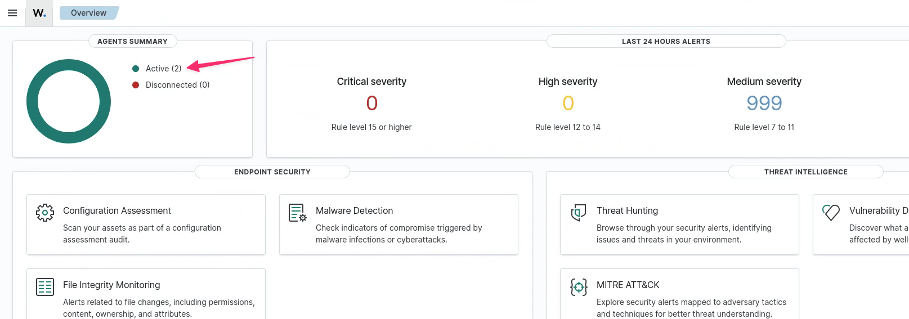
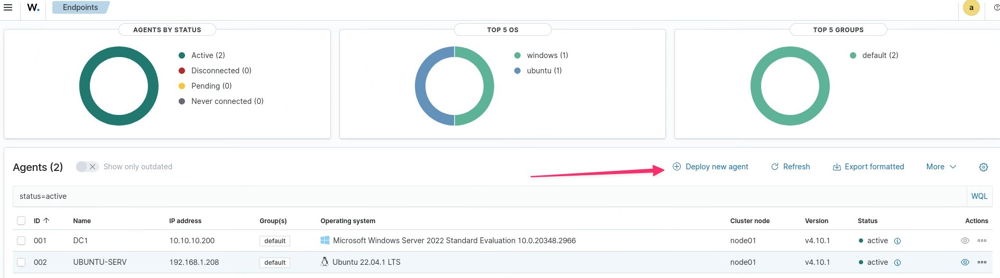
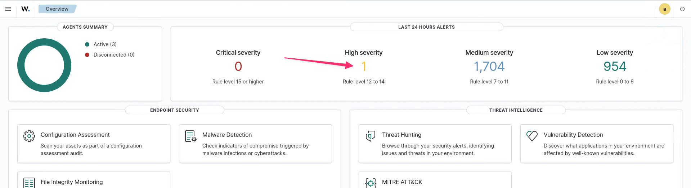
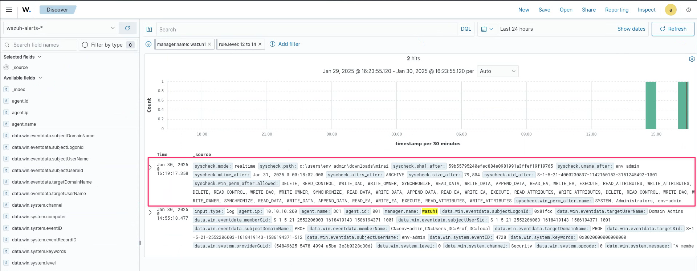
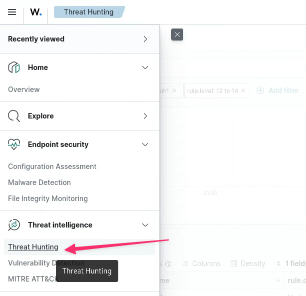
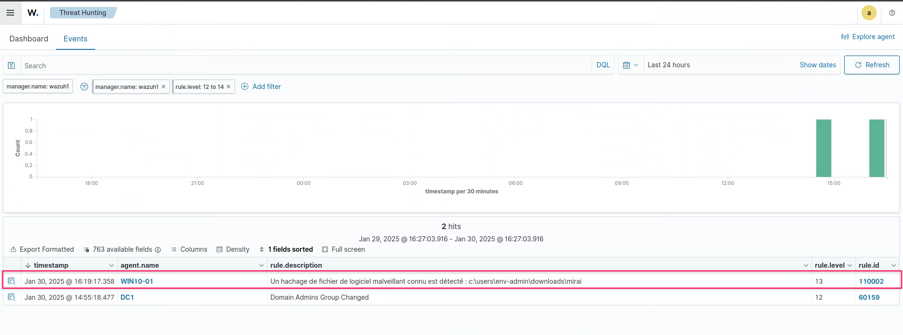
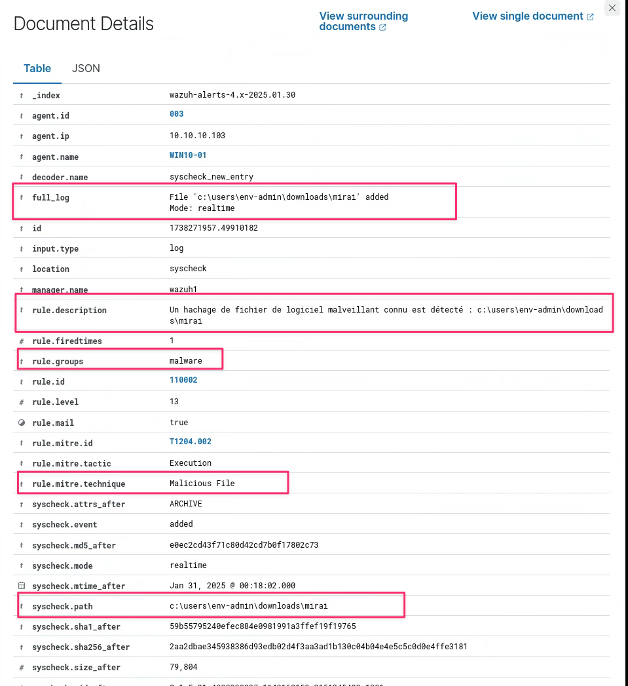

# Exercice 12 : Listes CDB

### Informations
- Évaluation : **formatif**.
- Type de travail : en équipe de 3.
- Durée estimée : 2 heures.
- Système d'exploitation : Linux, Windows.
- Environnement : Virtuel. 

### Objectifs  

- Installer et configurer un système de détection d’intrusion réseau et hôtes.  
- Configurer les droits d’accès aux journaux et aux serveurs de journaux, selon la politique de sécurité.
- Installer et configurer un serveur de journaux centralisé.  
- Lecture des journaux de serveurs Web pour comprendre les entrées.  
- Détecter et comprendre des entrées de sécurité dans les journaux.  
- Utiliser un logiciel pour lire les journaux.  
- Suivre en temps réel les journaux.  
- Configurer un pare-feu pour laisser passer les services d’un serveur.  
- Installer et configurer un outil de protection des logiciels malveillants.  
- Accéder de manière sécuritaire à un serveur ou un appareil réseau.  
- Installer et configurer un outil de protection des logiciels malveillants.  
- Appliquer une politique de vérification de l’authenticité de systèmes.  

### Description

Les listes CDB (constant database) de Wazuh servent de référentiel pour les hachages ou sommes de contrôle distincts des fichiers malveillants et bénins. La plateforme de sécurité Wazuh peut comparer précisément les représentations cryptographiques des fichiers sur un système et celles conservées dans une liste CDB. Les listes CDB se composent de listes d'utilisateurs, de hachages de fichiers, d'adresses IP, de noms de domaine, etc. 

Dans cet exercice, nous allons configurer le serveur Wazuh et un Windows pour utiliser une liste CDB. 

### Dépôt GitHub  

Pour cet exercice, vous devez créer un document nommé **ListesCDB.md** contenant :  

- Expliquer ce que sont les listes CDB.  
- Une explication de la liste CDB que vous avez créée.  
- La modification apportée au poste Windows pour détecter le changement dans le répertoire.  
- Des captures d'écrans, avec explication, de la découverte du malware **mirai**.  
- Une explication du malware **mirai** que vous avez découvert.

### Fonctionnement des listes CDB

Vous pouvez enregistrer une liste d'utilisateurs, de hachages de fichiers, d'adresses IP et de noms de domaine dans un fichier texte appelé liste CDB. Une liste CDB peut avoir des entrées ajoutées par une paire **clé:valeur** ou un format **clé:unique**. Les listes sur les CDBs peuvent fonctionner comme des listes d'autorisation ou de refus. Wazuh traite la liste CDB comme suit :    

1. **Génération de hachage** : les listes CDB se composent de hachages de contenu bon et mauvais, tels que des adresses IP, des hachages de logiciels malveillants et des noms de domaine. Un hachage est une valeur unique de longueur fixe générée en fonction du contenu de la liste CDB.  
2. **Comparaison de fichiers** : Wazuh calcule les hachages de fichiers lors d'une analyse du système et les compare aux entrées CDB.  
3. **Identification** : Wazuh marque un fichier comme potentiellement malveillant si son hachage correspond à un hachage malveillant connu dans la CDB.  
4. **Alertes et réactions** : en fonction des politiques définies, Wazuh a la capacité de déclencher des alertes ou des réponses lors de la détection.  

## Section 1 : Configuration du serveur Wazuh  

Les listes CDB sont stockées dans le répertoire `/var/ossec/etc/lists`.  

Connectez-vous au serveur Wazuh et listez le répertoire `/var/ossec/etc/lists`.

	
Résultat.
  

~~~bash
$ sudo ls -ahl /var/ossec/etc/lists/
total 32K
drwxrwx--- 3 root  wazuh 4.0K Jan 16 00:40 .
drwxrwx--- 7 wazuh wazuh 4.0K Jan 28 00:34 ..
drwxrwx--- 2 wazuh wazuh 4.0K Jan 16 00:40 amazon
-rw-rw---- 1 wazuh wazuh  107 Jan  8 12:30 audit-keys
-rw-rw---- 1 wazuh wazuh 2.3K Jan 16 00:40 audit-keys.cdb
-rw-rw---- 1 wazuh wazuh  892 Jan  8 12:30 security-eventchannel
-rw-rw---- 1 wazuh wazuh 6.4K Jan 16 00:40 security-eventchannel.cdb

~~~

  

Vous pouvez voir qu'il existe déjà des listes de configurées.  

Nous devons configurer notre serveur Wazuh avec la liste CDB des hachages de logiciels malveillants et créer les règles requises pour déclencher des alertes lorsqu'un fichier avec un hachage correspond aux hachages de logiciels malveillants CDB. Nous devons suivre ces étapes pour y parvenir :  

1. **Créez un fichier dans la liste CDB** : les listes CDB sont stockées dans le répertoire `/var/ossec/etc/lists` sur le serveur Wazuh. Pour ajouter une nouvelle liste CDB pour les hachages de logiciels malveillants, créez un nouveau fichier avec le nom `malware-hashes`.  
2. **Ajoutez des hachages de logiciels malveillants** : nous devons saisir les hachages de logiciels malveillants connus dans une paire `clé:valeur` où la clé sera le hachage réel du logiciel malveillant et la valeur sera le nom ou le mot-clé. Il existe désormais plusieurs sources à partir desquelles nous pouvons télécharger et utiliser les hachages de logiciels malveillants pour la liste CDB. L'une des sources les plus populaires est une liste publiée par Nextron Systems. Vous pouvez consulter et télécharger la liste à partir de la page officielle GitHub ([https://github.com/Neo23x0/signature-base/blob/master/iocs/hash-iocs.txt](https://github.com/Neo23x0/signature-base/blob/master/iocs/hash-iocs.txt)). Pour notre exercice, vous allez inclure le hashe de quelques malwares. Modifier le fichier `/ossec/etc/lists/malware-hashes` avec les informations suivantes :  

~~~config
e0ec2cd43f71c80d42cd7b0f17802c73:mirai
55142f1d393c5ba7405239f232a6c059:Xbash
F71539FDCA0C3D54D29DC3B6F8C30E0D:fanny
~~~  

3. **Ajoutez la liste CDB sous l'ensemble de règles par défaut** : en indiquant l'emplacement de la liste CDB dans le bloc `<ruleset>`, vous pouvez ajouter une référence à la liste CDB dans le fichier de configuration du gestionnaire Wazuh `/var/ossec/etc/ossec.conf` :  

~~~config
<!-- Trouver la balise ruleset -->
<ruleset>
  <!-- Default ruleset -->
  <!-- Ajouter à la fin des listes existantes. -->
  <list>etc/lists/malware-hashes</list>
  <!-- Laisser le reste tel quel -->
</ruleset>
~~~  

4. **Écrivez une règle pour comparer les hachages** : créez une règle personnalisée dans le fichier `/var/ossec/etc/rules/local_rules.xml` du serveur Wazuh. Lorsque Wazuh trouve une correspondance entre le hachage MD5 d'un fichier récemment créé ou mis à jour et un hachage de malware dans la liste CDB, cette règle se déclenche. Lorsqu'un événement se produit indiquant qu'un fichier nouvellement créé ou modifié existe, les règles 554 et 550 seront déclenchées :  

~~~config
<!-- Ajouter à la fin du fichier -->
<!-- Regle pour malware -->
<group name="malware,">
  <rule id="110002" level="13">
    <if_sid>554, 550</if_sid>
    <list field="md5" lookup="match_key">etc/lists/malware-hashes</list>
    <description>Un hachage de fichier de logiciel malveillant connu est détecté : $(file)</description>
    <mitre>
      <id>T1204.002</id>
    </mitre>
  </rule>
</group>
~~~  

5. **Redémarrez le manger** : nous devons redémarrer le gestionnaire Wazuh pour appliquer les modifications :  

~~~bash
systemctl restart wazuh-manager
~~~  

## Section 2 : Configuration d'un Windows  

Vous allez configurer votre Windows 10 avec un agent Wazuh relié au serveur Wazuh du réseau Principal. Consulter l'exercice 9 pour l'installation de l'agent. Je vous recommande de vous connecter avec le compte local **env-admin**. Pour trouver **Deploy new agent**, comme vous avez déjà des agents, à partir du tableau de bord, vous cliquer sur les agents actifs, puis sur **Deploy new agent**.

  
**Figure 1 : Agents actifs.**  

  
**Figure 2 : Déploie un nouvel agent.**  

  
	
Un exemple de la commande de déploiement.
  
	
~~~PowerShell
Invoke-WebRequest -Uri https://packages.wazuh.com/4.x/windows/wazuh-agent-4.10.1-1.msi -OutFile $env:tmp\wazuh-agent; msiexec.exe /i $env:tmp\wazuh-agent /q WAZUH_MANAGER='10.10.10.101' WAZUH_AGENT_NAME='WIN10-01' 

NET START WazuhSvc
~~~  

  

Par la suite, vous allez configurer l'agent Wazuh pour qu'il détecte un changement de fichiers dans le répertoire de téléchargement de votre utilisateur. Vous devez éditer le fichier d'agent `ossec.conf` situé dans `C:\Program Files (x86)\ossec-agent`.  

~~~config
<ossec_config>
  <syscheck>
          
    <!-- Mettre après la balise frequency -->
    <!-- Entrer de vérification de Malware -->        
    <directories check_all="yes" realtime="yes">C:\Users\env-admin\Downloads</directories>
    <!-- Ne rien changer d'autre. -->
  </syscheck>
</ossec_config>
~~~

Vous devez relancer l'agent Wazuh :  

~~~PowerShell
NET STOP WazuhSvc
NET START WazuhSvc
~~~  

## Section 3 : Vérification  

Pour la vérification, vous allez télécharger un malware.

**Attention : le fichier que vous allez télécharger est un véritable malware. Ne pas le placer dans votre ordinateur, mais seulement dans une VM.**  

Utiliser un navigateur pour télécharger le fichier mirai.zip au lien suivant : 
[https://mega.nz/folder/mHQGgQIQ#KYbfITk-ghb3mc_PPhB5vw](https://mega.nz/folder/mHQGgQIQ#KYbfITk-ghb3mc_PPhB5vw) ou [https://tinyurl.com/5a4an6x2](https://tinyurl.com/5a4an6x2). Vous devez désactiver l'antivirus de Windows dans Windows Security avant de télécharger le fichier. Décompresser le fichier dans le répertoire `Downloads`, le mot de passe pour l'ouvrir est 420-DN4.  

Déplacez-vous sur le poste de contrôle, dans le tableau de bord, vous devriez voir une alerte **High severity**. Cliquer dessus.

  
**Figure 3 : Alerte de haute sévérité.**  

Vous avez l'information du Malware.  

  
**Figure 4 : Information du malware.**  

Maintenant, aller dans le **Threat Hunting** :

  
**Figure 5 : Menu Threat Hunting.**  

Wazuh vous indique le changement dans l'agent Windows 10.

  
**Figure 6 : Malware détecté.**  

Cliquer sur la loupe à gauche pour avoir les détails.

  
**Figure 7 : Détails de l'alerte malware.**  

N'oubliez pas d'effacer le fichier malicieux de votre Windows (vider la corbeille) et d'activer l'antivirus.

## Références

- Security monitoring with Wazuh par Rajneesh Gupta  
- [Documentation : Using CDB lists](https://documentation.wazuh.com/current/user-manual/ruleset/cdb-list.html)  
- [Local configuration (ossec.conf) syscheck](https://documentation.wazuh.com/current/user-manual/reference/ossec-conf/syscheck.html#directories)
- [Documentations wazuh](https://documentation.wazuh.com/current/)  
- [Changement le mot de passe de l'utilisateur `admin` dans Wazuh.](https://documentation.wazuh.com/current/user-manual/user-administration/password-management.html#changing-the-password-for-single-user)  

&copy; Claude Roy 2025