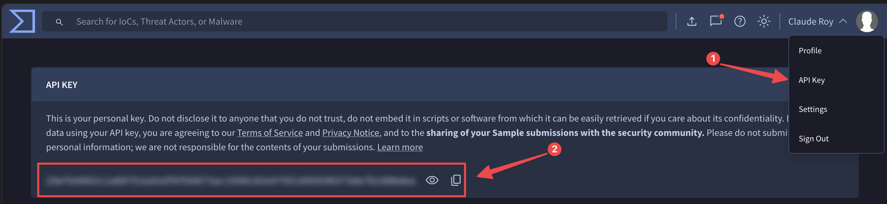
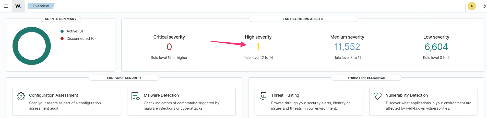
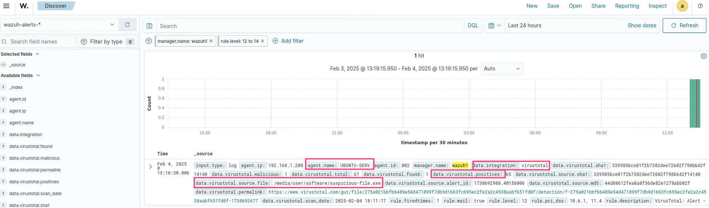
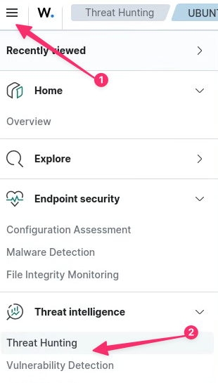
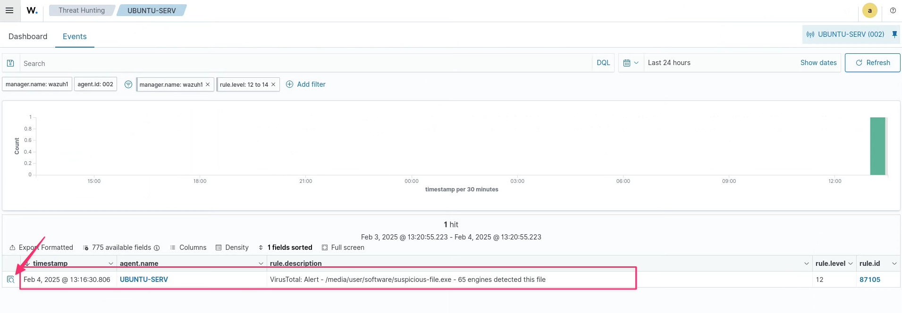
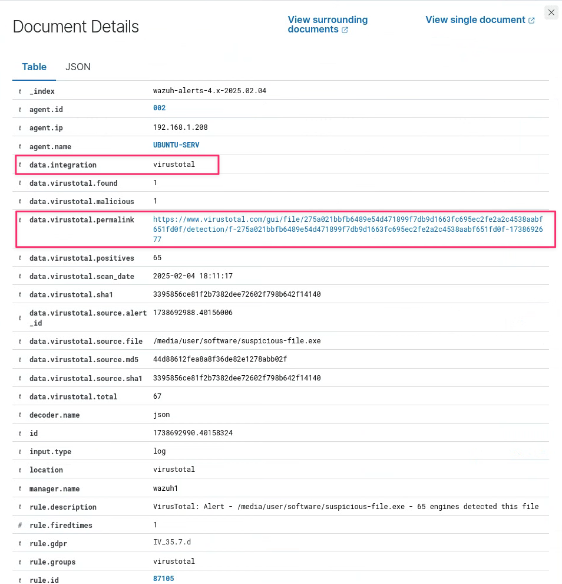
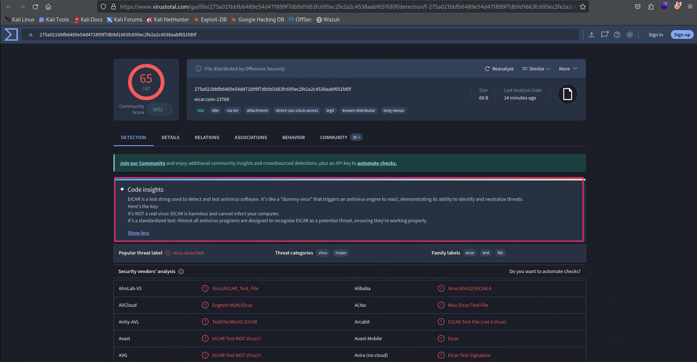

# Exercice 13 : Intégration de VirusTotal

### Informations
- Évaluation : **formatif**.
- Type de travail : en équipe de 3.
- Durée estimée : 2 heures.
- Système d'exploitation : Linux, Windows.
- Environnement : Virtuel. 

### Objectifs  

- Installer et configurer un système de détection d’intrusion réseau et hôtes.  
- Configurer les droits d’accès aux journaux et aux serveurs de journaux, selon la politique de sécurité.
- Installer et configurer un serveur de journaux centralisé.  
- Lecture des journaux de serveurs Web pour comprendre les entrées.  
- Détecter et comprendre des entrées de sécurité dans les journaux.  
- Utiliser un logiciel pour lire les journaux.  
- Suivre en temps réel les journaux.  
- Configurer un pare-feu pour laisser passer les services d’un serveur.  
- Installer et configurer un outil de protection des logiciels malveillants.  
- Accéder de manière sécuritaire à un serveur ou un appareil réseau.  
- Installer et configurer un outil de protection des logiciels malveillants.  
- Appliquer une politique de vérification de l’authenticité de systèmes.  

### Description

VirusTotal est un service en ligne gratuit qui analyse les fichiers et les URL pour détecter les programmes malveillants et autres contenus malveillants. Il utilise plus de 70 types de logiciels antivirus et de bloqueurs d'URL pour fournir des informations détaillées sur le fichier, l'URL ou l'adresse IP soumis. VirusTotal permet aux utilisateurs de contribuer à leurs propres découvertes et de soumettre des commentaires sur les fichiers et les URL. Ces contributions peuvent aider à améliorer la précision du service et fournir des informations précieuses aux autres utilisateurs. VirusTotal fournit une API avec plusieurs plans payants. Cependant, il propose également un plan gratuit où vous pouvez demander quatre recherches par minute avec un devis quotidien de 500 recherches.

Dans cet exercice, nous allons utiliser le module FIM pour détecter un changement, puis utiliser VirusTotal pour vérifier les fichiers dans ce répertoire.  

### Dépôt GitHub  

Pour cet exercice, vous devez créer un document nommé **IntegrationVirusTotal.md** contenant :  

- Une description de l'intégration de VirusTotal à Wazuh. Vous pouvez utiliser la page de documentation de Wazuh comme référence (voir les références de ce document).  
- Les modifications, avec explications, que vous avez faites aux fichiers `/var/ossec/etc/ossec.conf`, et `/var/ossec/etc/rules/local_rule.xml` du serveur Wazuh et `/var/ossec/etc/ossec.conf` de l'agent Wazuh.  
- Une explication de la raison d'utiliser le fichier de test EICAR.  
- L'événement de l'alerte de la détection du fichier malicieux, avec explication.  

## Intégrer VirusTotal
### Créer un compte VirusTotal

Vous devez aller sur le site Web [VirusTotal.com](https://www.virustotal.com/) et vous créer un compte en cliquant sur **Sign Up**.  

Une fois que la vérification de votre courriel a été faite, cliquer sur votre profil, choisir **API key** et copier la clé à un endroit sécuritaire.

  
**Figure 1 : Clé API de VirusTotal.**

### Intégrer VirusTotal au serveur Wazuh

Wazuh a des scripts d'intégration pour VirusTotal situés dans `/var/ossec/integrations`.   

Lister le répertoire `/var/ossec/integrations`.  

Avez-vous trouvé un script pour VirusTotal ?

	
Réponse.

	
Oui!
	
~~~bash  

root@wazuh1:/var/ossec/integrations# ll
total 84
drwxr-x---  2 root wazuh  4096 Jan 17 18:19 ./
drwxr-x--- 20 root wazuh  4096 Jan 17 18:20 ../
-rwxr-x---  1 root wazuh  1045 Jan 15 11:07 maltiverse*
-rwxr-x---  1 root wazuh 19577 Jan 15 11:07 maltiverse.py*
-rwxr-x---  1 root wazuh  1045 Jan 15 11:07 pagerduty*
-rwxr-x---  1 root wazuh  6449 Jan 15 11:07 pagerduty.py*
-rwxr-x---  1 root wazuh  1045 Jan 15 11:07 shuffle*
-rwxr-x---  1 root wazuh  7249 Jan 15 11:07 shuffle.py*
-rwxr-x---  1 root wazuh  1045 Jan 15 11:07 slack*
-rwxr-x---  1 root wazuh  6835 Jan 15 11:07 slack.py*
-rwxr-x---  1 root wazuh  1045 Jan 15 11:07 virustotal*
-rwxr-x---  1 root wazuh 10691 Jan 15 11:07 virustotal.py*
	
~~~

Pour que ce script soit appelé, vous devez ajouter une balise `<integration>` dans le fichier de configuration  `/var/ossec/etc/ossec.conf` comme indiqué ci-dessous :

~~~bash  

<ossec_config>

<!-- Je l'ai placé après la section Osquery integration -->
  <!-- VirusTotal integration -->
  <integration>
    <name>virustotal</name>
    <api_key>VOTRE_CLE_API_VIRUS_TOTAL</api_key> <!-- Mettre votre clé API. -->
    <rule_id>100200,100201</rule_id>
    <alert_format>json</alert_format>
  </integration>
  
  <!-- Ne rien changer d'autre. -->
</ossec_config>

~~~

Voici des informations sur le code ci-dessus :  

- `<api_key>` : représente la clé API de VirusTotal. Vous retrouvez cette clé dans votre profil de compte sur le site Web de VirusTotal.  
- `<rule_id>100200,100201</rule_id>` : indique la règle qui déclenche l'inspection de VirusTotal. Dans ce cas, nous avons les IDs de règle 100200 et 100201. Nous n'avons pas encore créé ces règles ; nous allons les écrire pour détecter les modifications de fichiers dans un dossier spécifique du poste à surveiller.  

### Créer une règle dans le serveur Wazuh  

Nous souhaitons maintenant déclencher l'analyse VirusTotal uniquement lorsqu'un fichier est modifié, ajouté ou supprimé afin d'éviter des tonnes d'alertes faussement positives. Nous allons créer une règle FIM avec un ID de 100200 et 100201 dans le fichier `local_rule.xml` situé dans `/var/ossec/etc/rules` dans le gestionnaire Wazuh.

~~~config
<!-- Ajouter à la fin du fichier -->
<!-- Règle pour les systèmes Linux -->
<group name="syscheck,pci_dss_11.5,nist_800_53_SI.7,">
    <rule id="100200" level="7">
        <if_sid>550</if_sid>
        <field name="file">/media/user/software</field>
        <description>Un fichier a été modifié dans le répertoire /media/user/software.</description>
    </rule>
    <rule id="100201" level="7">
        <if_sid>554</if_sid>
        <field name="file">/media/user/software</field>
        <description>Un fichier a été ajouté au répertoire /media/user/software.</description>
    </rule>
</group>  

~~~

Relancer le manager Wazuh.

Voici des informations sur le code ci-dessus :  

- `<if_sid>550</if_sid>` : cette balise spécifie une condition qui déclenche cette règle. Elle est déclenchée lorsque l'ID d'événement (SID) 550 se produit. La règle Wazuh 550 indique que la somme de contrôle d'intégrité a changé.  
- `<if_sid>554</if_sid>` : cette règle se déclenche lorsque l'ID d'événement 554 se produit. La règle Wazuh indique qu'un fichier a été ajouté au système.  

### Ajouté une vérification FIM sur le serveur Ubuntu  

Nous voulons que l'agent Wazuh détecte d'abord toute modification de fichier dans le répertoire `/media/user/software` et cela déclenchera l'ID de règle Wazuh 100200 et 100201.

Vérifier et faire les configurations suivantes :  

1. **Assurez-vous que syscheck est activé** : recherchez le bloc `<syscheck>` dans le fichier de configuration de l'agent Wazuh `/var/ossec/etc/ossec.conf`. Assurez-vous que `<disabled>` est défini sur **no**. Cela permet au FIM Wazuh de surveiller les modifications de répertoire.  
2. **Surveillez le répertoire racine pour toute modification de fichier** : dans l'agent Wazuh Ubuntu, vous devez ajouter le répertoire `/media/user/software` pour une vérification FIM à l'intérieur d'une balise `<directories check_all="yes" report_changes="yes" realtime="yes">`. Comme on a fait pour le répertoire `/root`. 
3. **Redémarrez l'agent Wazuh** : pour que les modifications FIM prennent effet dans le fichier `ossec.conf`, nous devons redémarrer l'agent Wazuh avec la commande suivante : `sudo systemctl restart wazuh-agent`.

N'oubliez pas de créer le répertoire `/media/user/software` sur le serveur Ubuntu.

### Tester la détection de malware

Pour tester la détection des logiciels malveillants à l'aide de VirusTotal, nous utiliserons le fichier de test de l'Institut européen de recherche sur les antivirus informatiques (EICAR - European Institute for Computer Antivirus Research). Un fichier de test EICAR est utilisé pour tester la réponse des logiciels antivirus et il est créé par l'Institut européen de recherche sur les antivirus informatiques (EICAR) et la Computer Antivirus Research Organization (CARO). Vous pouvez télécharger le fichier de test **eicar_com.zip** à partir de leur site Web officiel : [https://www.eicar.org/download-anti-malware-testfile/](https://www.eicar.org/download-anti-malware-testfile/).

**Remarque** : si vous testez sur une machine Windows avec Google Chrome, vous devez désactiver l'option **Enhanced security** sur Google Chrome et Edge, vous devez également désactiver l'option **Microsoft Defender SmartScreen** dans Edge et la protection en temps réel (**Real-time protection**) sur Windows Defender pour autoriser le téléchargement.

Comme nous allons faire le test sur un serveur Ubuntu, nous allons utiliser `curl` pour télécharger le fichier.

Déplacez-vous sur le serveur Ubuntu et utilisez la commande suivante pour télécharger le fichier :

~~~bash
$ sudo curl -Lo /media/user/software/suspicious-file.exe https://secure.eicar.org/eicar.com
~~~

### Visualisation des alertes

Dans le tableau de bord de Wazuh, vous devriez avoir une nouvelle alerte critique.  

  
**Figure 2 : Alerte de haute sévérité.**  

Cliquer sur l'alerte pour voir les informations de l'alerte VirusTotal.

  
**Figure 3 : Détails de l'alerte de haute sévérité.**  

Allez dans la section **Threat Hunting / Events**.  

  
**Figure 4 : Menu Threat Hunting.**  

Vous devriez avoir un nouvel événement. Cliquer sur la loupe à gauche pour avoir les détails de l'événement.

  
**Figure 5 : Événement VirusTotal.**  

  
**Figure 6 : Détails de l'événement VirusTotal.**  

Voici des informations sur le code ci-dessus :  

- `data.integration: virustotal` : ceci représente l'intégration tierce utilisée dans Wazuh. Dans ce cas, il s'agit de VirusTotal.  
- `data.virustotal.permalink` : ceci représente l'URL de la page de détection de VirusTotal.

Cliquer sur le lien de `data.virustotal.permalink` pour avoir les informations de VirusTotal sur la menace détectée.

VirusTotal a-t-il détecté le fichier comme un véritable virus ?  

	
Réponse.
  

Non! VirusTotal a reconnu le fichier EICAR.

  
**Figure 7 : Informations sur la menace sur le site VirusTotal.**  

  

Vous pouvez effacer le fichier EICAR sur le serveur Ubuntu.

## Références

- Security monitoring with Wazuh par Rajneesh Gupta  
- [Intégration de VirusTotal à Wazuh](https://documentation.wazuh.com/current/user-manual/capabilities/malware-detection/virus-total-integration.html).  
- [Local configuration (ossec.conf) syscheck](https://documentation.wazuh.com/current/user-manual/reference/ossec-conf/syscheck.html#directories)
- [Documentations wazuh](https://documentation.wazuh.com/current/)  
- [Changement le mot de passe de l'utilisateur `admin` dans Wazuh.](https://documentation.wazuh.com/current/user-manual/user-administration/password-management.html#changing-the-password-for-single-user)  

&copy; Claude Roy 2025