# Exercice 14 : Intégration des journaux de Windows

### Informations
- Évaluation : **formatif**.
- Type de travail : en équipe de 3.
- Durée estimée : 3 heures.
- Système d'exploitation : Linux, Windows.
- Environnement : Virtuel. 

### Objectifs  

- Installer et configurer un système de détection d’intrusion réseau et hôtes.  
- Configurer les droits d’accès aux journaux et aux serveurs de journaux, selon la politique de sécurité.
- Installer et configurer un serveur de journaux centralisé.  
- Lecture des journaux de serveurs Web pour comprendre les entrées.  
- Détecter et comprendre des entrées de sécurité dans les journaux.  
- Utiliser un logiciel pour lire les journaux.  
- Suivre en temps réel les journaux.  
- Configurer un pare-feu pour laisser passer les services d’un serveur.  
- Installer et configurer un outil de protection des logiciels malveillants.  
- Accéder de manière sécuritaire à un serveur ou un appareil réseau.  
- Installer et configurer un outil de protection des logiciels malveillants.  
- Appliquer une politique de vérification de l’authenticité de systèmes.  

### Description

Windows Defender est un module logiciel antivirus de Microsoft Windows. Selon le rapport sur le marché des antivirus 2024, Plus de la moitié (54 %) des utilisateurs utilisent l'antivirus par défaut ou aucun antivirus. Pour plus d'informations à ce sujet, vous pouvez consulter le lien suivant : [https://www.security.org/antivirus/antivirus-consumer-report-annual/](https://www.security.org/antivirus/antivirus-consumer-report-annual/). De plus, Microsoft propose également des solutions de sécurité des terminaux pour les entreprises appelées Windows Defender for Endpoint. Cela nous incite à accorder plus d'attention à l'intégration de Windows Defender avec Wazuh. Par défaut, Wazuh ne peut pas lire les journaux de Windows Defender. Il est donc important pour nous de faire des efforts supplémentaires pour rendre cela possible.

Les codes malveillants qui fonctionnent directement dans la mémoire d’un ordinateur plutôt que sur le disque dur sont appelés malwares sans fichier. Ils sont « sans fichier » dans le sens où aucun fichier n’est téléchargé sur votre disque dur lorsque votre machine est infectée. Cela rend leur détection plus difficile à l’aide d’outils antivirus ou anti-malware traditionnels, qui analysent principalement les fichiers du disque.

Sysmon est un pilote de périphérique et un service système Windows qui offre des capacités avancées de surveillance et de journalisation. Il a été créé par l’équipe Sysinternals de Microsoft pour surveiller divers aspects de l’activité du système, tels que les processus, les connexions réseau et les modifications de fichiers. Bien que Sysmon ne se concentre pas spécifiquement sur la détection des malwares sans fichier, ses capacités de surveillance complètes peuvent sans aucun doute aider à identifier et à atténuer l’impact des attaques de malwares sans fichier. Nous pouvons améliorer les capacités de détection des malwares de Wazuh en installant Sysmon sur chaque machine Windows. Pour tester la détection des attaques sans fichier, nous utiliserons l’outil APTSimulator pour simuler l’attaque et les visualiser sur le gestionnaire Wazuh.

Dans cet exercice, nous allons intégrer les journaux de Windows Defender dans Wazuh. Nous allons également tenter de détecter un malware sans fichier en utilisant Sysmon.  

### Dépôt GitHub  

Pour cet exercice, vous devez créer un document nommé **WazuhWindows.md** contenant : 

- Une description de l'intégration de Windows Defender et de Sysmon dans Wazuh.  
- Une explication de l'utilité d'intégrer les journaux de Windows Defender dans Wazuh.  
- La configuration du serveur et de l'agent Wazuh pour l'intégration des journaux de Windows Defender.  
- Une explications de l'endroit on se trouve (dans le système de fichier du serveur) les fichiers de configuration centralisée des agents dans le serveur Wazuh (consulter la documentation de Wazuh).  
- Décrire l'utilisation de la commande utilisée sur le serveur pour pousser la configuration aux agents.  
- Décrire l'utilisation de la commande utilisée sur le serveur pour relancer un agent.  
- Le résultat de la détection de malware dans Wazuh par Windows Defender sur Windows 10.  

## Section 1 : Les journaux de Windows Defender  

Les journaux Windows Defender aident les analystes SOC à comprendre l’état de sécurité des points de terminaison Windows, à identifier les cybermenaces potentielles et à enquêter sur les incidents de sécurité. Les journaux Windows Defender englobent plusieurs éléments d’information tels que les activités d’analyse, la détection des menaces, les mises à jour, la quarantaine, la correction, les activités du pare-feu et du réseau, ainsi que la protection en temps réel.  

### Travailler avec les journaux de Windows Defender  

Commençons par comprendre où sont stockés les journaux Defender. Vous pouvez afficher les journaux dans l’Observateur d’événements (Event Viewer).  

Accédez à l'Observateur d’événements, puis : **Applications and Services Logs | Microsoft | Windows | Windows Defender | Operational**.

L’onglet général vous donnera des informations sur le type d’analyse et les informations sur l’utilisateur.  

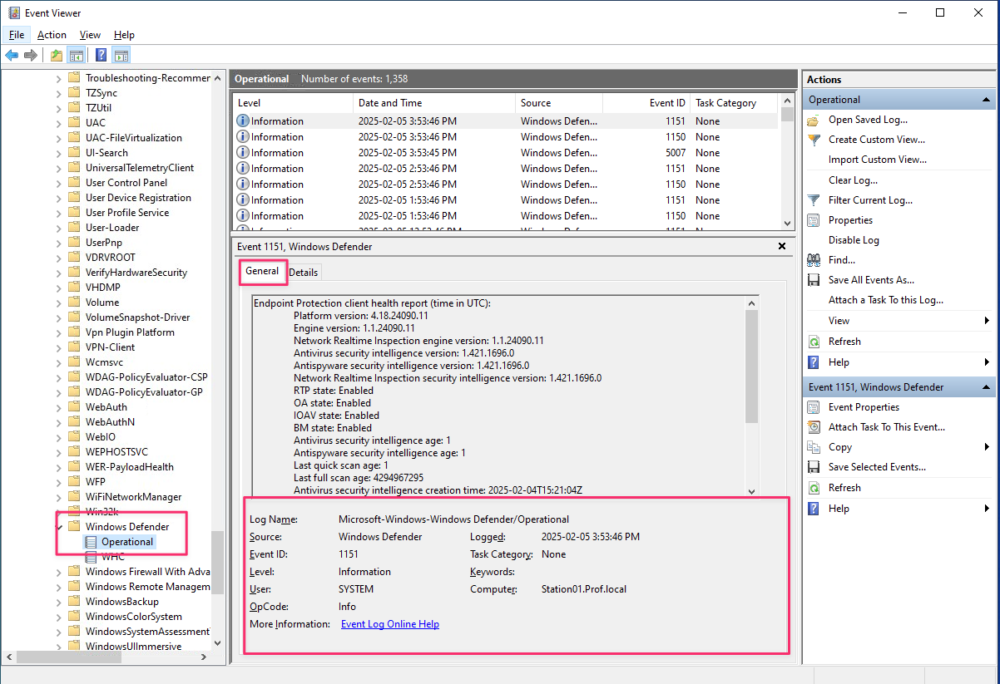  
**Figure 1 : Event Viewer.**

Cependant, l’onglet **Détails** vous donnera des informations complètes sur les détections de menace.  

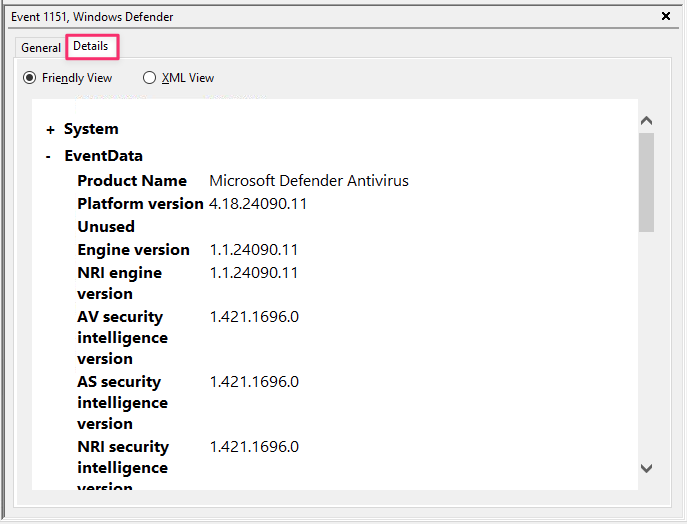  
**Figure 2 : Event Viewer details.**

### Configuration de l'agent Wazuh

Pour collecter les journaux Windows Defender, vous devez configurer l'agent Wazuh à l'aide du gestionnaire Wazuh ou localement à l'aide du fichier d'agent `ossec.conf` situé dans `C:\Program Files (x86)\ossec-agent`.  

Dans un grand réseau, accéder manuellement à chaque agent Wazuh et effectuer les modifications dans chaque agent est une tâche fastidieuse. Wazuh nous aide avec le fichier `agent.conf`, qui transmet la configuration à des groupes d'agents spécifiques.  

Voici le lien pour la documentation de `agent.conf` : [Centralized configuration (agent.conf)](https://documentation.wazuh.com/current/user-manual/reference/centralized-configuration.html)  

Pour débuter, on doit créer un groupe **Windows**. Connectez-vous au tableau de bord Wazuh, dans le menu à gauche (3 petites barres) accédez à **Agent Management | Groups**. Ajouter un groupe en cliquant sur **Add new group**

  
**Figure 3 : Ajouter un nouveau groupe.**

Nommer le groupe **Windows** et cliquer sur **Save new group**.  

On doit maintenant ajouter les agents Windows au groupe **Windows**. Accéder à **Agent Management | Summary**. Sélectionner les deux agents Windows, cliquer sur **More** et cliquer sur **Add groups to agents (2)**.

  
**Figure 4 : Ajouter le groupe à l'agent.**

Choisir le groupe Windows cliquer **Save**.  

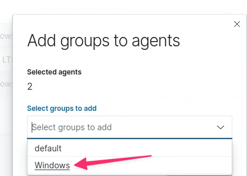  
**Figure 5 : Sélection du groupe Windows.**

Retournez à **Agent Management | Groups** et cliquez sur l'éditeur de groupe (le crayon dans la colone **Actions** du groupe).

  
**Figure 6 : Éditer un groupe.**

Pour transférer les journaux Microsoft Defender vers l'agent Wazuh, vous devez ajouter la balise `<localfile>` dans le fichier `agent.conf` comme indiqué ci-dessous :  

~~~config

<agent_config>

  <!-- Shared agent configuration here -->
  
  <!-- Transfert des journaux de Microsoft Defender -->
  <localfile>
    <location> Microsoft-Windows-Windows Defender/Operational</location>
    <log_format>eventchannel</log_format>
  </localfile>

</agent_config>
  
  
~~~  

Voici les informations de la configuration :  

- `<localfile>` : cette balise est utilisée pour définir le fichier journal local ou le chemin d'accès au fichier que l'agent Wazuh doit surveiller.  
- `<location> Microsoft-Windows-Windows Defender/Operational</location>` : ceci représente l'emplacement ou le chemin du fichier journal que Wazuh doit surveiller. Dans ce cas, il surveille l'emplacement du journal Microsoft-Windows-Windows Defender/Operational.  
- `<log_format>` : cette balise spécifie le format.

Cliquer sur **Save**.  

Pour que ces modifications prennent effet, vous devez attendre 10 secondes ou redémarrer l'agent Wazuh. Sur la VM Windows 10 :  

~~~PowerShell
NET STOP WazuhSvc
NET START WazuhSvc
~~~

**Remarque** : Pour vérifier l’emplacement des événements Windows Defender, vous pouvez également accéder à l’emplacement **Microsoft | Windows | Windows Defender | Operational** dans l’Observateur d’événements (Event Viewer) et vérifier le nom du journal comme indiqué dans la figure suivante.

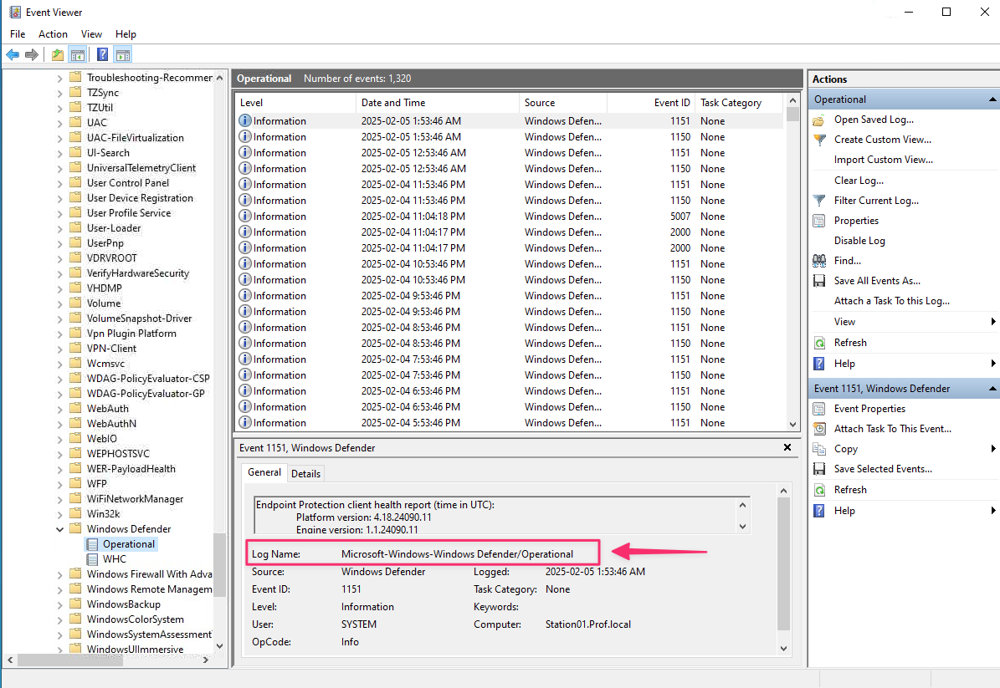  
**Figure 7 : Emplacement des événements Windows Defender.**

### Tester la détection d'un malware

Encore ici, nous allons utiliser le fichier de test EICAR. Vous pouvez télécharger le fichier de test **eicar_com.zip** à partir de leur site Web officiel : [https://www.eicar.org/download-anti-malware-testfile/](https://www.eicar.org/download-anti-malware-testfile/). Télécharger le fichier dans le dossier **Downloads**.

**Remarque** : vous devez désactiver l'option **Enhanced security** sur Google Chrome et Edge, et vous devez également désactiver l'option **Microsoft Defender SmartScreen** dans Edge pour autoriser le téléchargement.

Dans le tableau de bord de Wazuh, déplacez-vous à l'agent Windows 10 et cliquez l'onglet **Threat Hunting**.

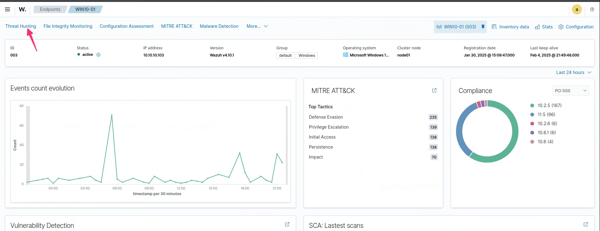  
**Figure 8 : Wazuh, Windows 10 Threat Hunting.**

Cliquez l'onglet **Events** et vous devriez trouver l'événement d'un fichier effacé.

  
**Figure 9 : Wazuh, Windows 10 fichier effacer.**

Observer les détails de l'événement.

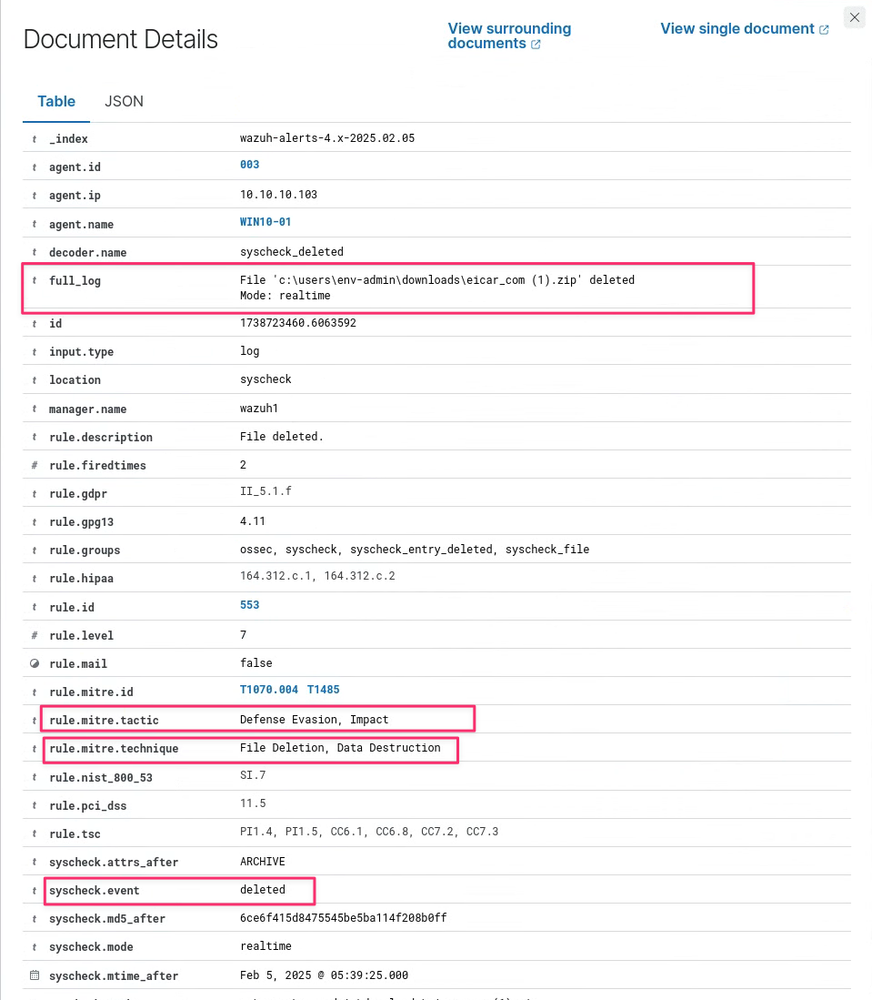  
**Figure 10 : Wazuh, Windows 10 fichier effacer détails.**

## Section 2 : Intégration de Sysmon dans Wazuh détecter un malware sans fichier  

### Comment fonctionnent les attaques de malware sans fichier ?

Dans son fonctionnement, une attaque de malware sans fichier est assez unique. Comprendre son fonctionnement peut aider une organisation à se protéger contre de futures attaques de malware sans fichier.  

Découvrons les différentes étapes impliquées dans une attaque de malware sans fichier.

#### Étape 1 – Obtenir l'accès  
Les acteurs de menace doivent d'abord accéder à la machine cible pour mener une attaque. Certains des techniques et outils courants impliqués dans cette étape sont mentionnés ici :

- **Techniques** : exploiter à distance une vulnérabilité et obtenir un accès à distance via un script Web ou un schéma d'ingénierie sociale tel que des courriels de phishing.  
- **Outils** : ProLock et Bumblebee  

#### Étape 2 – Voler les informations d'identification
En utilisant l'accès obtenu à l'étape précédente, l'attaquant tente maintenant d'obtenir des informations d'identification pour l'environnement qu'il a compromis, ce qui lui permettra de se déplacer facilement vers d'autres systèmes de cet environnement. Voici quelques-unes des techniques et des outils qu’il aurait pu utiliser :  

- **Techniques** : exploiter à distance une vulnérabilité et obtenir un accès à distance via un script Web (par exemple, Mimikatz)  
- **Outils** : Mimikatz et Kessel  

#### Étape 3 : Maintenir la persistance
L’attaquant crée alors une porte dérobée qui lui permettra de revenir à tout moment dans cet environnement sans avoir à répéter les étapes initiales de l’attaque. Voici quelques-unes des techniques et des outils :  

- **Techniques** : modifier le système de registre pour créer une porte dérobée.  
- **Outils** : Sticky Keys Bypass, Chinoxy, HALFBAKED, HiKit et ShimRat  

#### Étape 4 : Exfiltrer les données  
Lors de la dernière étape, l’attaquant collecte les données qu’il souhaite et les prépare pour l’exfiltration en les copiant dans un seul emplacement, puis en les compressant avec des outils système couramment disponibles tels que Compact. L’attaquant télécharge ensuite les données via FTP pour les supprimer de l’environnement de la victime. Voici quelques techniques et outils :  

- **Techniques** : utilisation du tunneling DNS, normalisation du trafic, utilisation d'un canal crypté, etc.  
- **Outils** : FTP, SoreFang et SPACESHIP

### Installation de Sysmon sur la VM Windows 10  

Sysmon nous donne des données complètes sur la création de processus, les connexions réseau et les changements d'heure de création de fichiers. Sysmon génère des événements et les stocke dans **Applications and Services Logs | Microsoft | Windows | Sysmon | Operational** de **Event Viewer**.  

Voici les instructions pour l'installation de Sysmon sur le système Windows 10 (vous devez être connecté avec un utilisateur local ayant des droits administrateur, utiliser env-admin sur CyberQuébec).  

####Étape 1 – Téléchargez et extrayez Sysmon  
Pour télécharger Sysmon sur votre machine Windows, visitez son site Web officiel : [https://learn.microsoft.com/en-us/sysinternals/downloads/sysmon](https://learn.microsoft.com/en-us/sysinternals/downloads/sysmon). Une fois téléchargé, extrayez l’archive Sysmon dans un dossier de votre choix sur votre machine Windows.  

####Étape 2 – Téléchargez la configuration Sysmon de SwiftOnSecurity  
La configuration Sysmon de SwiftOnSecurity est un fichier de configuration simple et bien connu créé par des professionnels de la sécurité réputés. L’utilisation de cette configuration peut améliorer nos capacités de surveillance Windows. Pour télécharger le fichier de configuration Sysmon de SwiftOnSecurity, visitez leur référentiel GitHub officiel ([https://github.com/SwiftOnSecurity/sysmon-config](https://github.com/SwiftOnSecurity/sysmon-config)) et téléchargez la dernière version du fichier de configuration appelée `sysmonconfig-export.xml`.  

**Remarque :** Assurez-vous de placer le fichier `sysmonconfig-export.xml` dans le même dossier où vous avez extrait Sysmon.  

####Étape 3 – Installer Sysmon avec la configuration SwiftOnSecurity
Pour installer Sysmon à l’aide du fichier de configuration SwiftOnSecurity appelé `sysmonconfig-export.xml`, vous devez suivre certaines étapes  :  

1. Ouvrez une invite de commande ou PowerShell avec des privilèges d’administrateur.  
2. Accédez au dossier dans lequel Sysmon est extrait.  
3. Maintenant, exécutez la commande suivante pour installer Sysmon avec la configuration SwiftOnSecurity :  

~~~bash
sysmon.exe -accepteula -i sysmonconfig-export.xml
~~~  

Le paramètre `-accepteula` permet d'indiquer que vous reconnaissez et acceptez les conditions d’utilisation par rapport au contrat de licence d’utilisateur final (CLUF) pour Sysmon.  

### Vérification de l'installation de Sysmon  

Après l'installation, vous pouvez vérifier que Sysmon fonctionne correctement en consultant l'Observateur d'événements. Pour ce faire, ouvrez l'Observateur d'événements, accédez à **Applications and Services Logs | Microsoft | Windows | Sysmon | Operational**, et vous devriez commencer à recevoir des événements liés à Sysmon comme indiqué dans la figure suivante :  

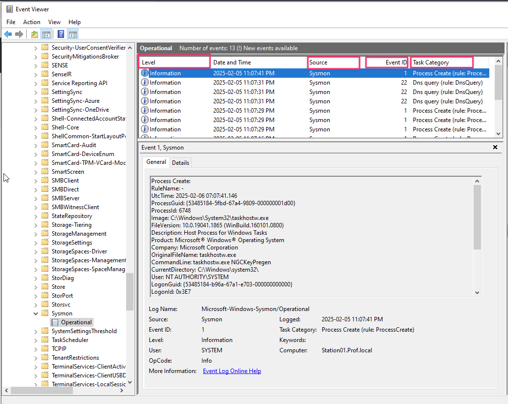  
**Figure 11 : Sysmon dans l'Observateur d'événements.**

Voici les informations :  

- **Level** : il s’agit de la gravité d’un événement. Les niveaux sont généralement classés comme suit :  
	- **0** : Information  
	- **1** : Avertissement  
	- **2** : Erreur  
	- **3** : Critique  

- **Source** : ce champ indique le logiciel ou le composant qui a généré l’événement. Dans ce cas, il s’agit de Sysmon.  

- **ID d’événement (Event ID)** : il s’agit d’une valeur unique attribuée à chaque type d’événement. Sysmon utilise différents ID d'événement à diverses fins :  
	- **ID d'événement 1** : création de processus  
	- **ID d'événement 2** : création de fichier  
	- **ID d'événement 3** : connexion réseau  
	- **ID d'événement 7** : image chargée  
	- **ID d'événement 10** : accès au processus  
	- **ID d'événement 11** : création de fichier  
	- **ID d'événement 12** : événement de registre (création et suppression d'objet)  
	- **ID d'événement 13** : événement de registre (définition de valeur)  
	- **ID d'événement 14** : événement de registre (renommage de clé et de valeur)  
	- **ID d'événement 15** : hachage de flux de création de fichier  
	- **ID d'événement 17** : événement de canal (canal créé)  
	- **ID d'événement 18** : événement de canal (canal connecté)  
	- **ID d'événement 22** : requête DNS  

- **Catégorie de tâche (Task Category)** : cela fournit la classification des événements. Il s'agit du nom des ID d'événement tel qu'ils sont répertoriés précédemment.  

### Configuration de l'agent Wazuh  

Sur votre Windows 10, vous devez informer l'agent de surveiller les événements Sysmon. Pour ce faire, vous devez ajouter le bloc suivant dans le fichier `C:\Program Files (x86)\ossec-agent\ossec.conf` :  

~~~configuration  

  <!-- Logs Sysmon -->
  <localfile>
    <location>Microsoft-Windows-Sysmon/Operational</location>
    <log_format>eventchannel</log_format>
  </localfile>
~~~  

Pour garantir que les modifications prennent effet, nous devons redémarrer l'agent.  

~~~PowerShell
NET STOP WazuhSvc
NET START WazuhSvc
~~~  

### Configuration du gestionnaire (manager) Wazuh  

Nous devons créer une règle personnalisée dans le gestionnaire Wazuh pour correspondre aux événements Sysmon générés par la machine Windows. Cette règle garantira que le gestionnaire Wazuh déclenche une alerte chaque fois qu'il reçoit un événement lié à Sysmon.  

Pour créer une règle, accédez au tableau de bord Wazuh et accédez à **Server Management | Rules**. Cliquez sur **+ Add new rules file**, entrer le nom **custom_sysmon.xml** à **Enter a name**, insérer les règles suivantes et sauvegarder le fichier :  

~~~Configuration

<!-- Log Sysmon Alerts -->
<group name="sysmon">
  <rule id="101100" level="5">
    <if_sid>61650</if_sid>
      <options>no_full_log</options>
    <description>Sysmon - Event 22: DNS Query.</description>
  </rule>

  <rule id="101101" level="5">
    <if_sid>61603</if_sid>
      <options>no_full_log</options>
    <description>Sysmon - Event 1: Process creation.</description>
  </rule>

  <rule id="101102" level="5">
    <if_sid>61604</if_sid>
      <options>no_full_log</options>
    <description>Sysmon - Event 2: A process changed a file creation time.</description>
  </rule>

  <rule id="101103" level="5">
    <if_sid>61605</if_sid>
      <options>no_full_log</options>
    <description>Sysmon - Event 3: Network connection.</description>
  </rule>

  <rule id="101104" level="5">
    <if_sid>61606</if_sid>
      <options>no_full_log</options>
    <description>Sysmon - Event 4: Sysmon service state changed.</description>
  </rule>

  <rule id="101105" level="5">
    <if_sid>61607</if_sid>
      <options>no_full_log</options>
    <description>Sysmon - Event 5: Process terminated.</description>
  </rule>

  <rule id="101106" level="5">
    <if_sid>61608</if_sid>
      <options>no_full_log</options>
    <description>Sysmon - Event 6: Driver loaded.</description>
  </rule>

  <rule id="101107" level="5">
    <if_sid>61609</if_sid>
      <options>no_full_log</options>
    <description>Sysmon - Event 7: Image loaded.</description>
  </rule>

  <rule id="101108" level="5">
    <if_sid>61610</if_sid>
      <options>no_full_log</options>
    <description>Sysmon - Event 8: CreateRemoteThread.</description>
  </rule>

  <rule id="101109" level="5">
    <if_sid>61611</if_sid>
      <options>no_full_log</options>
    <description>Sysmon - Event 9: RawAccessRead.</description>
  </rule>

  <rule id="101110" level="5">
    <if_sid>61612</if_sid>
      <options>no_full_log</options>
    <description>Sysmon - Event 10: ProcessAccess.</description>
  </rule>

  <rule id="101111" level="5">
    <if_sid>61613</if_sid>
      <options>no_full_log</options>
    <description>Sysmon - Event 11: FileCreate.</description>
  </rule>

  <rule id="101112" level="5">
    <if_sid>61614</if_sid>
      <options>no_full_log</options>
    <description>Sysmon - Event 12: RegistryEvent (Object create and delete).</description>
  </rule>

  <rule id="101113" level="5">
    <if_sid>61615</if_sid>
      <options>no_full_log</options>
    <description>Sysmon - Event 13: RegistryEvent (Value Set).</description>
  </rule>

  <rule id="101114" level="5">
    <if_sid>61616</if_sid>
      <options>no_full_log</options>
    <description>Sysmon - Event 14: RegistryEvent (Key and Value Rename).</description>
  </rule>

  <rule id="101115" level="5">
    <if_sid>61617</if_sid>
      <options>no_full_log</options>
    <description>Sysmon - Event 15: FileCreateStreamHash.</description>
  </rule>
</group>
~~~

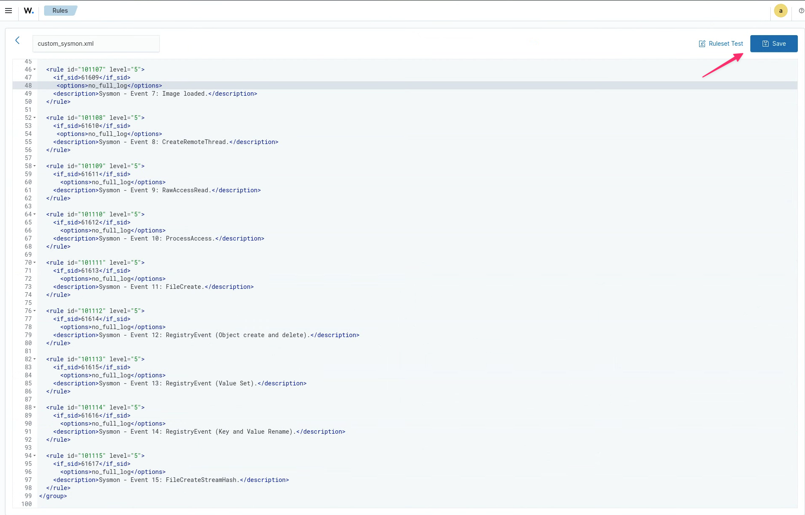  
**Figure 12 : Nouvelles règles custom_sysmon.xml.**

Voici des informations sur les règles :  

- `<group>` : cette balise est utilisée pour organiser les règles et permet de gérer et de classer les règles en fonction de leur fonctionnalité.  
- `<rule>` : elle définit la règle individuelle avec les attributs `id` et `level`. Dans l'ensemble de règles précédent, l'ID de règle est compris entre 101100 et 101107 avec `level=5`.  
- `<if_sid>` : cette balise est utilisée comme condition requise pour déclencher une règle lorsqu'un ID de règle a déjà été mis en correspondance. Par exemple :  
	- L'ID de règle « 101100 » avec `if_sid` « 61650 » sera vérifié lorsque les conditions requises de l'ID de règle 61650 seront satisfaites.  

**Remarque** : Vous pouvez consulter les détails de chacun des `if_sid` mentionnés dans le fichier de règles Wazuh nommé `0595-win-sysmon_rules.xml`. Vous pouvez trouver ce fichier dans la section **Rules** du tableau de bord Wazuh ou dans le référentiel GitHub officiel de Wazuh situé à l'adresse [https://github.com/wazuh/wazuh-ruleset/tree/master/rules](https://github.com/wazuh/wazuh-ruleset/tree/master/rules).  

Pour que les modifications prennent effet, vous devez redémarrer le gestionnaire Wazuh sur la page de nouveau fichier de règle après l'avoir sauvegardé, comme indiqué dans la figure suivante :

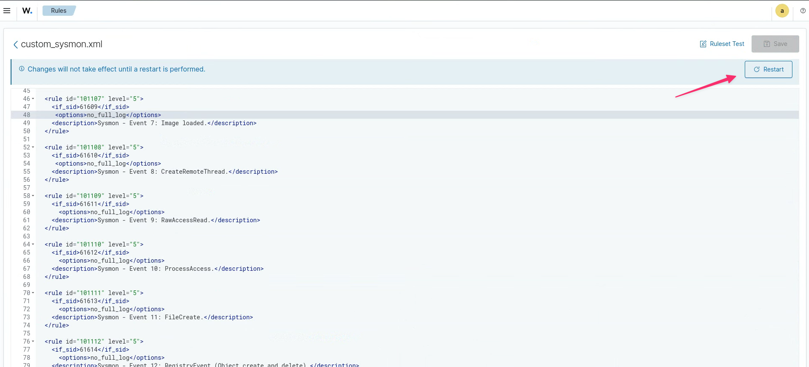  
**Figure 13 : Redémarrer le gestionnaire Wazuh.**

Vous pouvez toujours utiliser la commande `sudo systemctl restart wazuh-manager` pour relancer le gestionnaire Wazuh.  

### Vérification  

Pour tester un scénario de malware sans fichier, nous utiliserons l'outil APTSimulator développé par Florian Roth. Il s'agit d'un script batch Windows qui utilise plusieurs outils et fichiers de sortie pour simuler un système compromis. Pour exécuter ce script APTSimulator, téléchargez le fichier `APTSimulator_PW_apt.zip` sur une machine Windows. Vous devez décompresser (dézipper) l'archive, le mot de passe est apt.

Voici le lien pour le télécharger : [https://github.com/NextronSystems/APTSimulator/releases](https://github.com/NextronSystems/APTSimulator/releases).  

**Remarque** : vous pouvez ignorer les avertissements de Windows Security.  

Une fois que vous avez décompressé le fichier sur votre machine Windows, ouvrez une invite de commande administrative, accédez au dossier du script `APTSimulator.bat` et exécutez le script `APTSimulator.bat`. 

Une fois le script lancé, vous devriez voir un menu de tests,

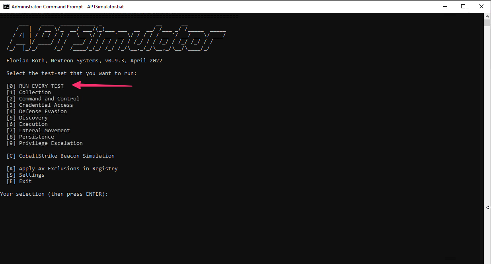  
**Figure 14 : Menu APTSimulator.**

**Entrez 0**. Cela exécutera tous les tests, y compris **Collection, Command and Control, Credential Access, Defense Evasion, Discovery, Execution, Lateral Movement, Persistence, and Privilege Escalation**.  

**Remarque** : certaines attaques peuvent ne pas fonctionner, vous pouvez donc les ignorer. Vous pouvez ignorer les avertissements de Windows Security.  

### Visualiser les alertes  

Pour visualiser les alertes Sysmon de la machine Windows, déplacez-vous au tableau de bord Wazuh, accédez à **Threat intelligence | Threat Hunting**. Choisissez l'agent Windows 10, puis cliquer sur l'onglet Events

  
**Figure 15 : Windows 10 Threat Hunting.**

Vous devriez voir plusieurs événements comme indiqué dans la figure suivante :

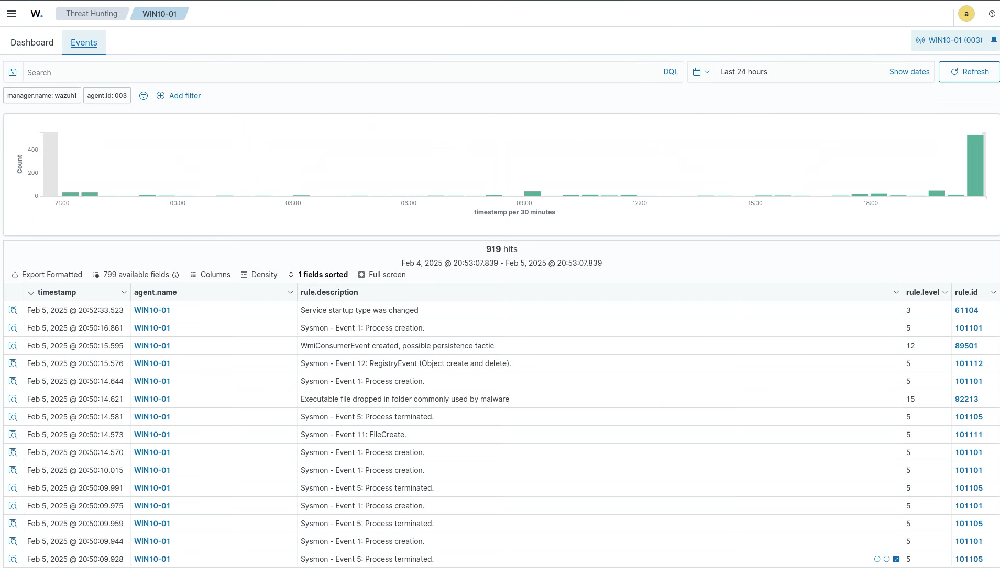  
**Figure 16 : Événements Sysmon.**

En faisant le tour des événements, vous pouvez voir que nous avons obtenu une large gamme d'événements Sysmon tels que **Process Creation (Event 1), DNS Query (Event 22), Network Connection (Event 3), RegistryEvent (Event 12)**... Tous ces événements Sysmon peuvent être utilisés pour effectuer une analyse plus approfondie.

## Références

- Security monitoring with Wazuh par Rajneesh Gupta  
- [Local configuration (ossec.conf) syscheck](https://documentation.wazuh.com/current/user-manual/reference/ossec-conf/syscheck.html#directories)  
- [Centralized configuration (agent.conf)](https://documentation.wazuh.com/current/user-manual/reference/centralized-configuration.html)  
- [Documentations wazuh](https://documentation.wazuh.com/current/)  
- [Changement le mot de passe de l'utilisateur `admin` dans Wazuh.](https://documentation.wazuh.com/current/user-manual/user-administration/password-management.html#changing-the-password-for-single-user)  

&copy; Claude Roy 2025